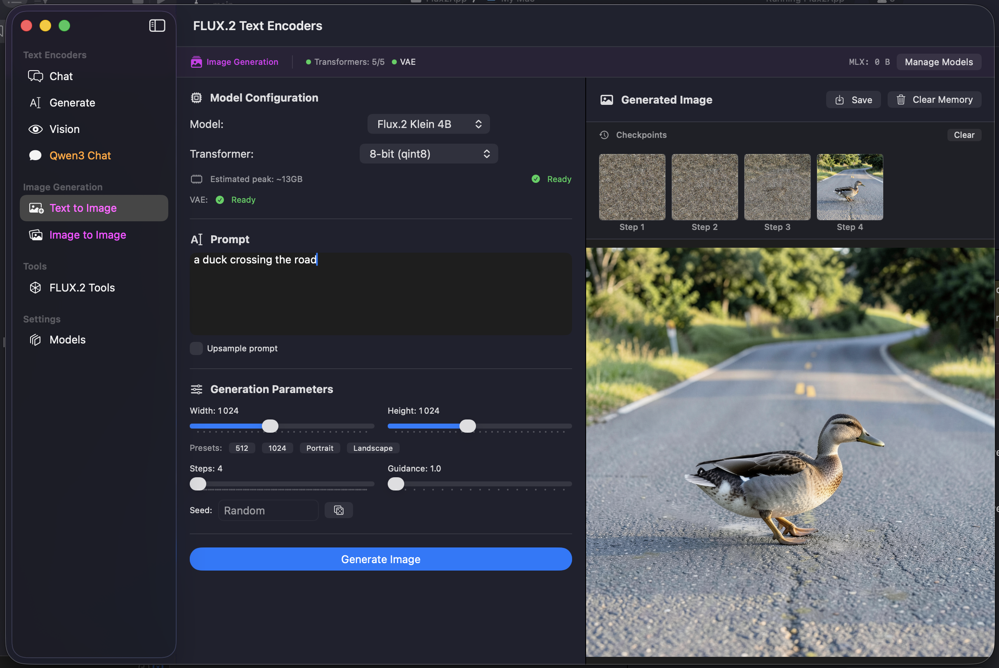
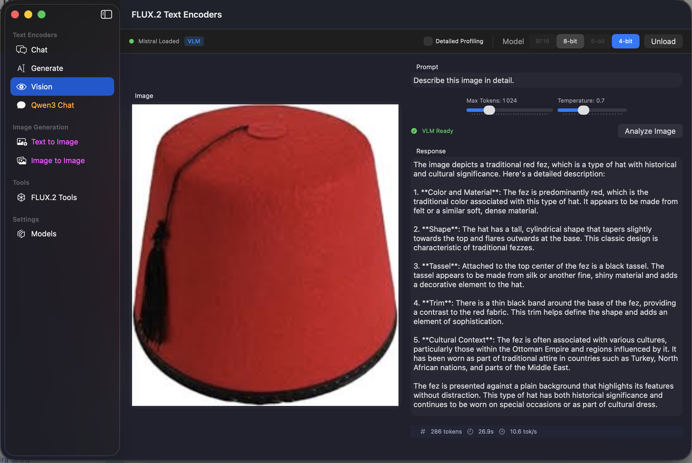
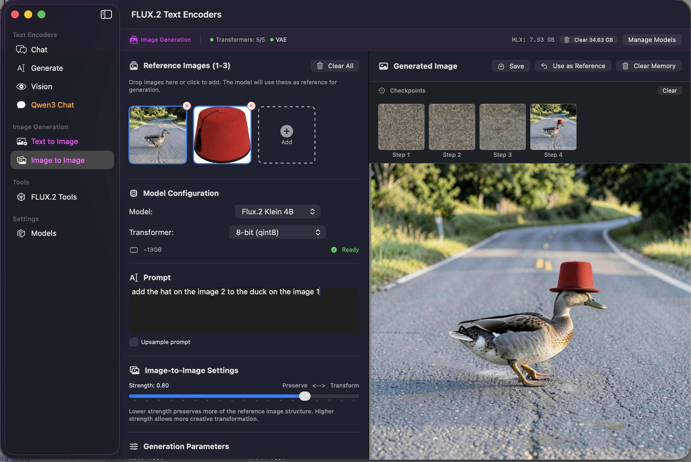
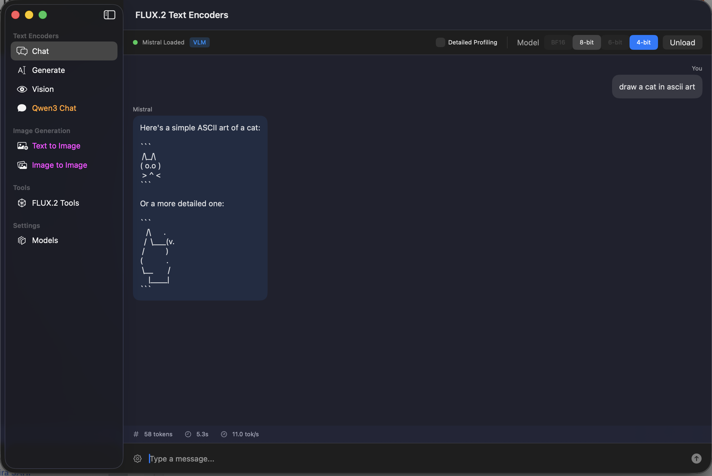
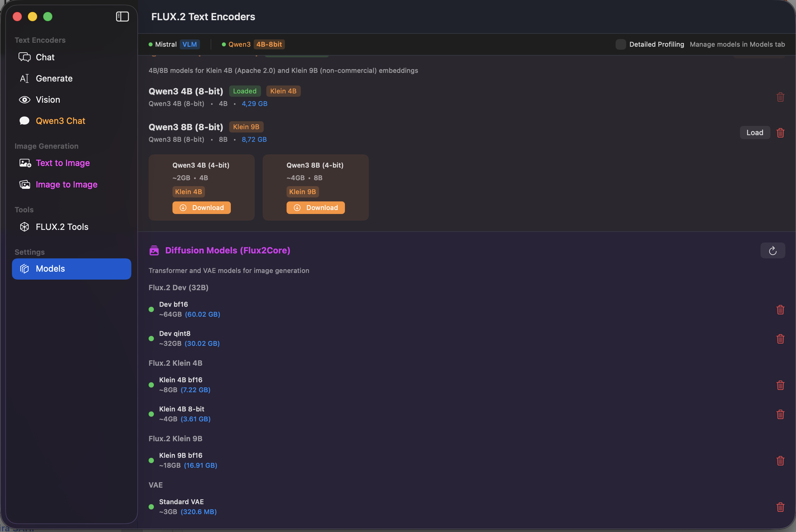
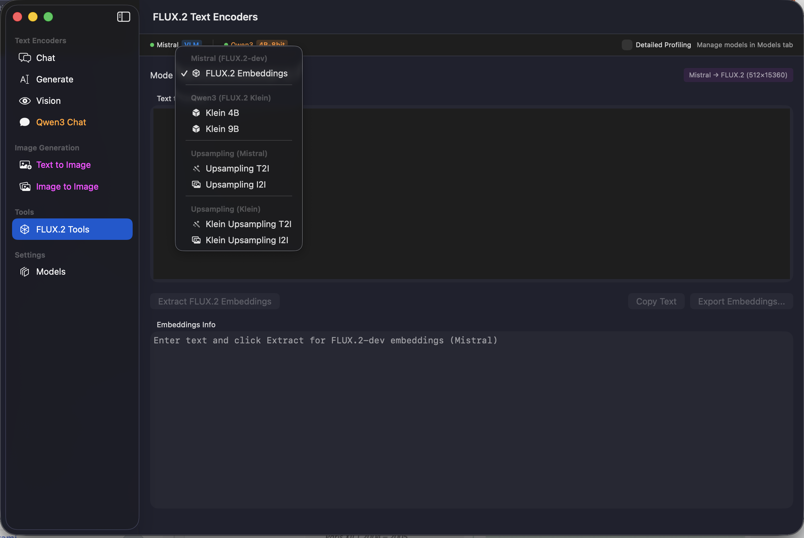
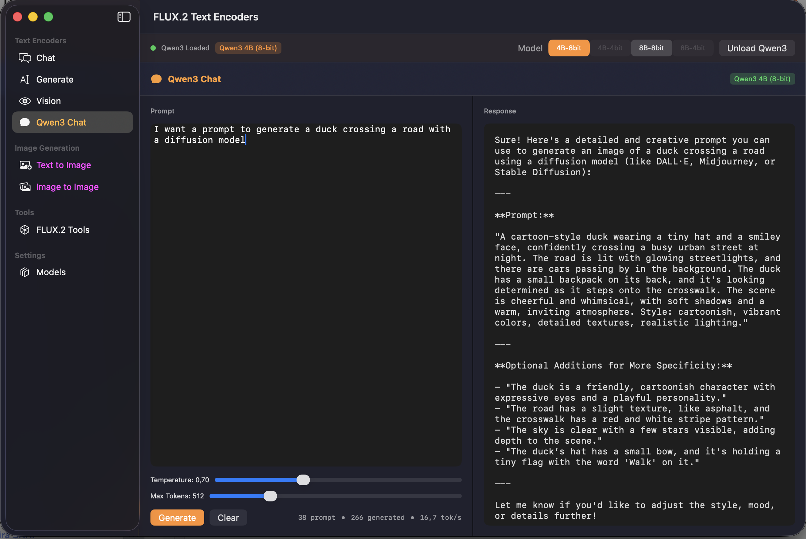
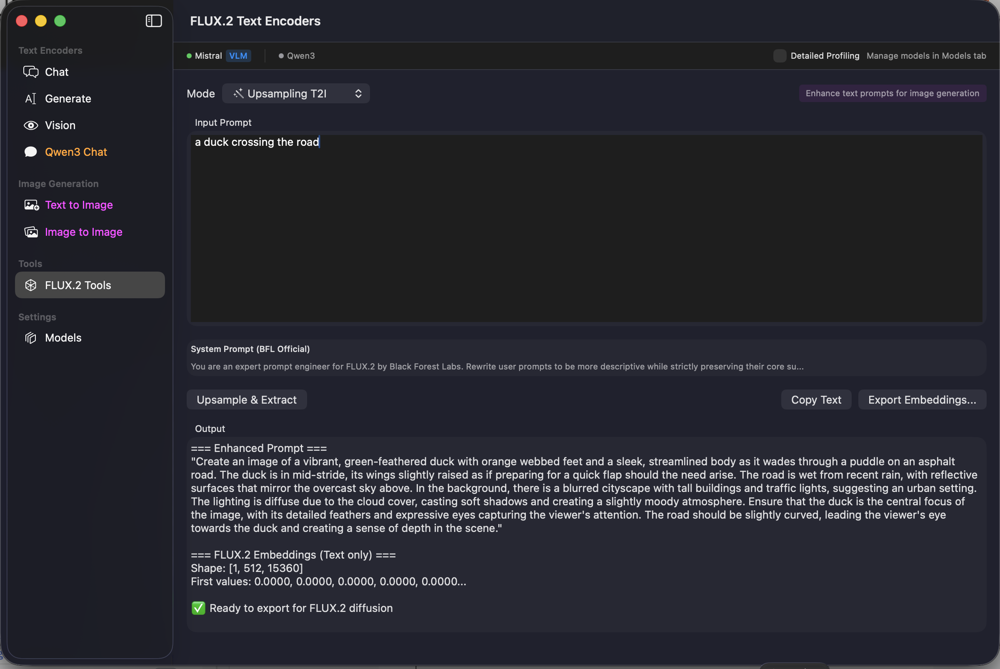

# Flux2App - Demo macOS Application

A complete SwiftUI demo application showcasing all Flux.2 Swift MLX capabilities, including image generation (T2I/I2I), text encoding, chat, and vision analysis.

## Features

- **Text-to-Image (T2I)**: Generate images from text prompts
- **Image-to-Image (I2I)**: Transform images with multiple reference images (up to 4 for Klein, 6 for Dev)
- **Chat**: Interactive conversations with Mistral 24B and Qwen3
- **Vision (VLM)**: Analyze images with Mistral Pixtral
- **FLUX.2 Tools**: Extract embeddings and upsample prompts
- **Model Management**: Download, delete, and monitor memory usage

## Screenshots

### Text-to-Image Generation

Generate images with Klein 4B (fast, ~26s) or Dev (high quality, ~35min):




### Image-to-Image Generation

Transform existing images or combine multiple references:





### Chat Interfaces

Interactive chat with Mistral 24B (FLUX.2 Dev encoder) and Qwen3 (FLUX.2 Klein encoder):





### FLUX.2 Tools

Extract embeddings for custom pipelines and upsample prompts:





### Model Management

Download and manage text encoders and diffusion models:



## Installation

### Build with Xcode

1. Open `flux-2-swift-mlx` in Xcode
2. Select the `Flux2App` scheme
3. Build and Run (`Cmd+R`)

### Requirements

- macOS 14.0 (Sonoma) or later
- Apple Silicon Mac (M1/M2/M3/M4)
- 16GB+ RAM for Klein 4B, 64GB+ for Dev

## Usage

### Getting Started

1. Launch the app
2. Go to **Settings > Models** to download required models
3. For quick results, download:
   - Qwen3-4B 8-bit (text encoder for Klein)
   - Klein 4B 8-bit (transformer)
   - VAE (required for all models)

### Text-to-Image

1. Select **Image Generation > Text to Image**
2. Choose a model (Klein 4B recommended for testing)
3. Enter your prompt
4. Optionally enable **Upsample prompt** for enhanced details
5. Click **Generate**

**Recommended parameters (from Black Forest Labs):**

| Model | Steps | Guidance | Time |
|-------|-------|----------|------|
| Klein 4B | 4 | 1.0 | ~26s |
| Klein 9B | 4 | 1.0 | ~62s |
| Dev | 28 | 4.0 | ~35min |

### Image-to-Image

1. Select **Image Generation > Image to Image**
2. Drop reference images (up to 4 for Klein, 6 for Dev)
3. Adjust **Strength** (0.0 = preserve original, 1.0 = full transformation)
4. Enter a prompt describing the desired changes
5. Optionally add **Interpret Images** for VLM-based semantic understanding
6. Click **Generate**

### Checkpoints

Enable **Show checkpoints** to see intermediate results during generation. Useful for:
- Understanding the denoising process
- Identifying optimal step counts
- Debugging prompts

### Chat

Use the chat interfaces for:
- Testing text generation quality
- Crafting better prompts
- Understanding model capabilities

Mistral 24B provides higher quality responses but requires more memory.

## Memory Management

The app uses a two-phase loading strategy:

1. **Encoding Phase**: Text encoder loaded (~5-25GB)
2. **Generation Phase**: Text encoder unloaded, transformer loaded (~4-32GB)

This allows running larger models on limited memory. Monitor usage in the status bar.

### Tips

- Clear the pipeline after generation to free memory
- Use Klein 4B for testing, Dev for final quality
- 8-bit quantization offers the best quality/memory tradeoff

## Troubleshooting

### "Model not loaded" error

Ensure you've downloaded the required models in Settings > Models.

### Out of memory

1. Try a smaller model (Klein 4B instead of Dev)
2. Reduce image dimensions (512x512 instead of 1024x1024)
3. Close other applications

### Slow generation

- Klein 4B at 4 steps is optimized for speed
- Dev model is slow by design (high quality)
- First run is slower due to model loading

## Architecture

```
Flux2App/
├── Flux2App.swift          # App entry point
├── ViewModels/
│   ├── ModelManager.swift           # Model state and downloads
│   ├── ImageGenerationViewModel.swift  # T2I/I2I generation
│   └── ChatViewModel.swift          # Chat state
└── Views/
    ├── ContentView.swift            # Main navigation
    ├── TextToImageView.swift        # T2I interface
    └── ImageToImageView.swift       # I2I interface
```

## Related Documentation

- [CLI Documentation](CLI.md) - Command-line usage
- [LoRA Guide](LoRA.md) - LoRA adapter support
- [Text Encoders](TextEncoders.md) - FluxTextEncoders library
