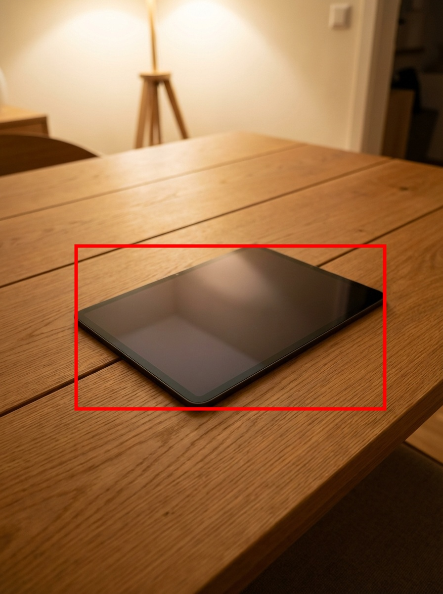
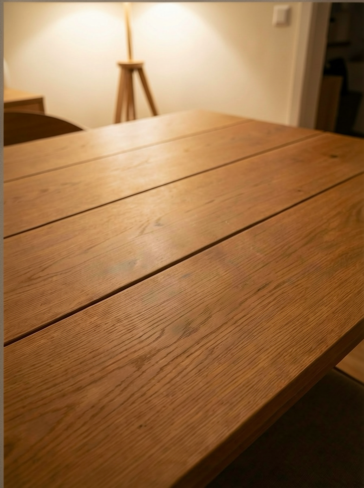
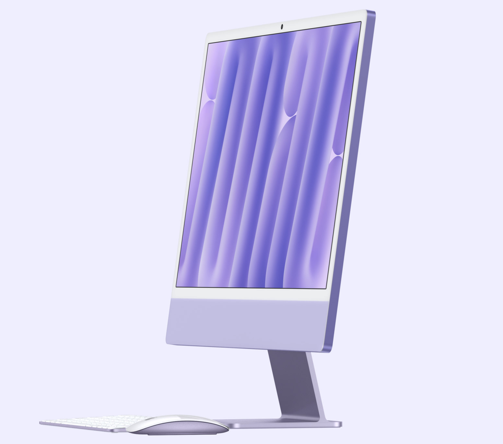
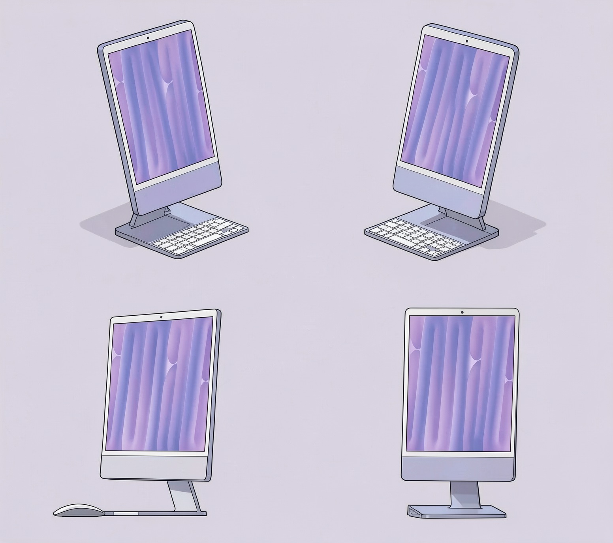
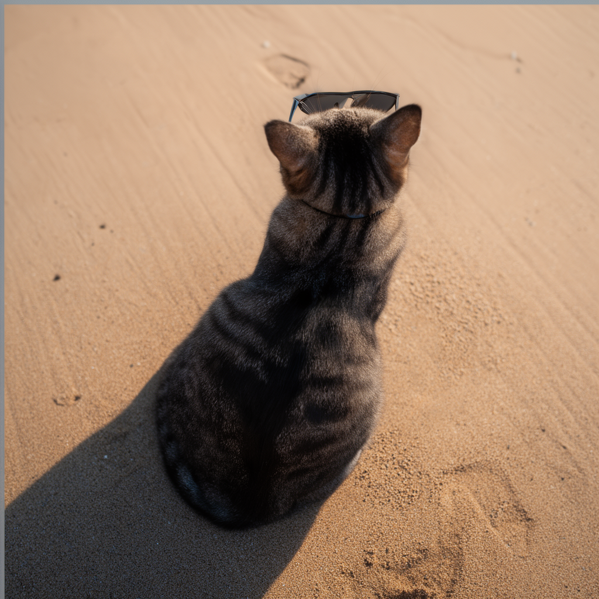

# LoRA Adapters for Flux.2

LoRA (Low-Rank Adaptation) allows fine-tuning models for specific tasks without modifying the base weights. This enables specialized capabilities like object removal, spritesheet generation, style transfer, and more.

> **Training your own LoRAs?** See the [Training Guide](examples/TRAINING_GUIDE.md) for detailed instructions on training subject and style LoRAs with DOP (Differential Output Preservation).

## Quick Start

```bash
flux2 i2i "your prompt" \
  --images input.jpg \
  --lora path/to/lora.safetensors \
  --lora-scale 1.0 \
  --model klein-4b \
  -o output.png
```

## CLI Options

| Option | Default | Description |
|--------|---------|-------------|
| `--lora` | none | Path to LoRA safetensors file |
| `--lora-scale` | `1.0` | LoRA scale factor (typically 0.5-1.5) |
| `--lora-config` | none | Path to JSON config file (for advanced LoRAs) |

### JSON Config Format

For LoRAs that require special settings (like Turbo LoRAs with custom sigmas), use a JSON config file:

```json
{
  "filePath": "/path/to/lora.safetensors",
  "scale": 1.0,
  "activationKeyword": "optional trigger word",
  "schedulerOverrides": {
    "customSigmas": [1.0, 0.6509, 0.4374, 0.2932, 0.1893, 0.1108, 0.0495, 0.00031],
    "numSteps": 8,
    "guidance": 2.5
  }
}
```

All fields except `filePath` are optional:

| Field | Description |
|-------|-------------|
| `filePath` | Path to LoRA safetensors (required) |
| `scale` | LoRA scale factor (default: 1.0) |
| `activationKeyword` | Trigger word to prepend to prompt |
| `schedulerOverrides.customSigmas` | Custom noise schedule (for Turbo LoRAs) |
| `schedulerOverrides.numSteps` | Recommended inference steps |
| `schedulerOverrides.guidance` | Recommended guidance scale |
| `schedulerOverrides.strength` | Recommended I2I strength |

**Example usage:**
```bash
flux2 t2i "a beautiful landscape" \
  --lora-config turbo-lora.json \
  --model dev \
  -o output.png
```

## How It Works

LoRA weights are merged into the transformer at load time:

```
new_weight = original_weight + scale × (loraB @ loraA)
```

This approach:
- Preserves the original model weights
- Allows adjusting influence via `--lora-scale`
- Adds minimal overhead (~76MB for rank-16 LoRAs)

## Compatibility

**Important:** LoRA files must match the model architecture:

| Model | Compatible LoRAs |
|-------|-----------------|
| `klein-4b` | Klein 4B LoRAs (3072 inner dim) |
| `klein-9b` | Klein 9B LoRAs (4096 inner dim) |
| `dev` | Dev LoRAs (6144 inner dim) |

Using a LoRA with the wrong model will result in a shape mismatch error.

## Recommended Settings

For best results with LoRA:

```bash
--transformer-quant bf16  # Full precision recommended
--lora-scale 1.0-1.1      # Adjust based on LoRA
```

---

## Examples

### Object Removal

**LoRA:** [fal/flux-2-klein-4B-object-remove-lora](https://huggingface.co/fal/flux-2-klein-4B-object-remove-lora)

Removes highlighted/masked objects from images.

| Input | Output |
|-------|--------|
|  |  |

**Command:**
```bash
flux2 i2i "Remove the highlighted object from the scene" \
  --images input.jpg \
  --lora flux-object-remove-lora.safetensors \
  --lora-scale 1.1 \
  --model klein-4b \
  --transformer-quant bf16 \
  --strength 0.8 \
  -s 4 \
  -o output.png
```

**Notes:**
- Requires exact prompt: "Remove the highlighted object from the scene"
- Objects should be highlighted/masked in the input image
- Recommended scale: 1.1

---

### Spritesheet Generation

**LoRA:** [fal/flux-2-klein-4b-spritesheet-lora](https://huggingface.co/fal/flux-2-klein-4b-spritesheet-lora)

Generates 2×2 sprite sheets with multiple views of an object.

| Input | Output |
|-------|--------|
|  |  |

**Command:**
```bash
flux2 i2i "2x2 sprite sheet" \
  --images object.png \
  --lora flux-spritesheet-lora.safetensors \
  --lora-scale 1.1 \
  --model klein-4b \
  --transformer-quant bf16 \
  --strength 0.8 \
  -s 4 \
  -o spritesheet.png
```

**Output views:**
- **Top-Left**: Isometric view (↘)
- **Top-Right**: Isometric view (↙)
- **Bottom-Left**: Side profile (←)
- **Bottom-Right**: Top-down view (↑)

**Notes:**
- Requires prompt: "2x2 sprite sheet"
- Recommended scale: 1.1
- Works best with isolated objects on clean backgrounds

---

### Hardware Style (Klein 9B)

**LoRA:** [siraxe/h4rd8are_klein9b](https://huggingface.co/siraxe/h4rd8are_klein9b)

Transforms objects into a metallic/industrial hardware aesthetic.

| Input | Output |
|-------|--------|
|  |  |

**Command:**
```bash
flux2 i2i "turn to h4rd8are" \
  --images input.png \
  --lora turn_to_h4rd8are_klein9b.safetensors \
  --lora-scale 1.0 \
  --model klein-9b \
  --strength 0.8 \
  -s 4 \
  -o output.png
```

**Notes:**
- Requires prompt: "turn to h4rd8are"
- Recommended scale: 0.6-1.0
- Klein 9B LoRA (144 layers, rank 32, ~332 MB)

---

### Multi-Angles View (Dev)

**LoRA:** [lovis93/Flux-2-Multi-Angles-LoRA-v2](https://huggingface.co/lovis93/Flux-2-Multi-Angles-LoRA-v2)

Generates images from different viewpoints using the `<sks>` trigger with view parameters.

| Input | Output |
|-------|--------|
|  |  |

**Command:**
```bash
flux2 i2i "<sks> back view high-angle shot medium shot" \
  --images input.png \
  --lora flux-multi-angles-v2-72poses-diffusers.safetensors \
  --lora-scale 1.0 \
  --model dev \
  --strength 0.8 \
  -s 28 \
  -o output.png
```

**Trigger format:** `<sks> [view] [elevation] shot [distance]`
- **Views:** front, back, left, right, 3/4 front left, 3/4 front right, 3/4 back left, 3/4 back right
- **Elevations:** low-angle, eye-level, high-angle, overhead
- **Distances:** close-up, medium, full body

**Notes:**
- Requires `<sks>` trigger prefix
- Dev LoRA (160 layers, rank 16, ~318 MB)
- Supports 72 different pose combinations

---

### Turbo 8-Step (Dev)

**LoRA:** [fal/FLUX.2-dev-Turbo](https://huggingface.co/fal/FLUX.2-dev-Turbo)

Enables 8-step inference (~3x faster) with custom sigma schedule. Requires JSON config.

| Standard (28 steps) | Turbo (8 steps) |
|---------------------|-----------------|
|  |  |
| 1503s (~25 min) | 542s (~9 min) |

*Prompt: "a red panda sitting in a bamboo forest, soft morning light, professional wildlife photography"*

**JSON Config (`turbo-lora.json`):**
```json
{
  "filePath": "/path/to/flux.2-turbo-lora.safetensors",
  "scale": 1.0,
  "schedulerOverrides": {
    "customSigmas": [1.0, 0.6509, 0.4374, 0.2932, 0.1893, 0.1108, 0.0495, 0.00031],
    "numSteps": 8,
    "guidance": 2.5
  }
}
```

**Command:**
```bash
flux2 t2i "a red panda sitting in a bamboo forest" \
  --lora-config-path turbo-lora.json \
  --model dev \
  -o output.png
# Automatically uses 8 steps, guidance 2.5, and custom sigmas
```

**Notes:**
- Requires JSON config with `customSigmas` for optimal results
- ~3x faster than standard Dev inference (8 steps vs 28)
- Dev LoRA (170 layers, rank 256, ~5.2 GB)

---

## Finding LoRAs

### Recommended Sources

- **[HuggingFace](https://huggingface.co/models?search=flux-2-klein)** - Official and community LoRAs
- **[fal.ai LoRAs](https://huggingface.co/fal)** - High-quality Klein 4B LoRAs
- **[Civitai](https://civitai.com/)** - Community LoRAs (check compatibility)

### Known Klein 4B LoRAs

| LoRA | Purpose | Prompt | Scale |
|------|---------|--------|-------|
| [object-remove](https://huggingface.co/fal/flux-2-klein-4B-object-remove-lora) | Remove objects | "Remove the highlighted object from the scene" | 1.1 |
| [spritesheet](https://huggingface.co/fal/flux-2-klein-4b-spritesheet-lora) | 2×2 sprite grid | "2x2 sprite sheet" | 1.1 |

### Known Klein 9B LoRAs

| LoRA | Purpose | Prompt | Scale |
|------|---------|--------|-------|
| [h4rd8are](https://huggingface.co/siraxe/h4rd8are_klein9b) | Metallic/tech style | "turn to h4rd8are" | 0.6-1.0 |

### Known Dev LoRAs

| LoRA | Purpose | Prompt | Scale | Notes |
|------|---------|--------|-------|-------|
| [Multi-Angles](https://huggingface.co/lovis93/Flux-2-Multi-Angles-LoRA-v2) | 72 viewpoint poses | "`<sks>` [view] [elevation] shot [distance]" | 1.0 | |
| [Turbo](https://huggingface.co/fal/FLUX.2-dev-Turbo) | 8-step fast inference | any | 1.0 | Requires JSON config |

---

## Troubleshooting

### Shape Mismatch Error

```
MLX error: Shapes (6144,15360) and (3072,7680) cannot be broadcast
```

**Cause:** LoRA is for a different model (e.g., Dev LoRA with Klein 4B model).

**Solution:** Use `--model` matching the LoRA's target architecture.

### Desaturated/Washed Out Colors

**Cause:** dtype mismatch between LoRA weights and model weights.

**Solution:** This was fixed in commit e9de5b5. Update to latest version.

### LoRA Has No Effect

**Possible causes:**
1. Wrong prompt (some LoRAs require specific activation keywords)
2. Scale too low (try increasing `--lora-scale`)
3. Incompatible LoRA format

---

## Technical Details

### Supported Format

- **File format:** SafeTensors (`.safetensors`)
- **Weight naming:** `*.lora_A.weight`, `*.lora_B.weight`
- **Typical rank:** 16 (configurable by LoRA creator)

### Memory Usage

| Rank | Parameters | Memory |
|------|------------|--------|
| 8 | ~10M | ~38 MB |
| 16 | ~20M | ~76 MB |
| 32 | ~40M | ~152 MB |

### Layer Coverage

Klein 4B LoRAs typically cover:
- 88 layers (44 pairs of loraA/loraB)
- Single transformer blocks: `attn.to_out`, `attn.to_qkv_mlp_proj`
- Double transformer blocks: attention projections
