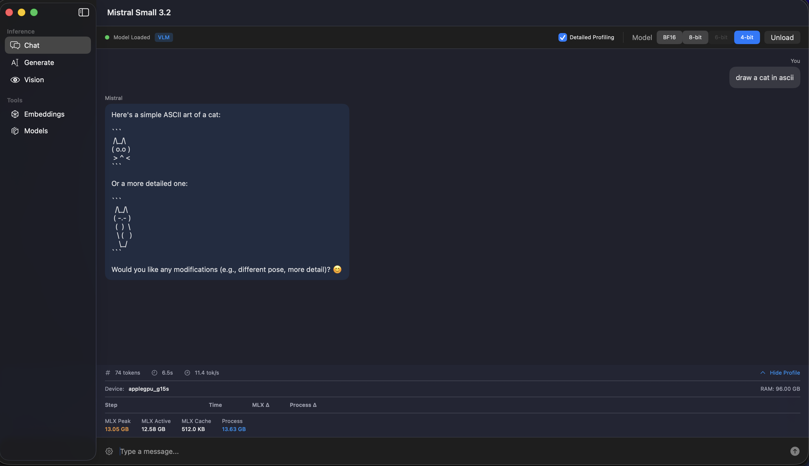
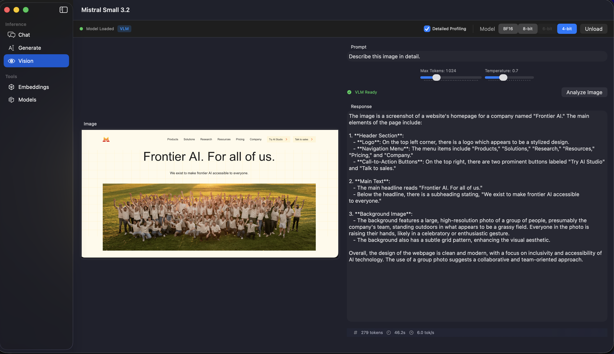
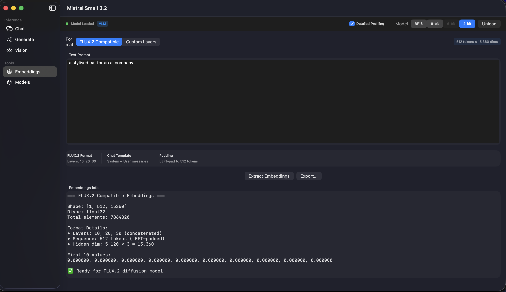
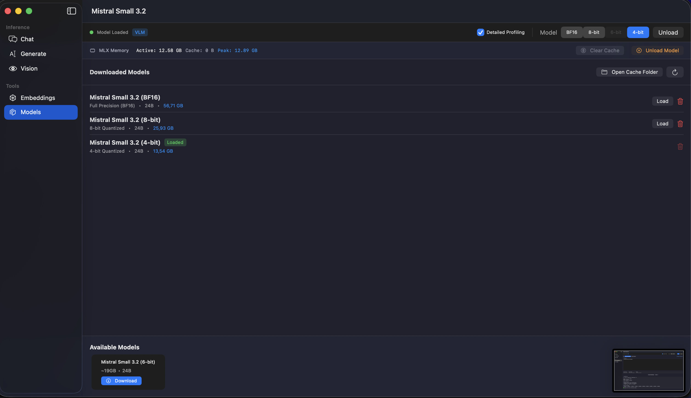

# FluxTextEncoders - Text Encoding Library

Native Swift implementation of text encoders for FLUX.2 image generation on Apple Silicon using MLX.
Supports **Mistral Small 3.2** (for FLUX.2 dev) and **Qwen3** (for FLUX.2 Klein).

## Features

- **Mistral Small 3.2 (24B)** - Text encoder for FLUX.2 dev/pro
- **Qwen3 (4B/8B)** - Text encoder for FLUX.2 Klein
- **Text Generation** - Streaming text generation with configurable parameters
- **Interactive Chat** - Multi-turn conversation with chat template support
- **Vision Analysis** - Image understanding via Pixtral vision encoder (Mistral VLM)
- **FLUX.2 Embeddings** - Extract embeddings compatible with FLUX.2 image generation
- **Klein Embeddings** - Extract embeddings for FLUX.2 Klein (Qwen3-based)
- **Native macOS App** - Full-featured SwiftUI application (`FluxEncodersApp`)
- **CLI Tool** - Complete command-line interface (`FluxEncodersCLI`)
- **Model Management** - Automatic download and caching from HuggingFace

## FLUX.2 Model Compatibility

| FLUX.2 Model | Text Encoder | Embedding Layers | Output Dimension |
|--------------|--------------|------------------|------------------|
| dev / pro | Mistral Small 3.2 | [10, 20, 30] | 15,360 |
| Klein 4B | Qwen3 4B | [9, 18, 27] | 7,680 |
| Klein 9B | Qwen3 8B | [9, 18, 27] | 12,288 |

## Library API

```swift
import FluxTextEncoders

// === Mistral (FLUX.2 dev) ===

// Load Mistral model
try await FluxTextEncoders.shared.loadModel(variant: .mlx8bit)

// Generate text
let result = try FluxTextEncoders.shared.generate(prompt: "Hello") { token in
    print(token, terminator: "")
    return true
}

// Chat
let messages = [["role": "user", "content": "Hello!"]]
let response = try FluxTextEncoders.shared.chat(messages: messages)

// FLUX.2 dev Embeddings
let embeddings = try FluxTextEncoders.shared.extractFluxEmbeddings(prompt: "A cat")
// Shape: [1, 512, 15360]

// Vision (VLM)
try await FluxTextEncoders.shared.loadVLMModel(variant: .mlx4bit)
let analysis = try FluxTextEncoders.shared.analyzeImage(path: "photo.jpg", prompt: "Describe this")

// === Qwen3 (FLUX.2 Klein) ===

// Load Qwen3 model
try await FluxTextEncoders.shared.loadQwen3Model(variant: .qwen3_4B_8bit)

// Chat with Qwen3
let qwenResult = try FluxTextEncoders.shared.chatQwen3(
    messages: [["role": "user", "content": "Hello!"]],
    parameters: GenerateParameters(maxTokens: 500)
)

// FLUX.2 Klein Embeddings
let kleinEmbeddings = try FluxTextEncoders.shared.extractKleinEmbeddings(
    prompt: "A sunset over mountains",
    config: .klein4B
)
// Shape: [1, 512, 7680] for Klein 4B
```

## CLI Commands (FluxEncodersCLI)

```bash
# Chat mode (default - Mistral)
FluxEncodersCLI chat

# Chat with Qwen3
FluxEncodersCLI chat --qwen3

# Text generation
FluxEncodersCLI generate "Your prompt here" --temperature 0.7

# Vision analysis (Mistral VLM)
FluxEncodersCLI vision image.jpg "What's in this image?"

# Extract FLUX.2 dev embeddings (Mistral)
FluxEncodersCLI embed "Your text" --flux --output embeddings.bin

# Extract FLUX.2 Klein embeddings (Qwen3)
FluxEncodersCLI embed "Your text" --klein 4b --output klein_embeddings.bin

# Upsampling (enhance prompts using Qwen3)
FluxEncodersCLI upsample "A cat" --style photographic

# Manage models
FluxEncodersCLI models
FluxEncodersCLI models --download mistral-8bit
FluxEncodersCLI models --download qwen3-4b-8bit
```

## Model Variants

### Mistral Small 3.2 (FLUX.2 dev)

| Variant | Size | RAM Required | Speed |
|---------|------|--------------|-------|
| BF16 | ~48GB | 64GB+ | Baseline |
| 8-bit | ~24GB | 32GB | ~Same |
| 4-bit | ~12GB | 16GB | Slightly slower |

### Qwen3 (FLUX.2 Klein)

| Model | Variant | Size | RAM Required |
|-------|---------|------|--------------|
| Qwen3 4B | 8-bit | ~4GB | 8GB |
| Qwen3 4B | 4-bit | ~2GB | 6GB |
| Qwen3 8B | 8-bit | ~8GB | 12GB |
| Qwen3 8B | 4-bit | ~4GB | 8GB |

### Swapping in an alternate Qwen3 encoder (Klein only)

`Flux2Pipeline.init(...)` accepts an optional `kleinEncoderPath: URL?`
that bypasses the curated Hub variant and loads the Klein text encoder
from a local directory instead. This is the supported way to plug in:

- **Abliterated / uncensored** Qwen3 builds (e.g.
  [`ponpoke/flux2-klein-9b-uncensored-text-encoder`](https://huggingface.co/ponpoke/flux2-klein-9b-uncensored-text-encoder))
  so refusal directions in the curated encoder stop distorting prompts
  the base transformer is otherwise willing to render.
- **Fine-tuned** Qwen3 variants (style-conditioned, language-tuned, …).
- **Different quantisations** of the same architecture (8-bit / 4-bit /
  bf16) without waiting for an upstream addition to `Qwen3Variant`.

```swift
let encoderDir = URL(fileURLWithPath: "/path/to/qwen3-encoder")

let pipeline = Flux2Pipeline(
    model: .klein9B,
    quantization: .balanced,
    kleinEncoderPath: encoderDir
)
try await pipeline.loadModels()  // ← uses encoderDir, no Hub fetch
```

#### Directory layout

The path must point at a directory containing the standard
HuggingFace-style layout that `FluxTextEncoders.loadKleinModel(variant:from:)`
expects:

```
/path/to/qwen3-encoder/
├── config.json           # Qwen3 architecture config
├── tokenizer.json        # Qwen3 tokenizer
└── model.safetensors     # weights (single-file or sharded *.safetensors)
```

Sharded safetensors with an `index.json` are also supported.

#### Architecture constraints

The override must match the **target Klein variant**'s expected
architecture exactly. The framework reads whichever precision the
safetensors carry, but it doesn't auto-detect dimension mismatches —
loading the wrong arch will fail at decode time with a confusing error.

| Klein variant | Required Qwen3 architecture | Output dimension |
|---|---|---|
| `.klein4B` / `.klein4BBase` | Qwen3-4B (3 × 2560 hidden) | 7,680 |
| `.klein9B` / `.klein9BBase` / `.klein9BKV` | Qwen3-8B (3 × 4096 hidden) | 12,288 |

The hidden-state layers extracted are `[9, 18, 27]` for both — this is
fixed in `KleinTextEncoder` and won't follow a fine-tune that expects a
different layer triplet.

#### What happens when the path is nil

The default (`kleinEncoderPath: nil`) keeps the existing auto-download
behavior: the framework picks a curated `Qwen3Variant` based on
`(kleinVariant, quantization)`, reuses any already-downloaded variant,
or falls back to Hub download. No behavior change for existing callers.

#### What it does NOT do

- It has **no effect on Dev** (`model == .dev`) — Dev uses the Mistral
  encoder via `Flux2TextEncoder`, which has its own loader.
- It doesn't validate the encoder before loading; an incompatible build
  fails at the first forward pass, not at `Flux2Pipeline.init`.
- It doesn't change the embedding layer indices, max sequence length, or
  any other Klein-specific extraction logic — only the source of the
  Qwen3 weights changes.

## Performance Benchmarks

Performance comparison between Swift MLX and Python MLX on Apple Silicon.

### Text Generation (tokens/s)

| Quantization | Swift MLX | Python MLX | Swift Advantage |
|--------------|-----------|------------|-----------------|
| 4-bit | **11.8** | 6.4 | 1.84x faster |
| 6-bit | **9.3** | 5.3 | 1.75x faster |
| 8-bit | **8.0** | 4.2 | 1.90x faster |

**Swift MLX is ~1.8x faster for text generation across all quantizations.**

### Vision (VLM)

| Quantization | Swift MLX | Notes |
|--------------|-----------|-------|
| 4-bit | 2.5 tok/s | Correct output |
| 6-bit | 2.2 tok/s | Correct output |
| 8-bit | 2.1 tok/s | Correct output |

**Note:** Python `mlx_vlm` produces incorrect/hallucinated responses for this model. Swift VLM is the **only working implementation**.

## Screenshots

### Chat Interface


### Vision Analysis (VLM)


### FLUX.2 Embeddings


### Model Management


## Architecture

```
Sources/FluxTextEncoders/
├── FluxTextEncoders.swift    # Main API
├── Configuration/            # Model configurations
├── Model/                    # Mistral transformer
│   └── Qwen3/               # Qwen3 transformer
├── Vision/                   # Pixtral vision encoder
├── Tokenizer/               # Tekken tokenizer
├── Embeddings/              # FLUX.2 & Klein extraction
├── Generation/              # Text generation
└── Loading/                 # Model downloading & weight loading
```
