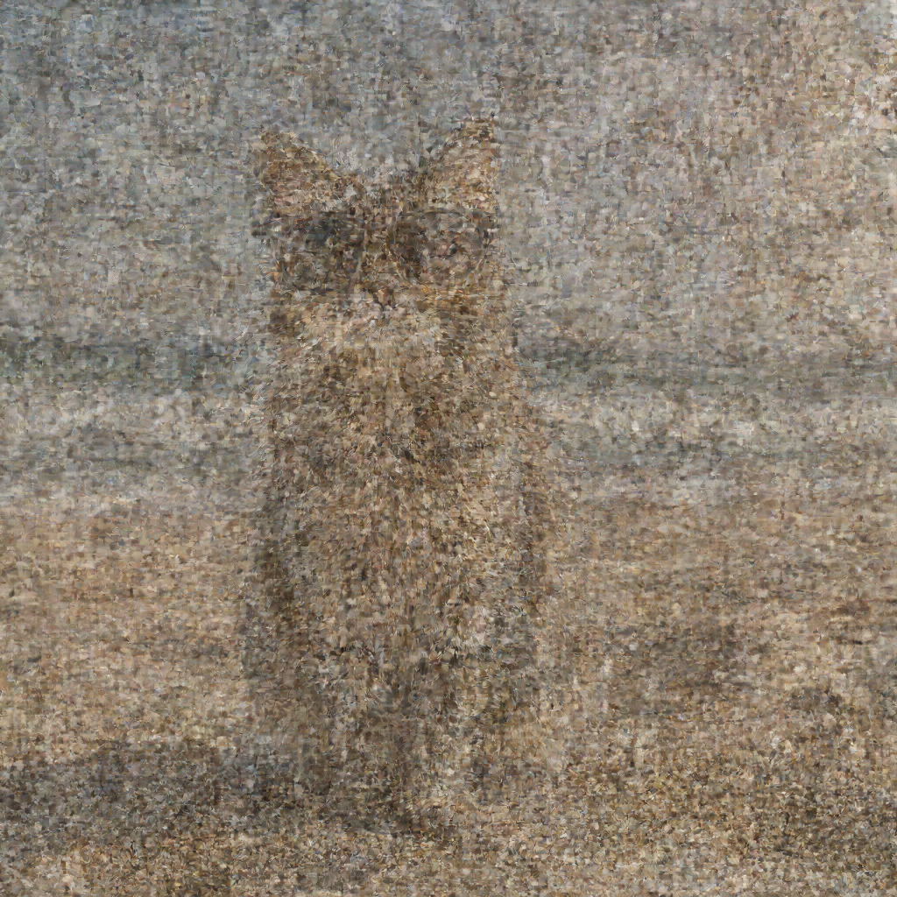
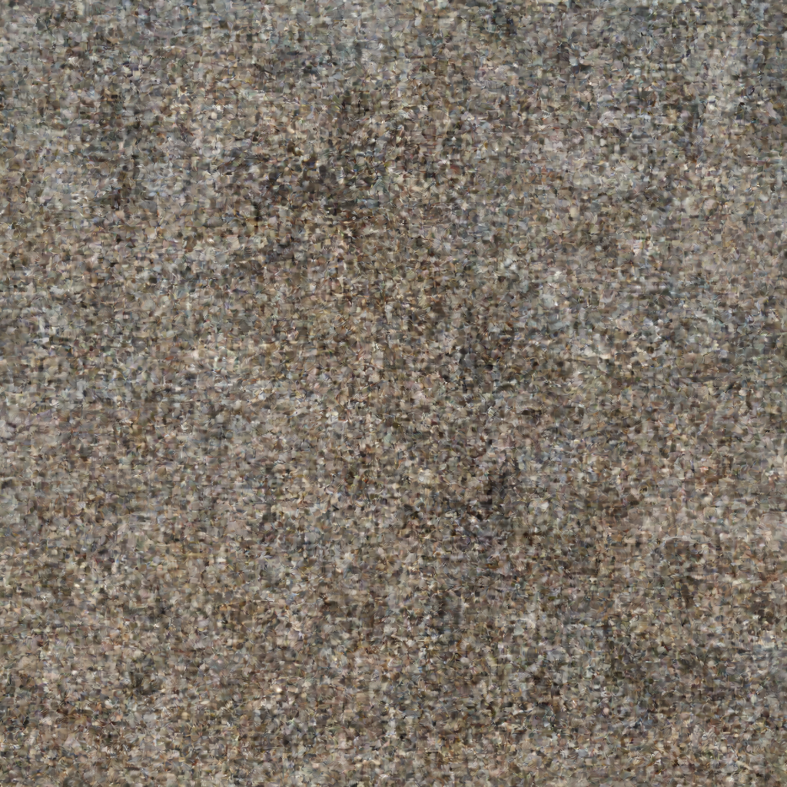

# Generation Examples

This folder contains example images generated with Flux.2 Swift MLX.

## Cat on Beach - Standard Generation

**Prompt:** `"a cat wearing sunglasses, sitting on a sunny beach"`

**Parameters:**
- Size: 1024x1024
- Steps: 28
- Guidance: 4.0
- Seed: random
- Prompt upsampling: disabled

### Progression

| Step 7 | Step 14 | Step 21 | Final (Step 28) |
|--------|---------|---------|-----------------|
|  |  |  |  |

### Performance Report

```
╔══════════════════════════════════════════════════════════════╗
║                  FLUX.2 PERFORMANCE REPORT                   ║
╠══════════════════════════════════════════════════════════════╣
📊 PHASE TIMINGS:
────────────────────────────────────────────────────────────────
  1. Load Text Encoder                4.08s    0.2%
  2. Text Encoding                    2.41s    0.1%
  3. Unload Text Encoder            113.7ms    0.0%
  4. Load Transformer                23.63s    1.1%
  5. Load VAE                        80.9ms    0.0%
  6. Denoising Loop               34m 19.2s   98.5% ███████████████████
  7. VAE Decode                       1.94s    0.1%
  8. Post-processing                  1.5ms    0.0%
────────────────────────────────────────────────────────────────
  TOTAL                           34m 51.4s  100.0%

📈 DENOISING STEP STATISTICS:
────────────────────────────────────────────────────────────────
  Steps:              28
  Total denoising:    34m 19.2s
  Average per step:   1m 13.1s
  Fastest step:       52.02s
  Slowest step:       2m 49.3s
╚══════════════════════════════════════════════════════════════╝
```

---

## Cat on Beach - With Prompt Upsampling

**Original prompt:** `"a cat wearing sunglasses, sitting on a sunny beach"`

**Enhanced prompt (by Mistral):** *(generated automatically with `--upsample-prompt`)*

The prompt upsampling feature uses Mistral to enhance the original prompt with more visual details before encoding, potentially improving image quality and coherence.

**Parameters:**
- Size: 1024x1024
- Steps: 28
- Guidance: 4.0
- Seed: random
- Prompt upsampling: **enabled**

### Progression

| Step 7 | Step 14 | Step 21 | Final (Step 28) |
|--------|---------|---------|-----------------|
|  |  |  |  |

### Performance Report (with prompt upsampling)

```
╔══════════════════════════════════════════════════════════════╗
║                  FLUX.2 PERFORMANCE REPORT                   ║
╠══════════════════════════════════════════════════════════════╣
📊 PHASE TIMINGS:
────────────────────────────────────────────────────────────────
  1. Load Text Encoder                4.47s    0.2%
  2. Text Encoding                 2m 28.7s    7.7% █
  3. Unload Text Encoder            289.7ms    0.0%
  4. Load Transformer                30.30s    1.6%
  5. Load VAE                        83.1ms    0.0%
  6. Denoising Loop               29m 16.0s   90.4% ██████████████████
  7. VAE Decode                       1.86s    0.1%
  8. Post-processing                  1.5ms    0.0%
────────────────────────────────────────────────────────────────
  TOTAL                           32m 21.7s  100.0%

📈 DENOISING STEP STATISTICS:
────────────────────────────────────────────────────────────────
  Steps:              28
  Total denoising:    29m 7.4s
  Average per step:   1m 2.4s
  Fastest step:       54.11s
  Slowest step:       1m 48.4s

  📐 Estimated times for different step counts:
     10 steps: 10m 24.1s
     20 steps: 20m 48.2s
     28 steps: 29m 7.4s
     50 steps: 52m 0.4s

💡 INSIGHTS:
────────────────────────────────────────────────────────────────
  Bottleneck: 6. Denoising Loop (90.4% of total)
  Overhead (non-denoising): 3m 5.7s

╚══════════════════════════════════════════════════════════════╝
```

**Note:** Text encoding takes longer with prompt upsampling (~2.5 min vs ~2.4s) because Mistral generates an enhanced prompt before encoding.

---

## CLI Commands Used

```bash
# Standard generation
.build/release/Flux2CLI t2i "a cat wearing sunglasses, sitting on a sunny beach" \
  --width 1024 --height 1024 \
  --steps 28 --guidance 4.0 \
  --checkpoint 7 \
  --profile \
  --output cat_beach.png

# With prompt upsampling
.build/release/Flux2CLI t2i "a cat wearing sunglasses, sitting on a sunny beach" \
  --width 1024 --height 1024 \
  --steps 28 --guidance 4.0 \
  --upsample-prompt \
  --checkpoint 7 \
  --profile \
  --output cat_beach_upsampled.png
```

---

## Hardware

- **Machine:** MacBook Pro 14" (Nov 2023)
- **Chip:** Apple M3 Max
- **RAM:** 96 GB Unified Memory
- **macOS:** Tahoe 26.2
- **Quantization:** 8-bit text encoder + qint8 transformer (~60GB peak)
