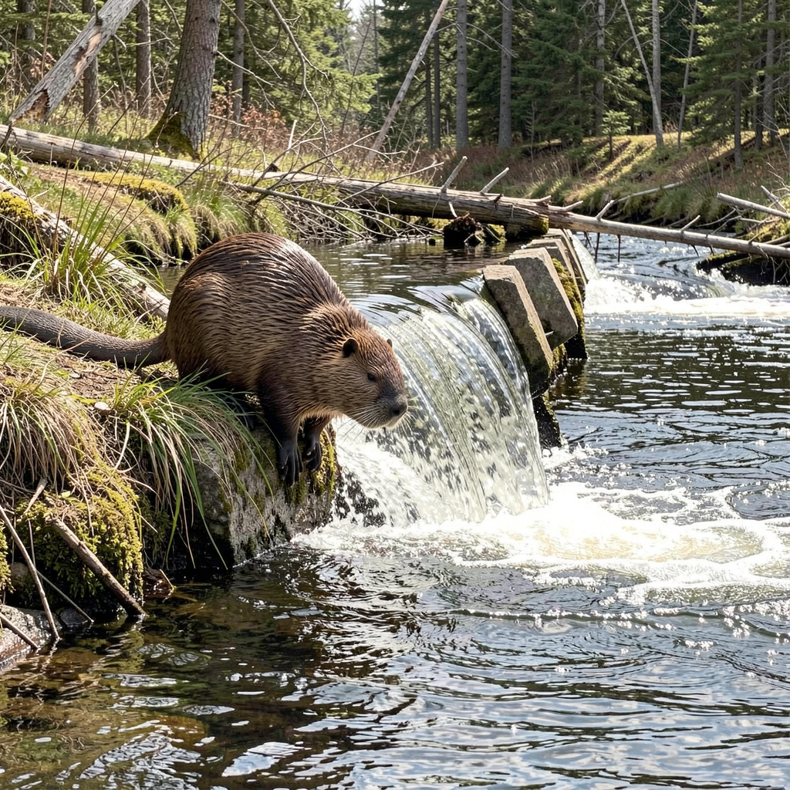

# Flux.2 Swift MLX - Examples Gallery

This directory contains example images and documentation for the Flux.2 Swift MLX framework.

## Available Models

| Model | Parameters | Speed | License | Documentation |
|-------|------------|-------|---------|---------------|
| **[Flux.2 Dev](flux2-dev/README.md)** | 32B | ~35 min/image | Non-commercial | High quality, detailed generation |
| **[Flux.2 Klein 4B](flux2-klein-4b/README.md)** | 4B | ~26s/image | Apache 2.0 | Fast, commercial-friendly |
| **[Flux.2 Klein 9B](flux2-klein-9b/README.md)** | 9B | ~56s/image | Non-commercial | Balance of quality and speed |

## Quick Comparison

| Feature | Flux.2 Dev | Klein 4B | Klein 9B |
|---------|------------|----------|----------|
| Parameters | 32B | 4B | 9B |
| Text Encoder | Mistral Small 3.2 | Qwen3-4B | Qwen3-8B |
| Default Steps | 50 | 4 (distilled) | 4 (distilled) |
| VRAM Usage | ~60GB | ~5-8GB | ~20GB |
| 1024x1024 Time | ~35 min | ~26s | ~56s |
| License | Non-commercial | **Apache 2.0** | Non-commercial |
| **Speedup** | 1x | **~80x** | **~38x** |

For detailed comparison, see [**Model Comparison**](comparison.md).

---

## Documentation Index

### Model-Specific Examples

- **[Flux.2 Dev Examples](flux2-dev/README.md)**
  - Text-to-Image (standard and with prompt upsampling)
  - Image-to-Image (artistic variation)
  - Multi-reference I2I (cat + hat + jacket)
  - Image interpretation (map to Paris photo)

- **[Flux.2 Klein 4B Examples](flux2-klein-4b/README.md)**
  - Fast T2I generation (4 steps)
  - Multiple resolutions (1024x1024, 1536x1024, 2048x2048)
  - Quantization comparison (bf16 vs qint8)
  - Prompt upsampling progression

- **[Flux.2 Klein 9B Examples](flux2-klein-9b/README.md)**
  - Better quality T2I generation (4 steps)
  - Multiple resolutions (1024x1024, 1536x1024, 2048x2048)
  - Prompt upsampling progression
  - Performance comparison with Klein 4B

### Comparisons

- **[Model Comparison](comparison.md)**
  - Performance benchmarks
  - Quality comparison
  - When to use each model
  - Recommended workflows

---

## Sample Outputs

### Flux.2 Dev (32B) - High Quality

| Text-to-Image | Image-to-Image |
|---------------|----------------|
|  |  |

*~35 min generation time, ~60GB VRAM*

### Flux.2 Klein 4B - Fast Generation

| 1024x1024 | 2048x2048 |
|-----------|-----------|
|  |  |

*~26s generation time, ~5-8GB VRAM*

### Flux.2 Klein 9B - Quality/Speed Balance

| 1024x1024 | 2048x2048 |
|-----------|-----------|
|  |  |

*~56s generation time (1024x1024), ~20GB VRAM*

Klein 9B offers better quality than Klein 4B while remaining much faster than Dev.

---

## Hardware Used

All examples generated on:
- **Machine:** MacBook Pro 14" (Nov 2023)
- **Chip:** Apple M3 Max
- **RAM:** 96 GB Unified Memory
- **macOS:** Tahoe 26.2

---

## Quick Start

```bash
# Klein 4B - Fastest generation (commercial OK)
flux2 t2i "a beaver building a dam" --model klein-4b

# Klein 9B - Better quality, still fast (non-commercial)
flux2 t2i "a beaver building a dam" --model klein-9b

# Dev - Maximum quality (requires 64GB+ RAM)
flux2 t2i "a cat wearing sunglasses" --model dev --steps 28

# See all options
flux2 --help
```

For complete CLI documentation, see [CLI.md](../CLI.md).
