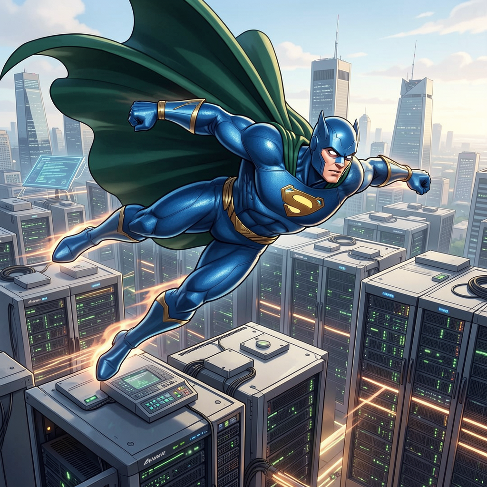
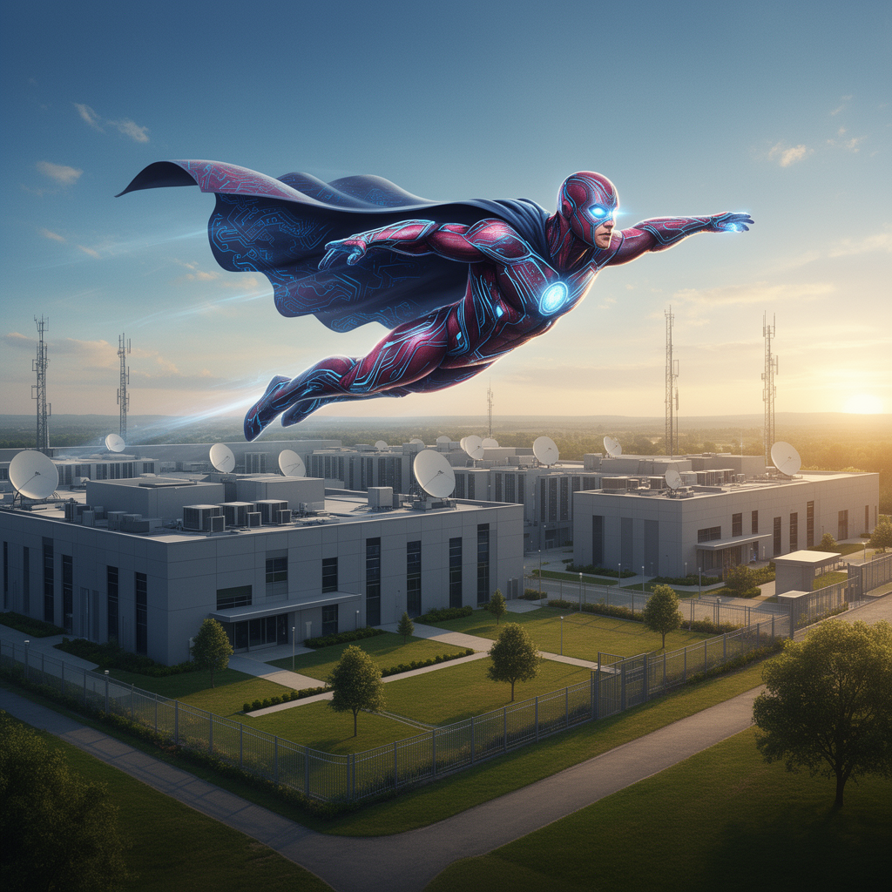

# Flux.2 Model Comparison: Dev vs Klein 4B vs Klein 9B

A side-by-side comparison of all Flux.2 model variants.

## Model Specifications

| Feature | Flux.2 Dev | Klein 4B | Klein 9B |
|---------|------------|----------|----------|
| **Parameters** | 32B | 4B | 9B |
| **Text Encoder** | Mistral Small 3.2 | Qwen3-4B | Qwen3-8B |
| **Default Steps** | 28 | 4 (distilled) | 4 (distilled) |
| **Default Guidance** | 4.0 | 1.0 | 1.0 |
| **VRAM Usage (qint8)** | ~33GB | ~4GB | ~9GB |
| **License** | Non-commercial | Apache 2.0 | Non-commercial |
| **1024x1024 Time** | ~35 min | ~26s | ~56s |

---

## When to Use Each Model

### Choose Flux.2 Dev (32B) when:
- **Maximum quality** is required
- Generating images for **professional** or **artistic** purposes
- You need **fine-grained control** over the generation process
- Memory is not a constraint (~33GB+ RAM recommended with qint8, ~17GB+ with int4)
- You can wait for longer generation times

### Choose Flux.2 Klein 4B when:
- **Speed** is a priority (~80x faster than Dev)
- You need **commercial use** (Apache 2.0 license)
- Working with **limited memory** (~8GB sufficient)
- **Iterating quickly** on prompts
- Generating **many images** in a batch

### Choose Flux.2 Klein 9B when:
- You want **better quality than Klein 4B** but faster than Dev
- You have **~20GB+ VRAM** available
- **Non-commercial** use is acceptable
- You want a **balance** between speed and quality

---

## Performance Comparison

| Metric | Flux.2 Dev (qint8) | Flux.2 Dev (bf16) | Klein 4B (qint8) | Klein 9B (qint8) |
|--------|-------------------|-------------------|-----------------|-----------------|
| **Total Time (1024x1024)** | ~30 min | ~30 min | ~28s | ~60s |
| **Steps** | 28 | 28 | 4 | 4 |
| **Per-Step Time** | ~1 min | ~1 min | ~5.5s | ~13s |
| **Transformer Memory** | ~33GB | ~62GB | ~3.9GB | ~9.2GB |
| **Speedup vs Dev** | 1x | 1x | **~64x** | **~30x** |

---

## Quality Comparison

### Flux.2 Dev (32B)
- Most **detailed textures** and **coherent compositions**
- Best **prompt following** for complex prompts
- Superior **fine details** (faces, hands, text)
- Ideal for **final production** images

### Flux.2 Klein 9B (9B)
- **Better quality** than Klein 4B
- Good **detail preservation**
- Reasonable **prompt adherence**
- Good balance of **speed and quality**

### Flux.2 Klein 4B (4B)
- **Fastest** generation
- Good for **simple to medium complexity** prompts
- Best for **quick iterations** and concept exploration
- Only option for **commercial use** (Apache 2.0)

---

## Visual Quality Comparison

**Prompt:** `"a superhero flying over a datacenter"`

All images generated at 1024×1024 with seed=42 for direct comparison.

### Without Prompt Upsampling

| Klein 4B (bf16) | Klein 4B (qint8) | Klein 9B (bf16) | Dev (qint8) | Dev (bf16) |
|-----------------|------------------|-----------------|-------------|------------|
|  |  |  |  |  |
| **25.3s** | **27.2s** | **53.9s** | **30m 15s** | **29m 47s** |

### With Prompt Upsampling

| Klein 4B (bf16) | Klein 4B (qint8) | Klein 9B (bf16) | Dev (qint8) | Dev (bf16) |
|-----------------|------------------|-----------------|-------------|------------|
|  |  |  |  |  |
| **29.3s** | **31.0s** | **63.5s** | **31m 49s** | **26m 39s** |

### Timing Summary

| Model | Without Upsampling | With Upsampling | Overhead |
|-------|-------------------|-----------------|----------|
| Klein 4B (bf16) | 25.3s | 29.3s | +4.0s |
| Klein 4B (qint8) | 27.2s | 31.0s | +3.8s |
| Klein 9B (bf16) | 53.9s | 63.5s | +9.6s |
| Dev (qint8) | 30m 15s | 31m 49s | +1m 34s |
| Dev (bf16) | 29m 47s | 26m 39s | -3m 8s |

> **Note:** Prompt upsampling adds overhead for VLM inference but typically improves detail and prompt adherence.

---

## Quantization Options

### Flux.2 Dev (Transformer memory)

| Quantization | Memory | Quality |
|--------------|--------|---------|
| bf16 | ~61.5GB | Best (requires 96GB+ RAM) |
| qint8 | ~32.7GB | Excellent (recommended) |
| int4 | ~17.3GB | Very Good (32GB+ Macs) |

### Flux.2 Klein 4B (Transformer memory)

| Quantization | Memory | Speed (4 steps) | Quality |
|--------------|--------|-----------------|---------|
| bf16 | ~7.4GB | ~26s | Best |
| qint8 | ~3.9GB | ~28s | Excellent |
| int4 | ~2.1GB | ~30s | Very Good |

### Flux.2 Klein 9B (Transformer memory)

| Quantization | Memory | Speed (4 steps) | Quality |
|--------------|--------|-----------------|---------|
| bf16 | ~17.3GB | ~55s | Best |
| qint8 | ~9.2GB | ~60s | Excellent |
| int4 | ~4.9GB | ~65s | Very Good |

> All models support on-the-fly quantization. See [benchmark results](quantization-benchmark/) for detailed measurements.

---

## CLI Examples

### Same Prompt, Different Models

**Prompt:** `"a beaver building a dam"`

#### Flux.2 Dev
```bash
flux2 t2i "a beaver building a dam" \
  --model dev \
  --steps 28 \
  -o beaver_dev.png
# Time: ~30 min, Transformer: ~33GB (qint8)
```

#### Klein 4B
```bash
flux2 t2i "a beaver building a dam" \
  --model klein-4b \
  -o beaver_klein4b.png
# Time: ~26s, Memory: ~5GB
```

#### Klein 9B
```bash
flux2 t2i "a beaver building a dam" \
  --model klein-9b \
  -o beaver_klein9b.png
# Time: ~56s, Memory: ~20GB
```

---

## Recommended Workflows

### Iterative Development
1. **Explore** with Klein 4B (fastest iterations)
2. **Refine** with Klein 9B (better quality check)
3. **Final render** with Dev for maximum quality

### Production (Commercial)
- Use **Klein 4B** only (Apache 2.0 license)
- Dev and Klein 9B are non-commercial only

### Production (Non-Commercial)
- Use **Dev** for hero images
- Use **Klein 9B** for secondary images needing quality
- Use **Klein 4B** for rapid variations and exploration

---

## Image-to-Image Support

All models support I2I with VAE-encoded reference images and unique T-coordinate position IDs.

### Reference Image Limits

| Model | Transformer (qint8) | Max Images | Max Tokens |
|-------|---------------------|------------|------------|
| Klein 4B | ~3.9GB | 2-3 | ~16k |
| Klein 9B | ~9.2GB | 3-5 | ~25k |
| Dev | ~32.7GB | 5-10 | ~45k |

Each 1024×1024 reference image consumes ~4,096 tokens.

### VLM Capabilities

| Feature | Dev | Klein 4B/9B |
|---------|-----|-------------|
| Text Encoder | Mistral VLM | Qwen3 LLM |
| Native Vision | ✅ Yes | ❌ No |
| T2I Upsampling | Vision-aware | Text-only |
| I2I Upsampling | **Analyzes refs** ✅ | **Analyzes refs** ✅ |
| --interpret | **VLM analysis** ✅ | **VLM analysis** ✅ |

> **Note:** For Klein, when using `--upsample-prompt` with I2I or `--interpret`, the pipeline temporarily loads Mistral VLM to analyze images, then unloads it and uses Qwen3 for text encoding. This provides the same vision capabilities as Dev.

---

## Hardware Requirements

| Model | Minimum RAM | Recommended RAM |
|-------|-------------|-----------------|
| Flux.2 Dev (bf16) | 96GB | 128GB+ |
| Flux.2 Dev (qint8) | 64GB | 96GB+ |
| Klein 9B (bf16) | 32GB | 48GB+ |
| Klein 4B (qint8) | 16GB | 32GB+ |
| Klein 4B (bf16) | 16GB | 32GB+ |

---

## See Also

- [Flux.2 Dev Examples](flux2-dev/README.md)
- [Flux.2 Klein 4B Examples](flux2-klein-4b/README.md)
- [Flux.2 Klein 9B Examples](flux2-klein-9b/README.md)
- [CLI Documentation](../CLI.md)
