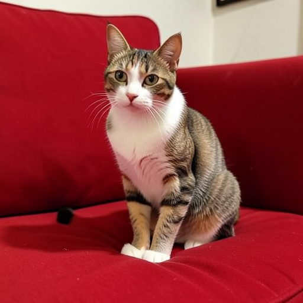
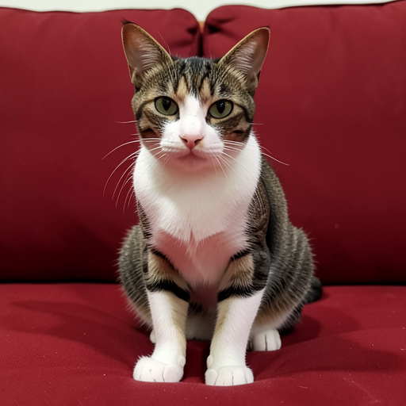

# LoRA Evaluation Pipeline

Automatically evaluate the gap between a reference image and the base model output, then get recommended LoRA training parameters.

> **Help Wanted**: The parameter recommendation weights are based on initial heuristics and will be refined over time with more user feedback and real-world training results. If you run evaluations and train LoRAs, please share your results to help improve the recommendations! See [Contributing](#contributing).

## How It Works

```
Reference Image ──→ VLM Describes ──→ Base Model Generates Baseline ──→ VLM Compares ──→ Recommendation
```

The pipeline uses the **Qwen3.5-4B VLM** (auto-downloaded, ~3GB) to:

1. **Analyze** your reference image and produce a detailed FLUX.2-compatible description
2. **Generate** a baseline image using the base model (Klein 4B/9B or Dev) from that description
3. **Compare** the reference vs baseline on two criteria:
   - **Scene** (0-10): content fidelity — same subjects, actions, objects, setting
   - **Style** (0-10): visual fidelity — same art style, composition, colors, lighting, textures
4. **Recommend** LoRA training parameters based on the gap analysis

## Quick Start

```bash
flux2 evaluate-lora \
  --image your_reference.png \
  --model klein-4b \
  --trigger-word "xyz_mystyle" \
  --output-dir ./my_eval
```

Output:

```
my_eval/
├── reference.png              # Your original image (copy)
├── baseline.png               # What the base model generates
├── prompt.txt                 # VLM-generated description used as prompt
├── report.txt                 # Full comparison report with scores
└── recommended_config.yaml    # Ready-to-use training config
```

Then train directly:
```bash
flux2 train-lora --config my_eval/recommended_config.yaml
```

## Example: Cat on Red Couch

### Reference vs Baseline

| Reference (input) | Baseline (Klein 4B, no LoRA) |
|:--:|:--:|
|  |  |

### VLM-Generated Prompt

> A single domestic shorthair cat with a tabby-and-white coat sits attentively on the plush, deep red upholstery of a sofa. The cat is positioned in a seated posture with its front paws planted firmly on the fabric, facing directly toward the camera with wide, alert green eyes and perked ears. Its fur features distinct dark brown and black stripes on the head, back, and legs, contrasting with a clean white chest, muzzle, and paws.

### Comparison Scores

| Criterion | Score | Reason |
|-----------|:-----:|--------|
| **Scene** | 9/10 | Accurately preserves the core scene elements: tabby and white cat, alert seated pose, red sofa. Spatial relationship maintained. |
| **Style** | 9/10 | Faithfully replicates the photographic style, color palette, lighting conditions, and texture of the fabric with high fidelity. |

### Recommendation

Since the base model already produces a very faithful result (9/10 on both criteria), only a **light LoRA** is needed:

| Parameter | Value | Why |
|-----------|-------|-----|
| **Steps** | 150 | Very small gap — minimal training needed |
| **Rank** | 8 | Low capacity sufficient for fine-tuning |
| **Timestep Sampling** | `balanced` | Both scene and style are close — uniform refinement |
| **DOP** | No | Base model already captures the subject well |
| **Target Layers** | `all` | Full coverage at low rank is affordable |
| **Learning Rate** | 1e-4 | Standard LoRA learning rate |
| **Loss Weighting** | `bell_shaped` | Focus on medium denoising steps |
| **Gradient Checkpointing** | No | Not needed for Klein 4B |

### Generated YAML Config

```yaml
# LoRA Training Config — Auto-generated by evaluate-lora
model:
  name: klein-4b
  quantization: bf16

lora:
  rank: 8
  alpha: 8.0
  target_layers: all

training:
  batch_size: 1
  max_steps: 150
  warmup_steps: 15
  learning_rate: 0.0001
  weight_decay: 0.0001

loss:
  weighting: bell_shaped
  timestep_sampling: balanced

memory:
  gradient_checkpointing: false
  cache_latents: true
  cache_text_embeddings: true
  bucketing:
    enabled: true
    resolutions: [512, 768]

dataset:
  path: ./dataset
  trigger_word: xyz_cat
```

## Recommendation Logic

The gap between scores determines the training effort:

| Scene | Style | Diagnosis | Steps | Rank | Timestep | DOP |
|:-----:|:-----:|-----------|:-----:|:----:|----------|:---:|
| 8-10 | 8-10 | Model already good | 100-200 | 8 | uniform | No |
| 6-8 | 6-8 | Moderate gap | 250-500 | 16 | balanced | Optional |
| 4-6 | 4-6 | Significant gap | 500-1000 | 32 | balanced | Yes |
| <4 | <4 | Major gap | 1000-2000 | 48-64 | content/style | Yes |
| Low | High | Style OK, learn scene | 500-1000 | 32 | **content** | Yes |
| High | Low | Scene OK, learn style | 500-1000 | 32 | **style** | No |

## CLI Options

```
flux2 evaluate-lora [OPTIONS] --image <path>

Options:
  --image <path>              Reference image (required)
  --model <variant>           klein-4b (default), klein-9b, dev
  --seed <n>                  Random seed for baseline (default: 42)
  -w, --width <n>             Baseline width (default: 512)
  -h, --height <n>            Baseline height (default: 512)
  --output-dir <path>         Output directory (default: ./evaluation)
  --trigger-word <word>       Trigger word for YAML config (default: xyz_trigger)
  --dataset-path <path>       Dataset path in YAML (default: ./dataset)
  --transformer-quant <q>     bf16, qint8, int4 (default: qint8)
  --hf-token <token>          HuggingFace token for gated models
```

## As a Library

```swift
import Flux2Core
import FluxTextEncoders

let evaluator = LoRAEvaluator()
let result = try await evaluator.evaluate(
    referenceImage: myImage,
    model: .klein4B,
    seed: 42
) { progress in
    print(progress)
}

// Access all results
let description = result.prompt           // VLM description
let baseline = result.baselineImage       // Generated baseline
let scene = result.sceneScore             // 0-10
let style = result.styleScore             // 0-10
let yaml = result.recommendation.toYAML(  // Ready YAML config
    model: .klein4B, triggerWord: "xyz_cat"
)
```

## Requirements

- **VLM**: Qwen3.5-4B (~3GB, auto-downloaded on first use)
- **Base model**: Klein 4B (~4GB), Klein 9B (~9GB), or Dev (~33GB)
- **RAM**: 16GB minimum (Klein 4B), 32GB+ recommended
- **Time**: ~30s for Klein 4B evaluation, ~2min for Dev

## Contributing

The recommendation heuristics (score → parameters mapping) are initial estimates. To help improve them:

1. Run `evaluate-lora` on your reference images
2. Train with the recommended config
3. Compare the trained LoRA output quality
4. Report whether the recommendations were:
   - Too aggressive (overfitting, too many steps/rank)
   - Too conservative (underfitting, not enough steps/rank)
   - Just right

Open an issue with your evaluation report (`report.txt`) and training results. This feedback will directly improve the recommendation engine for everyone.
