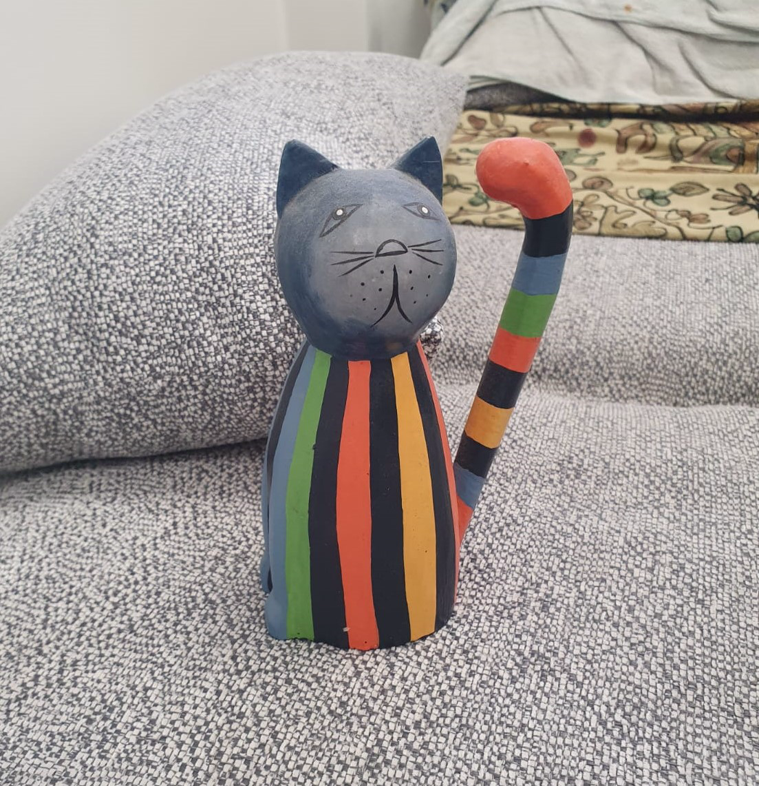
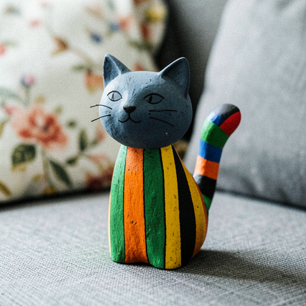

# LoRA Evaluation Pipeline

Automatically evaluate the gap between a reference image and the base model output, then get recommended LoRA training parameters.

> **Help Wanted**: The parameter recommendation weights are based on initial heuristics and will be refined over time with more user feedback and real-world training results. If you run evaluations and train LoRAs, please share your results to help improve the recommendations! See [Contributing](#contributing).

## How It Works

```
Reference Image ──→ VLM Describes ──→ Base Model Generates Baseline ──→ VLM Compares ──→ Recommendation
```

The pipeline uses the **Qwen3.5-4B VLM** (auto-downloaded, ~3GB) to:

1. **Analyze** your reference image and produce a detailed FLUX.2-compatible description
2. **Generate** a baseline image using the base model (Klein 4B/9B or Dev) from that description
3. **Compare** the reference vs baseline on two criteria:
   - **Scene** (0-10): content fidelity — same subjects, actions, objects, setting
   - **Style** (0-10): visual fidelity — same art style, composition, colors, lighting, textures
4. **Recommend** LoRA training parameters based on the gap analysis

## Quick Start

```bash
flux2 evaluate-lora \
  --image your_reference.png \
  --name "My Subject" \
  --lora-description "A specific blue ceramic vase with gold leaf pattern" \
  --model klein-4b \
  --output-dir ./my_eval
```

Output:

```
my_eval/
├── reference.png              # Your original image (copy)
├── baseline.png               # What the base model generates
├── prompt.txt                 # VLM-generated description used as prompt
├── report.txt                 # Full comparison report with scores
└── recommended_config.yaml    # Ready-to-use training config
```

Then train directly:
```bash
flux2 train-lora --config my_eval/recommended_config.yaml
```

## Example: Cat on Red Couch (Specific Subject)

```bash
flux2 evaluate-lora \
  --image comparison2/standard_qwen3.png \
  --name "Tabby Cat" \
  --lora-description "A specific tabby-and-white domestic cat with brown and black stripes, sitting on a red couch" \
  --model klein-4b
```

### Reference vs Baseline

| Reference (input) | Baseline (Klein 4B, no LoRA) |
|:--:|:--:|
|  |  |

### Auto-detected Settings

The LLM analyzes the LoRA name and description to suggest:
- **Trigger word**: `sks` — auto-detected as a subject LoRA
- **DOP**: not recommended — generic cat subject, not a specific instance

### Comparison Scores (context-aware)

| Criterion | Score | Reason |
|-----------|:-----:|--------|
| **Scene** | 9/10 | Accurately captures the core subject: a tabby-and-white cat sitting on a red couch. Pose, color palette, and spatial arrangement are correctly reproduced. |
| **Style** | 8/10 | Very close rendering style and lighting. Minor discrepancies in the cat's facial features (eye shape, nose) — critical for a high-fidelity LoRA. |

### Recommendation

| Parameter | Value | Why |
|-----------|-------|-----|
| **Steps** | 150 | Small gap — fine-tuning facial details only |
| **Rank** | 8 | Low capacity sufficient |
| **Timestep** | `balanced` | Both scene and style are close |
| **DOP** | No | Auto-detected: generic cat subject |
| **Trigger word** | `sks` | Auto-detected from context |
```

---

## Example: Hand-Painted Cat Toy (Unique Object)

A specific, unique object — a hand-carved wooden cat figurine with colorful stripes. The evaluation uses LoRA context to focus the comparison on what matters for training.

```bash
flux2 evaluate-lora \
  --image examples/cat-toy/train/6.jpeg \
  --name "Cat Toy" \
  --lora-description "A specific hand-painted wooden cat figurine with colorful vertical stripes" \
  --model klein-4b
```

### Reference vs Baseline

| Reference (input) | Baseline (Klein 4B, no LoRA) |
|:--:|:--:|
|  |  |

The base model generates a similar concept (wooden cat toy with stripes) but with **wrong specific details** — different stripe colors, wrong proportions, missing features.

### Comparison Scores (context-aware)

| Criterion | Score | Reason |
|-----------|:-----:|--------|
| **Scene** | 6/10 | Correctly identifies the subject as a hand-painted wooden cat figurine. But the bell on neck is missing, tail pattern (coral-pink ball tip with alternating stripes) differs significantly. |
| **Style** | 5/10 | Rendering style is similar (hand-painted wood), but color palette and proportions are inaccurate. Different stripe colors, head and tail proportions distorted. |

The **LoRA context** makes the VLM focus on the specific details that matter: the exact stripe pattern, the coral-pink tail tip, the bell — details the base model doesn't know. Without context, the same comparison scored 9/10 because "it's a cat toy with stripes" was enough.

### Recommendation

| Parameter | Value | Why |
|-----------|-------|-----|
| **Steps** | 750 | Significant gap in both scene and style details |
| **Rank** | 32 | Need enough capacity to learn specific stripe patterns and proportions |
| **Timestep** | `balanced` | Both content (specific object) and style (colors, proportions) need work |
| **DOP** | Yes | Preserve general "cat toy" concept while learning this specific one |
| **Trigger word** | `sks` | Auto-detected by LLM analysis |

This demonstrates the value of providing LoRA context: the evaluation focuses on what the training actually needs to achieve, not just generic image similarity.

---

## Recommendation Logic

The gap between scores determines the training effort:

| Scene | Style | Diagnosis | Steps | Rank | Timestep | DOP |
|:-----:|:-----:|-----------|:-----:|:----:|----------|:---:|
| 8-10 | 8-10 | Model already good | 100-200 | 8 | uniform | No |
| 6-8 | 6-8 | Moderate gap | 250-500 | 16 | balanced | Optional |
| 4-6 | 4-6 | Significant gap | 500-1000 | 32 | balanced | Yes |
| <4 | <4 | Major gap | 1000-2000 | 48-64 | content/style | Yes |
| Low | High | Style OK, learn scene | 500-1000 | 32 | **content** | Yes |
| High | Low | Scene OK, learn style | 500-1000 | 32 | **style** | No |

## CLI Options

```
flux2 evaluate-lora [OPTIONS] --image <path> --name <name> --lora-description <desc>

Options:
  --image <path>              Reference image (required)
  --name <name>               LoRA name, e.g., "Cat Toy" (required)
  --lora-description <desc>   What the LoRA should learn (required)
  --model <variant>           klein-4b (default), klein-9b, dev
  --seed <n>                  Random seed for baseline (default: 42)
  -w, --width <n>             Baseline width (default: 512)
  -h, --height <n>            Baseline height (default: 512)
  --output-dir <path>         Output directory (default: ./evaluation)
  --dataset-path <path>       Dataset path in YAML (default: ./dataset)
  --transformer-quant <q>     bf16, qint8, int4 (default: qint8)
  --hf-token <token>          HuggingFace token for gated models
```

The trigger word and DOP settings are **auto-detected** by the LLM from the name and description — no need to specify them manually.

## As a Library

```swift
import Flux2Core
import FluxTextEncoders

let context = LoRAContext(name: "Cat Toy", description: "A hand-painted wooden cat figurine with colorful stripes")
let evaluator = LoRAEvaluator()
let result = try await evaluator.evaluate(
    referenceImage: myImage,
    context: context,
    model: .klein4B,
    seed: 42
) { progress in
    print(progress)
}

// Access all results
let prompt = result.prompt                // VLM description
let baseline = result.baselineImage       // Generated baseline
let trigger = result.triggerWord           // Auto-detected trigger word
let scene = result.sceneScore             // 0-10
let style = result.styleScore             // 0-10
let yaml = result.recommendation.toYAML(  // Ready YAML config
    model: .klein4B, triggerWord: trigger
)
```

## Requirements

- **VLM**: Qwen3.5-4B (~3GB, auto-downloaded on first use)
- **Base model**: Klein 4B (~4GB), Klein 9B (~9GB), or Dev (~33GB)
- **RAM**: 16GB minimum (Klein 4B), 32GB+ recommended
- **Time**: ~30s for Klein 4B evaluation, ~2min for Dev

## Contributing

The recommendation heuristics (score → parameters mapping) are initial estimates. To help improve them:

1. Run `evaluate-lora` on your reference images
2. Train with the recommended config
3. Compare the trained LoRA output quality
4. Report whether the recommendations were:
   - Too aggressive (overfitting, too many steps/rank)
   - Too conservative (underfitting, not enough steps/rank)
   - Just right

Open an issue with your evaluation report (`report.txt`) and training results. This feedback will directly improve the recommendation engine for everyone.
