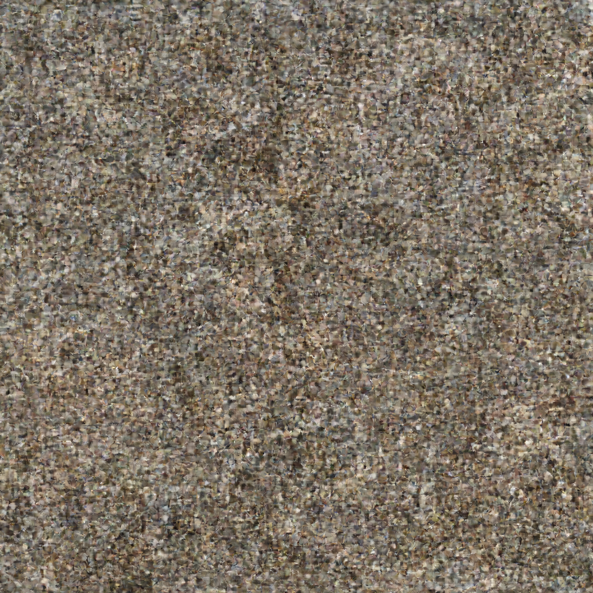
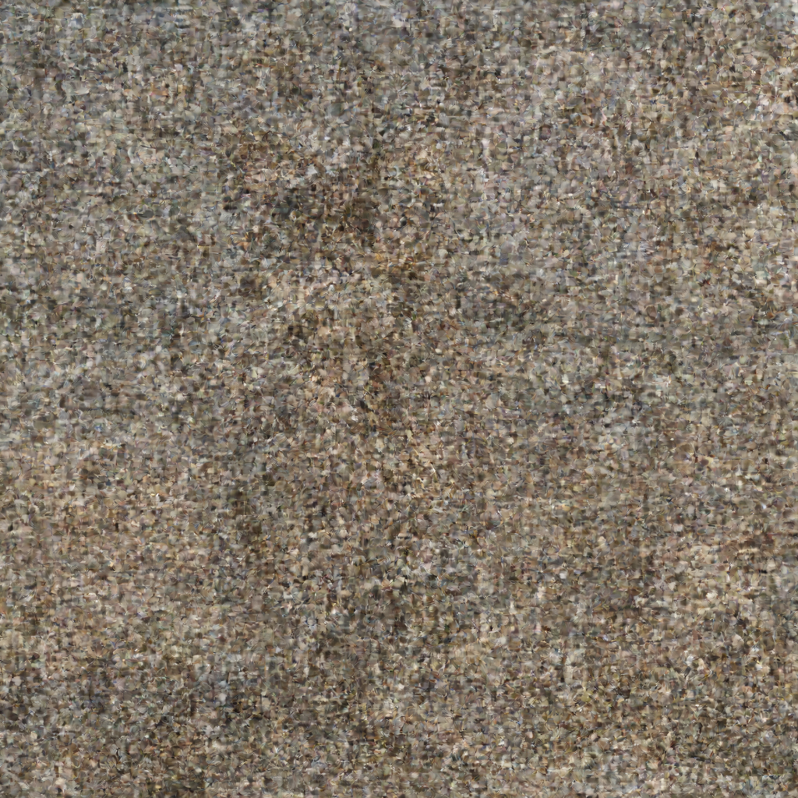
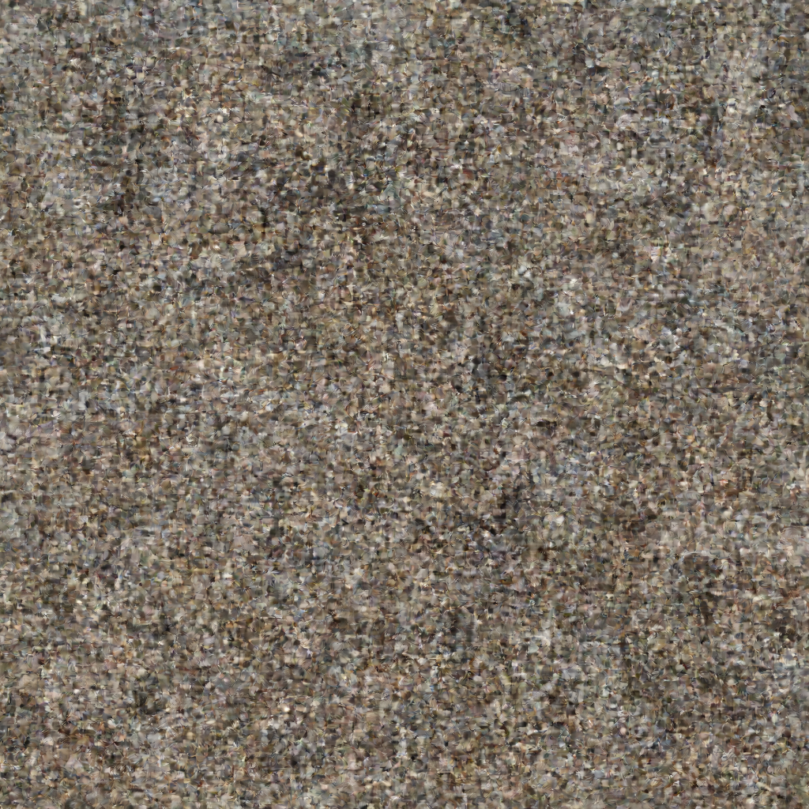
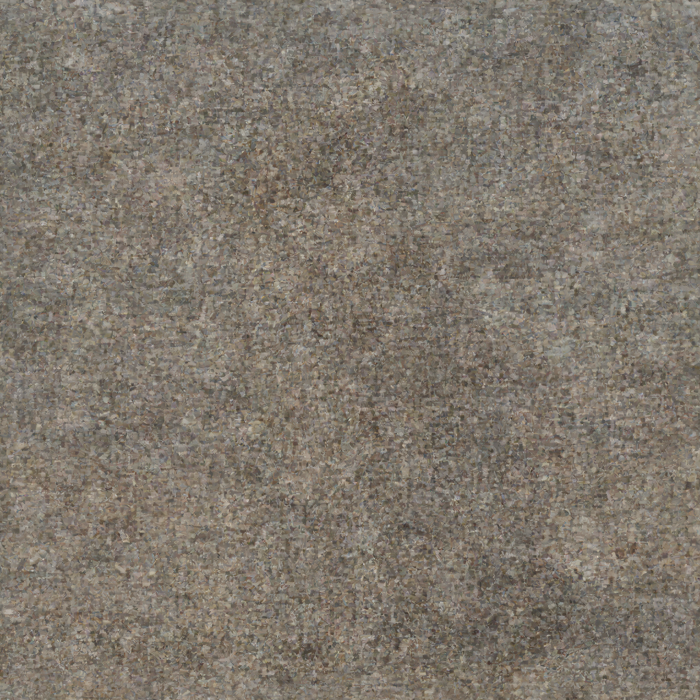
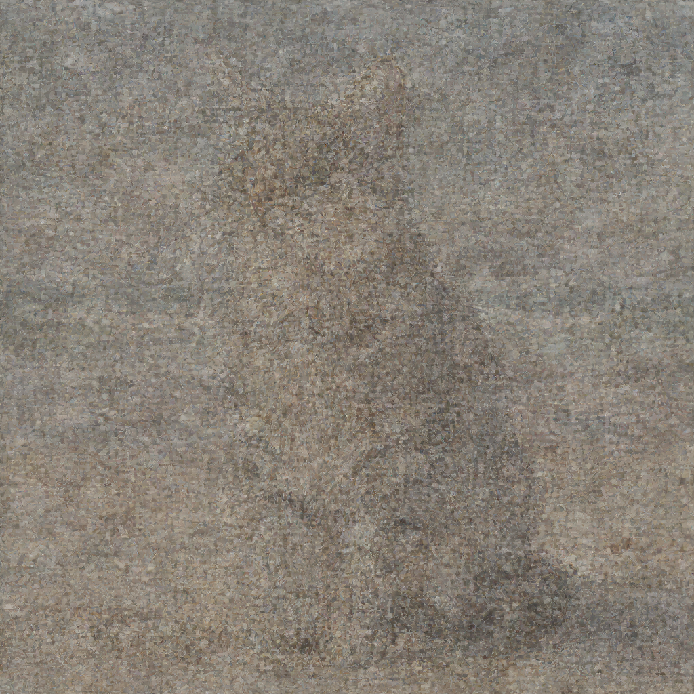
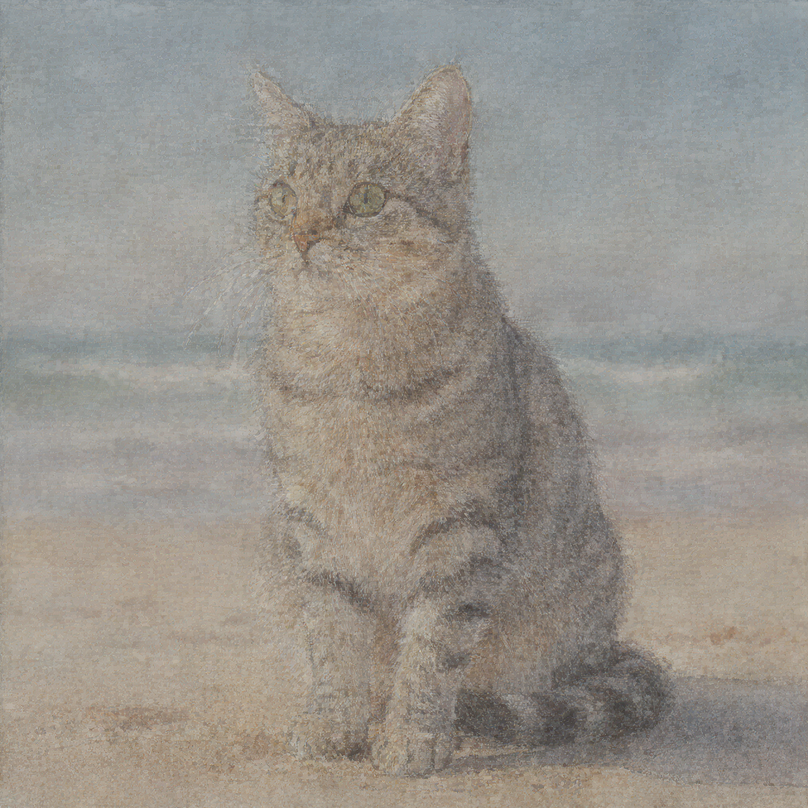

# Flux.2 Dev Examples

Examples generated with **Flux.2 Dev** (32B parameters) on Mac with MLX.

## Model Specifications

| Feature | Value |
|---------|-------|
| Parameters | 32B |
| Default Steps | 50 |
| Default Guidance | 4.0 |
| Text Encoder | Mistral Small 3.2 |
| Transformer (qint8) | ~33GB |
| License | Non-commercial |
| 1024×1024 Time | ~35 min |

---

## Text-to-Image Examples

### Cat on Beach - Standard Generation

**Prompt:** `"a cat wearing sunglasses, sitting on a sunny beach"`

**Parameters:**
- Size: 1024x1024
- Steps: 28
- Guidance: 4.0
- Seed: random
- Prompt upsampling: disabled

#### Progression

| Step 7 | Step 14 | Step 21 | Final (Step 28) |
|--------|---------|---------|-----------------|
|  |  |  |  |

#### Performance Report

```
╔══════════════════════════════════════════════════════════════╗
║                  FLUX.2 PERFORMANCE REPORT                   ║
╠══════════════════════════════════════════════════════════════╣
📊 PHASE TIMINGS:
────────────────────────────────────────────────────────────────
  1. Load Text Encoder                4.08s    0.2%
  2. Text Encoding                    2.41s    0.1%
  3. Unload Text Encoder            113.7ms    0.0%
  4. Load Transformer                23.63s    1.1%
  5. Load VAE                        80.9ms    0.0%
  6. Denoising Loop               34m 19.2s   98.5% ███████████████████
  7. VAE Decode                       1.94s    0.1%
  8. Post-processing                  1.5ms    0.0%
────────────────────────────────────────────────────────────────
  TOTAL                           34m 51.4s  100.0%

📈 DENOISING STEP STATISTICS:
────────────────────────────────────────────────────────────────
  Steps:              28
  Total denoising:    34m 19.2s
  Average per step:   1m 13.1s
  Fastest step:       52.02s
  Slowest step:       2m 49.3s
╚══════════════════════════════════════════════════════════════╝
```

**Command:**
```bash
flux2 t2i "a cat wearing sunglasses, sitting on a sunny beach" \
  --width 1024 --height 1024 --steps 28 \
  --checkpoint 7 --profile \
  -o cat_beach.png
```

---

### Cat on Beach - With Prompt Upsampling

**Original prompt:** `"a cat wearing sunglasses, sitting on a sunny beach"`

**Enhanced prompt (by Mistral):** *(generated automatically with `--upsample-prompt`)*

The prompt upsampling feature uses Mistral to enhance the original prompt with more visual details before encoding, potentially improving image quality and coherence.

**Parameters:**
- Size: 1024x1024
- Steps: 28
- Guidance: 4.0
- Seed: random
- Prompt upsampling: **enabled**

#### Progression

| Step 7 | Step 14 | Step 21 | Final (Step 28) |
|--------|---------|---------|-----------------|
|  |  |  |  |

#### Performance Report (with prompt upsampling)

```
╔══════════════════════════════════════════════════════════════╗
║                  FLUX.2 PERFORMANCE REPORT                   ║
╠══════════════════════════════════════════════════════════════╣
📊 PHASE TIMINGS:
────────────────────────────────────────────────────────────────
  1. Load Text Encoder                4.47s    0.2%
  2. Text Encoding                 2m 28.7s    7.7% █
  3. Unload Text Encoder            289.7ms    0.0%
  4. Load Transformer                30.30s    1.6%
  5. Load VAE                        83.1ms    0.0%
  6. Denoising Loop               29m 16.0s   90.4% ██████████████████
  7. VAE Decode                       1.86s    0.1%
  8. Post-processing                  1.5ms    0.0%
────────────────────────────────────────────────────────────────
  TOTAL                           32m 21.7s  100.0%

📈 DENOISING STEP STATISTICS:
────────────────────────────────────────────────────────────────
  Steps:              28
  Total denoising:    29m 7.4s
  Average per step:   1m 2.4s
  Fastest step:       54.11s
  Slowest step:       1m 48.4s

  📐 Estimated times for different step counts:
     10 steps: 10m 24.1s
     20 steps: 20m 48.2s
     28 steps: 29m 7.4s
     50 steps: 52m 0.4s

💡 INSIGHTS:
────────────────────────────────────────────────────────────────
  Bottleneck: 6. Denoising Loop (90.4% of total)
  Overhead (non-denoising): 3m 5.7s

╚══════════════════════════════════════════════════════════════╝
```

**Note:** Text encoding takes longer with prompt upsampling (~2.5 min vs ~2.4s) because Mistral generates an enhanced prompt before encoding.

**Command:**
```bash
flux2 t2i "a cat wearing sunglasses, sitting on a sunny beach" \
  --upsample-prompt \
  --width 1024 --height 1024 --steps 28 \
  --checkpoint 7 --profile \
  -o cat_upsampled.png
```

---

## Image-to-Image Examples

### I2I - Artistic Variation (Watercolor)

**Prompt:** `"transform into a beautiful watercolor painting with soft brushstrokes and vibrant colors"`

**Reference:** Cat on beach (single image)

**Parameters:**
- Size: 1024x1024
- Steps: 28 effective
- Strength: 0.7 (30% original preserved)
- Prompt upsampling: disabled

| Step 7 | Step 14 | Step 21 | Final (Step 28) |
|--------|---------|---------|-----------------|
|  |  |  |  |

**Command:**
```bash
flux2 i2i "transform into a beautiful watercolor painting with soft brushstrokes and vibrant colors" \
  --images cat_beach_upsampled.png \
  --strength 0.7 --steps 28 \
  --checkpoint 7 --profile \
  --output artistic_variation.png
```

> **Note:** The I2I mode transforms the input image by encoding it with VAE, adding noise based on strength, and denoising with the text prompt as guidance. Lower strength preserves more of the original image.

---

### Image Interpretation: Map to Paris Photo (I2I + T2I Upsampling Chain)

This example demonstrates the **`--interpret`** feature which chains I2I and T2I upsampling:

1. **I2I Upsampling**: VLM analyzes the image and interprets the user's request
2. **T2I Upsampling**: The interpretation is enriched into a detailed generation prompt
3. **Generation**: Flux.2 generates a new image based on the enriched prompt

**Prompt:** `"Describe what the red arrow is seeing"`

**Input:** A map of Paris with a red arrow pointing from Tour Eiffel towards Place de la Bastille

| Input Map | Generated Photo |
|-----------|-----------------|
|  |  |

**VLM Interpretation (Step 1 - I2I):**
> "Highlight the view from the Eiffel Tower towards Place de la Bastille, keeping the red arrow direction unchanged. Enhance visibility of landmarks along this axis including Musée d'Orsay, Palais Garnier, and Place de la Bastille..."

**Enriched Prompt (Step 2 - T2I):**
> "The red arrow is directed towards a panoramic view from the Eiffel Tower, capturing a sweeping perspective of Parisian landmarks along its axis. The view should prominently feature the Musée d'Orsay, a grand, U-shaped Beaux-Arts building with a distinctive clock facade, situated along the left bank of the Seine River..."

**Generation Progress:**

| Step 7 (25%) | Step 14 (50%) | Step 21 (75%) | Step 28 (100%) |
|--------------|---------------|---------------|----------------|
|  |  |  |  |

**Command:**
```bash
flux2 t2i "Describe what the red arrow is seeing" \
  --interpret map.png \
  --width 1024 --height 1024 \
  --steps 28 --checkpoint 7 \
  -o output.png
```

> **Key insight:** The `--interpret` flag enables VLM image understanding. Instead of just describing the map, the model interprets the user's semantic intent ("what the arrow is seeing") and generates a photorealistic image of the Parisian landmarks along the arrow's path.

See [i2i_map_paris/README.md](i2i_map_paris/README.md) for full technical details.

---

### Multi-Reference I2I: Cat + Hat + Jacket

This example demonstrates **multi-reference Image-to-Image** where elements from multiple images are combined based on explicit prompt instructions.

**Prompt:** `"Modify the cat on image 1 to wear the hat from image 2 and the jacket from image 3"`

**Reference Images:**

| Image 1 (Cat) | Image 2 (Hat) | Image 3 (Jacket) |
|---------------|---------------|------------------|
|  |  |  |

**Parameters:**
- Size: 1024x1024
- Steps: 28
- Strength: 0.7
- Generation Time: ~3.1 hours

**Generation Progress:**

| Step 7 (25%) | Step 14 (50%) | Step 21 (75%) | Step 28 (100%) |
|--------------|---------------|---------------|----------------|
|  |  |  |  |

**Final Output:**


**Command:**
```bash
flux2 i2i "Modify the cat on image 1 to wear the hat from image 2 and the jacket from image 3" \
  --images cat.png --images hat.jpg --images jacket.jpg \
  --strength 0.7 --steps 28 \
  --checkpoint 7 -o output.png
```

> **Key insight:** The prompt explicitly references images by number ("image 1", "image 2", "image 3"). The model uses multi-reference conditioning where each image gets unique T-coordinates, allowing the transformer to distinguish and extract specific elements from each reference.

See [i2i_cat_hat_jacket/README.md](i2i_cat_hat_jacket/README.md) for full technical details.

---

## CLI Commands Summary

```bash
# Standard T2I generation
flux2 t2i "a cat wearing sunglasses, sitting on a sunny beach" \
  --width 1024 --height 1024 --steps 28 \
  --checkpoint 7 -o cat_beach.png

# T2I with prompt upsampling
flux2 t2i "a cat wearing sunglasses" \
  --upsample-prompt \
  --width 1024 --height 1024 --steps 28 \
  -o cat_upsampled.png

# I2I artistic transformation
flux2 i2i "transform into watercolor painting" \
  --images input.png --strength 0.7 \
  --steps 28 -o watercolor.png

# T2I with image interpretation (VLM)
flux2 t2i "describe what you see" \
  --interpret reference.png \
  --width 1024 --height 1024 --steps 28 \
  -o interpreted.png

# Multi-reference I2I (combine elements from multiple images)
flux2 i2i "Modify the cat on image 1 to wear the hat from image 2 and the jacket from image 3" \
  --images cat.png --images hat.jpg --images jacket.jpg \
  --strength 0.7 --steps 28 \
  -o combined.png
```

---

## Hardware

- **Machine:** MacBook Pro 14" (Nov 2023)
- **Chip:** Apple M3 Max
- **RAM:** 96 GB Unified Memory
- **macOS:** Tahoe 26.2
- **Quantization:** 8-bit text encoder + qint8 transformer (~33GB transformer, ~57GB peak)
