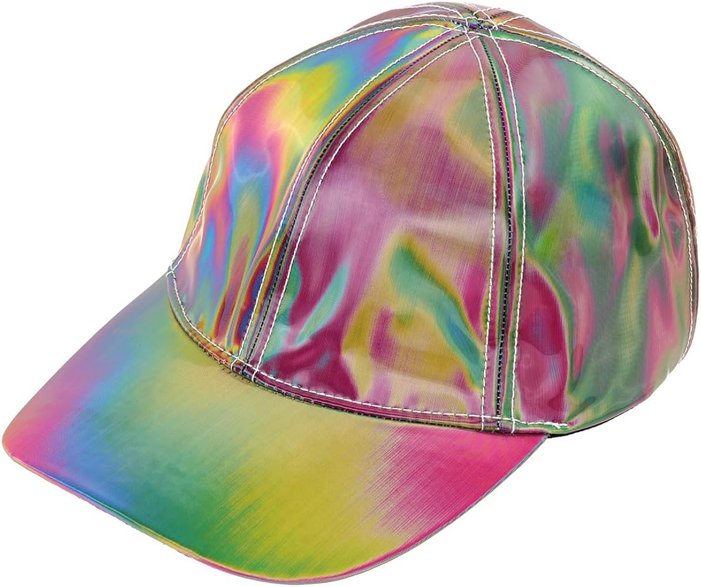
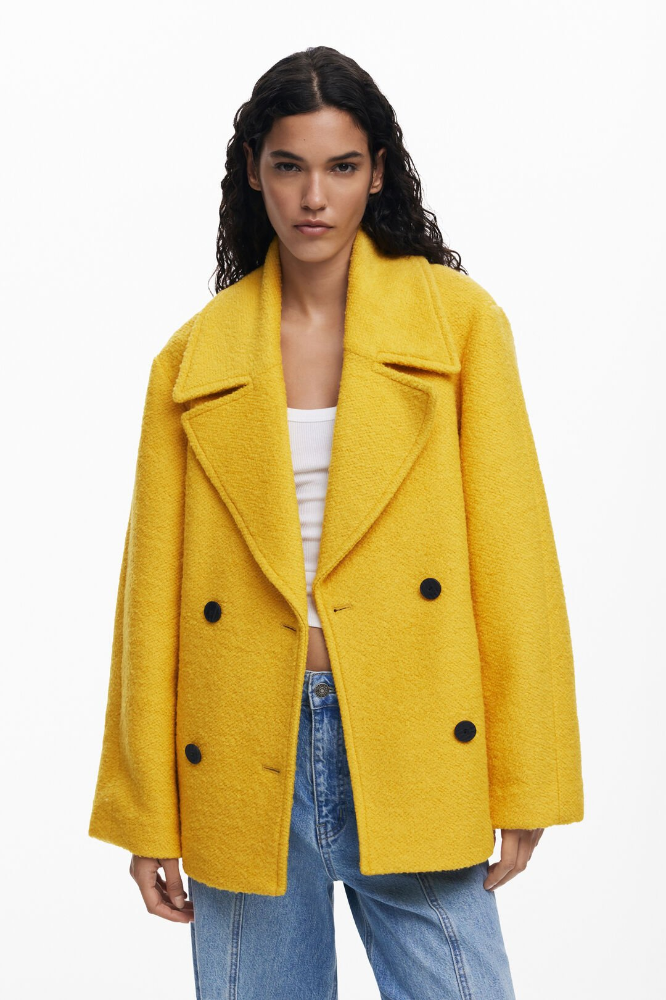
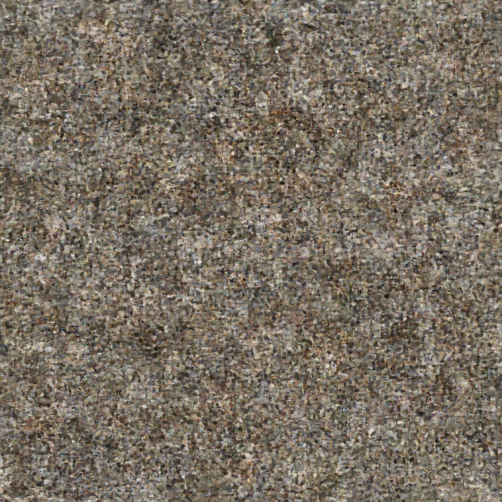
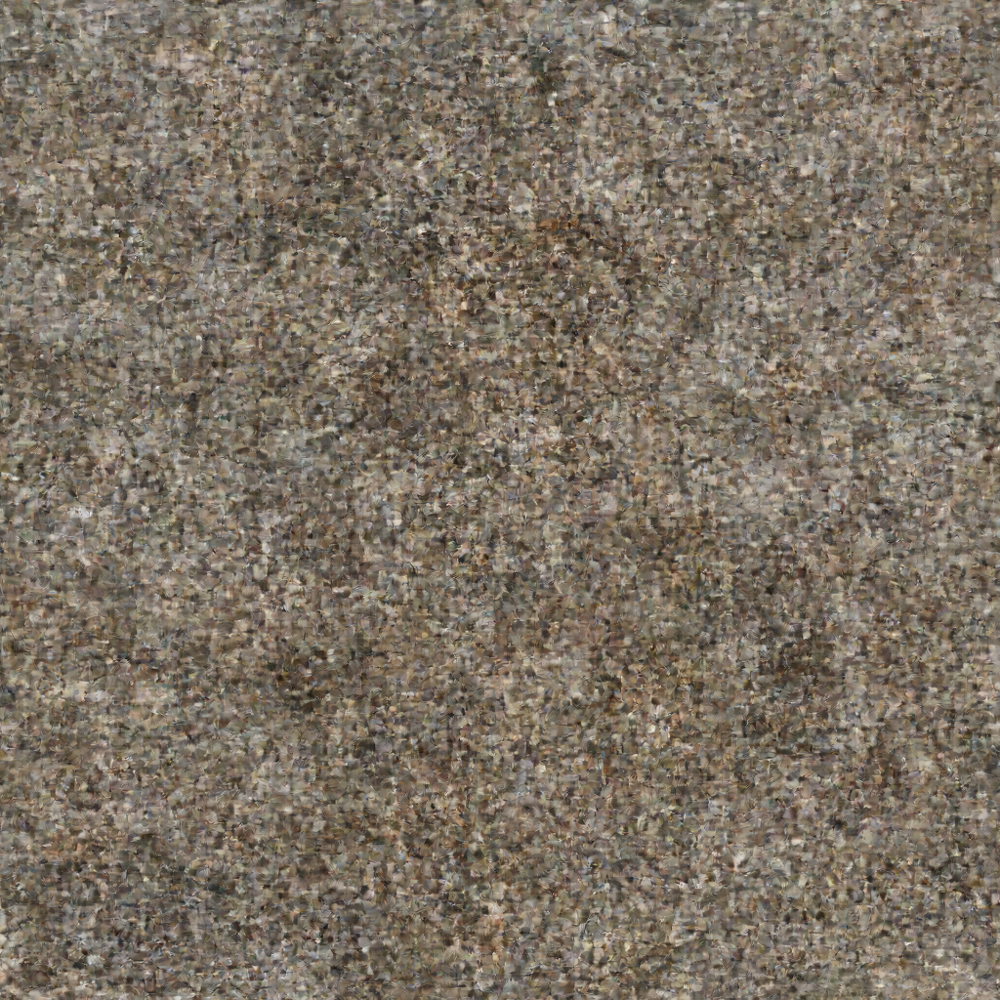
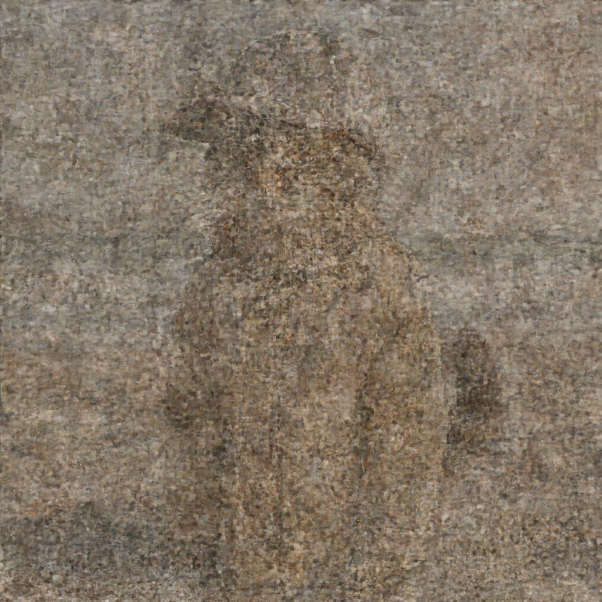
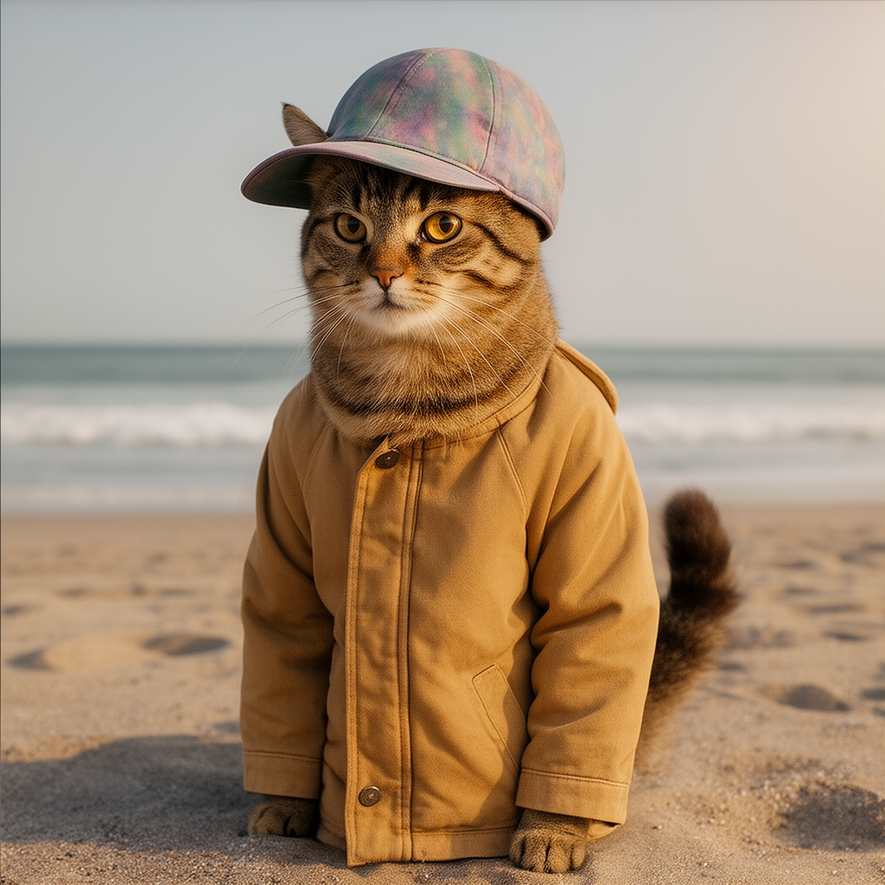

# Multi-Image I2I: Cat + Hat + Jacket

This example demonstrates **multi-reference Image-to-Image** generation where Flux.2 combines elements from multiple reference images based on explicit prompt instructions.

## Concept

The prompt explicitly references each image by number, telling the model which elements to take from which reference:

```
"Modify the cat on image 1 to wear the hat from image 2 and the jacket from image 3"
```

## Input Images

| Image 1 (Cat) | Image 2 (Hat) | Image 3 (Jacket) |
|---------------|---------------|------------------|
|  |  |  |

## Command

```bash
flux2 i2i "Modify the cat on image 1 to wear the hat from image 2 and the jacket from image 3" \
  --images cat.png \
  --images hat.jpg \
  --images jacket.jpg \
  --strength 0.7 \
  --steps 28 \
  --width 1024 --height 1024 \
  --checkpoint 7 \
  -o output.png
```

## Generation Progress

| Step 7 (25%) | Step 14 (50%) | Step 21 (75%) | Step 28 (100%) |
|--------------|---------------|---------------|----------------|
|  |  |  |  |

## Final Output


## Technical Details

- **Resolution**: 1024x1024
- **Steps**: 28
- **Strength**: 0.7
- **Guidance**: 4.0
- **Text Encoder**: Mistral 8-bit
- **Generation Time**: ~3.1 hours

## Key Points

1. **Explicit Image References**: The prompt uses "image 1", "image 2", "image 3" to tell the model which reference to use for each element
2. **Multi-Reference Conditioning**: Each reference image is encoded with unique T-coordinates so the transformer can distinguish them
3. **Element Transfer**: The model extracts specific elements (hat, jacket) from their respective references and applies them to the subject (cat)
