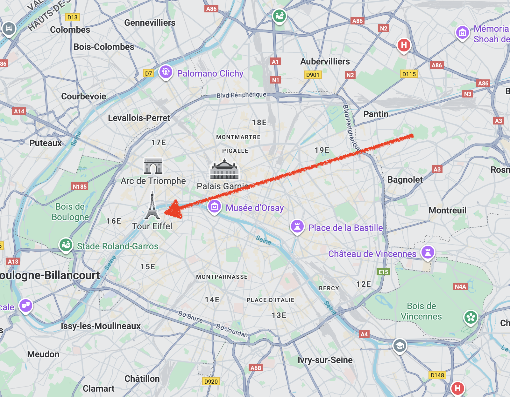
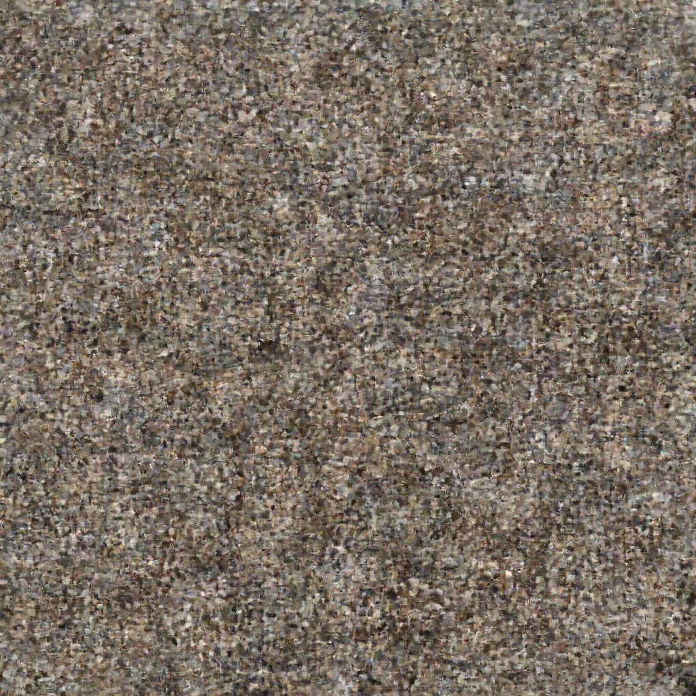
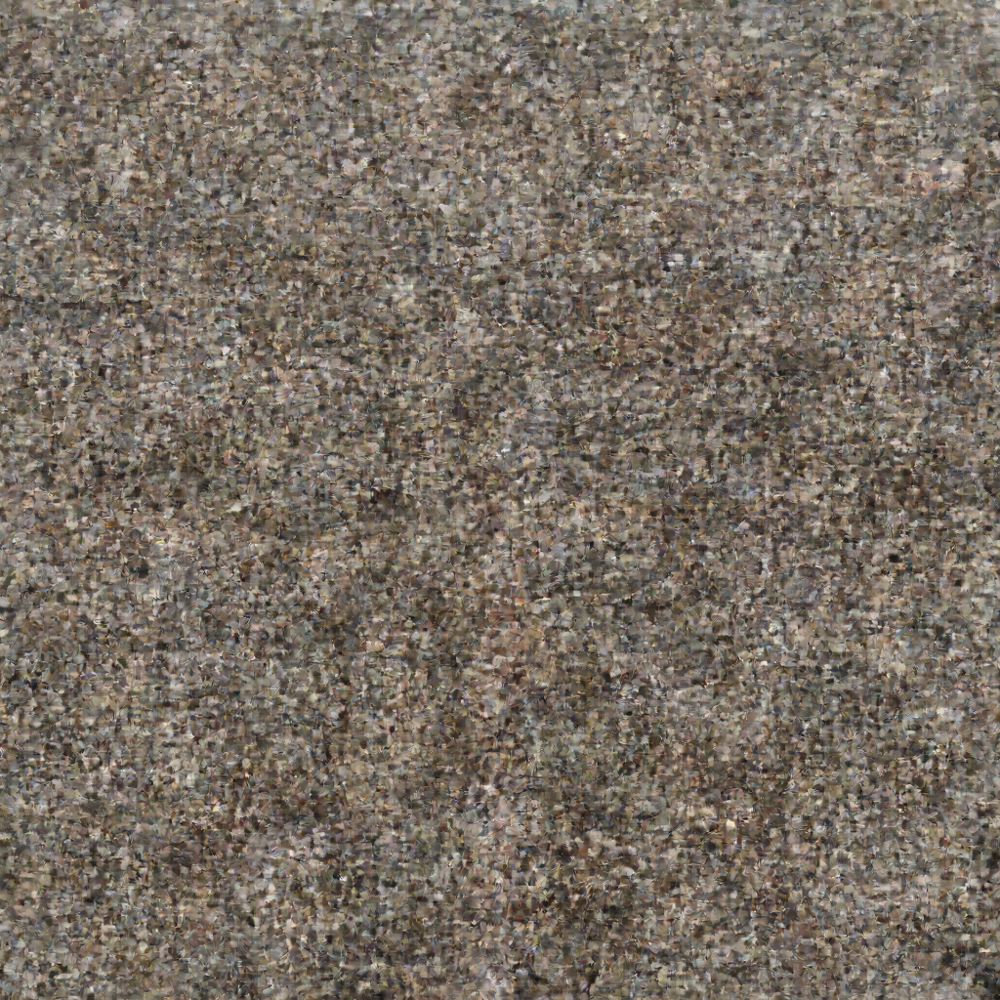
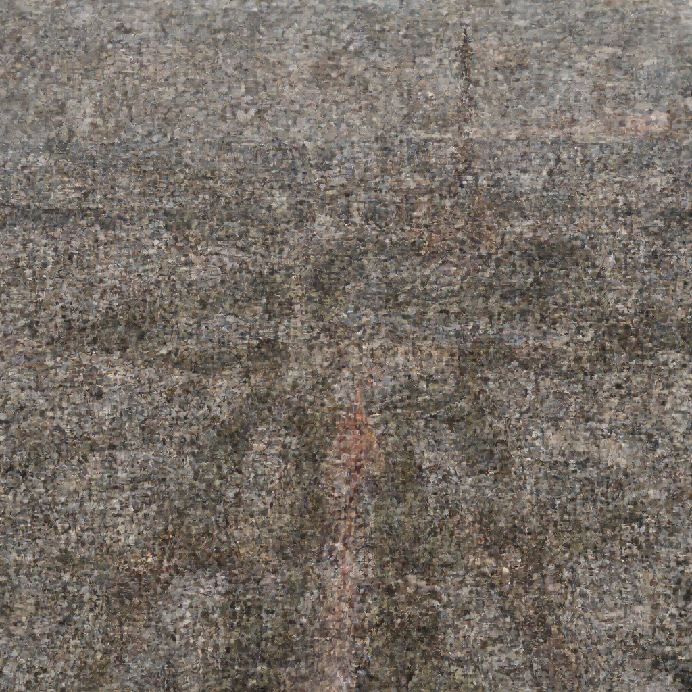
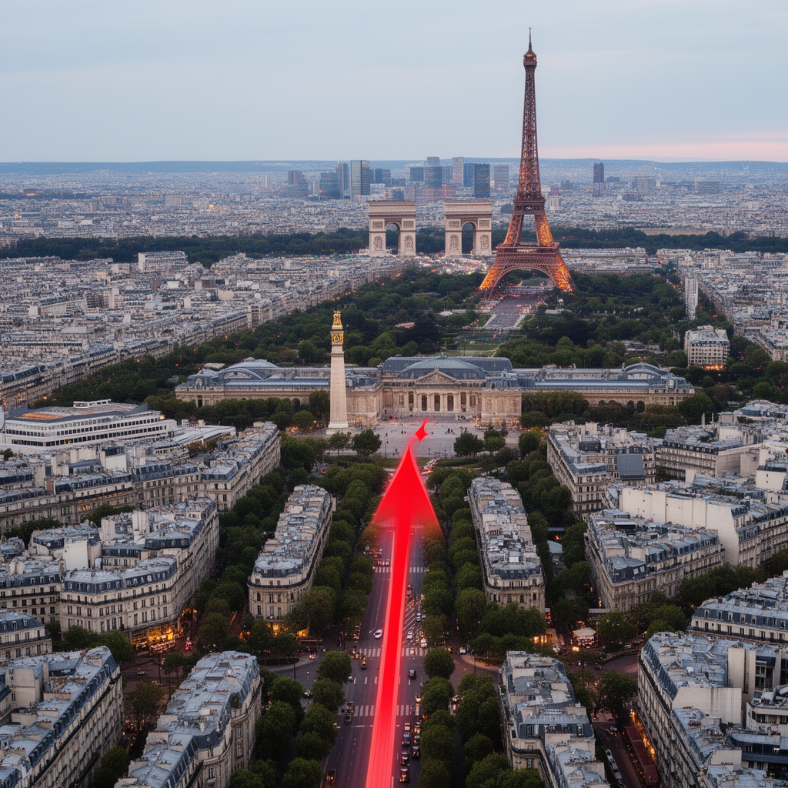

# Image Interpretation to Generation: Map to Paris Photo

This example demonstrates the **I2I + T2I upsampling chain** feature, which:
1. Uses VLM to **interpret** what's in an image (I2I upsampling)
2. Then **enriches** that interpretation into a detailed generation prompt (T2I upsampling)
3. Finally **generates** a new image based on that enriched prompt

## Use Case

Given a map of Paris with a red arrow pointing from one location to another, generate a **photo of Paris** showing what the arrow is pointing at.

## Input

| Input Map | Prompt |
|-----------|--------|
|  | "Describe what the red arrow is seeing" |

## Command

```bash
flux2 t2i "Describe what the red arrow is seeing" \
  --interpret map.png \
  --width 1024 --height 1024 \
  --steps 28 \
  --checkpoint 7 \
  -o output.png
```

## Processing Steps

### Step 1: I2I Upsampling (VLM Image Interpretation)

The VLM analyzes the map and produces an interpretation:

> "Highlight the view from the Eiffel Tower towards Place de la Bastille, keeping the red arrow direction unchanged. Enhance visibility of landmarks along this axis including Musée d'Orsay, Palais Garnier, and Place de la Bastille while maintaining the map's existing road networks, city labels, and metro lines."

### Step 2: T2I Upsampling (Prompt Enrichment)

The interpretation is then enriched into a detailed generation prompt:

> "The red arrow is directed towards a panoramic view from the Eiffel Tower, capturing a sweeping perspective of Parisian landmarks along its axis. The view should prominently feature the Musée d'Orsay, a grand, U-shaped Beaux-Arts building with a distinctive clock facade, situated along the left bank of the Seine River. The Palais Garnier, an opulent opera house with a grand staircase and ornate architectural details, should be visible in the mid-ground. The Place de la Bastille, a historic square with the July Column monument at its center, should be clearly seen in the distance..."

## Generation Progress (Checkpoints)

| Step 7 (25%) | Step 14 (50%) | Step 21 (75%) | Step 28 (100%) |
|--------------|---------------|---------------|----------------|
|  |  |  |  |

## Final Output



## Technical Details

- **Resolution**: 1024x1024
- **Steps**: 28
- **Guidance**: 4.0
- **VLM Model**: Mistral Small 3.2 (8-bit)
- **Generation Time**: ~49 minutes (includes VLM interpretation)
- **mlx-swift Version**: 0.29.1

## Key Features Demonstrated

1. **VLM Image Understanding**: The model correctly identifies landmarks on the map (Tour Eiffel, Musée d'Orsay, Palais Garnier, Place de la Bastille)
2. **Semantic Interpretation**: Instead of just describing the map, it understands the user's intent to see what the arrow points at
3. **Rich Prompt Generation**: T2I upsampling converts the interpretation into a detailed, visually descriptive prompt
4. **Photo Generation**: The final output is a photorealistic image of Paris, not a map
