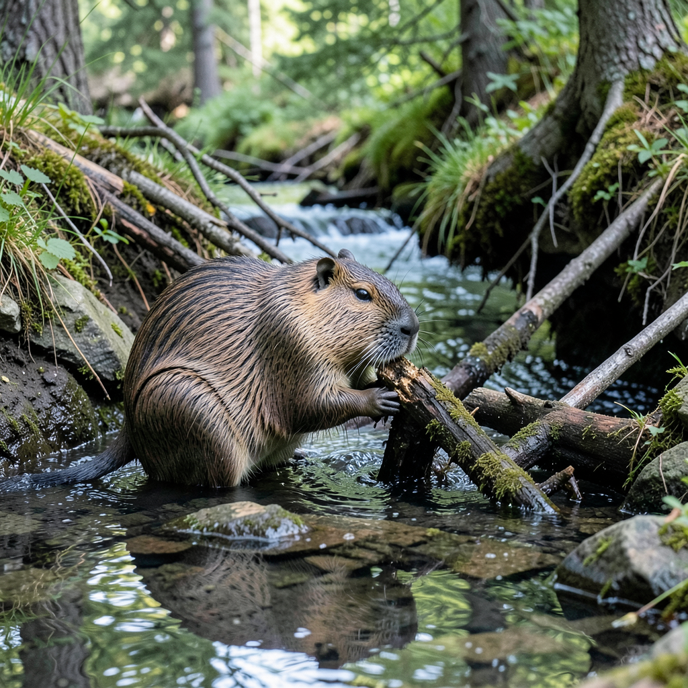
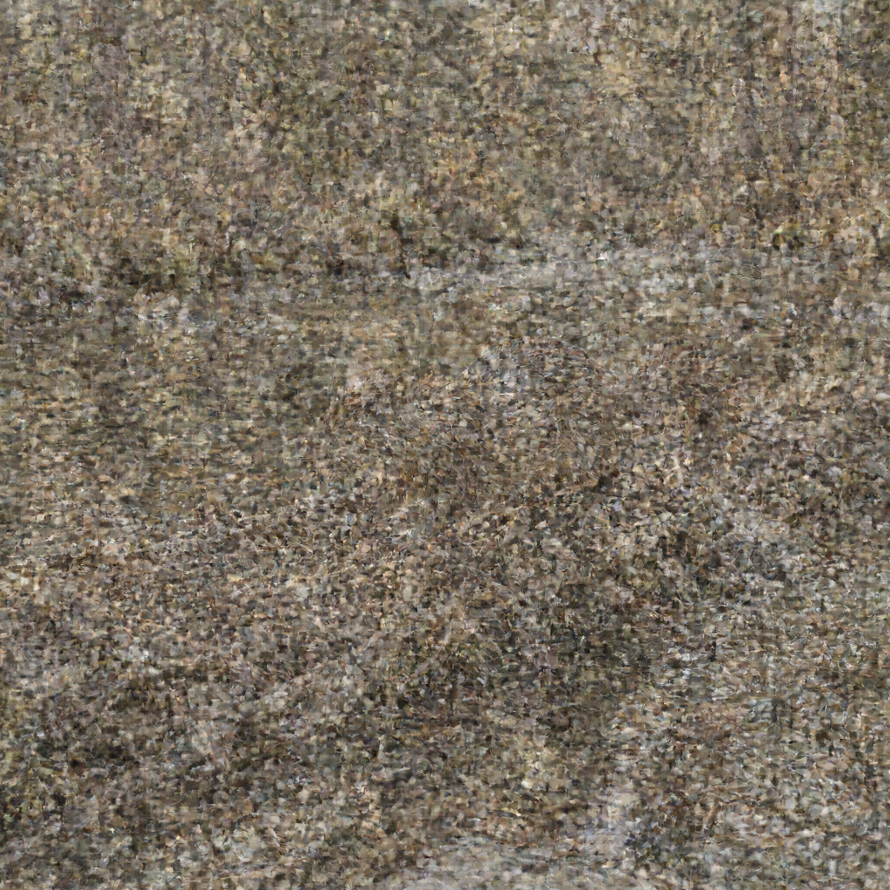
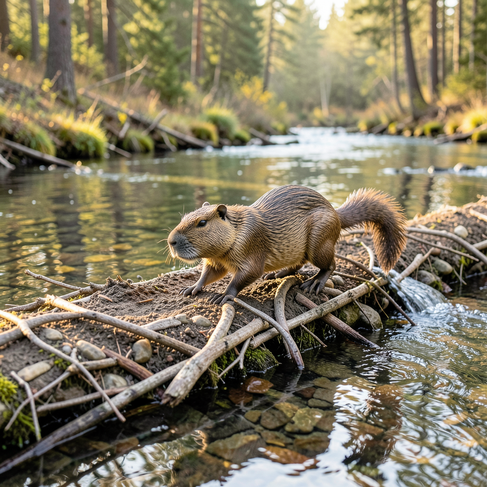
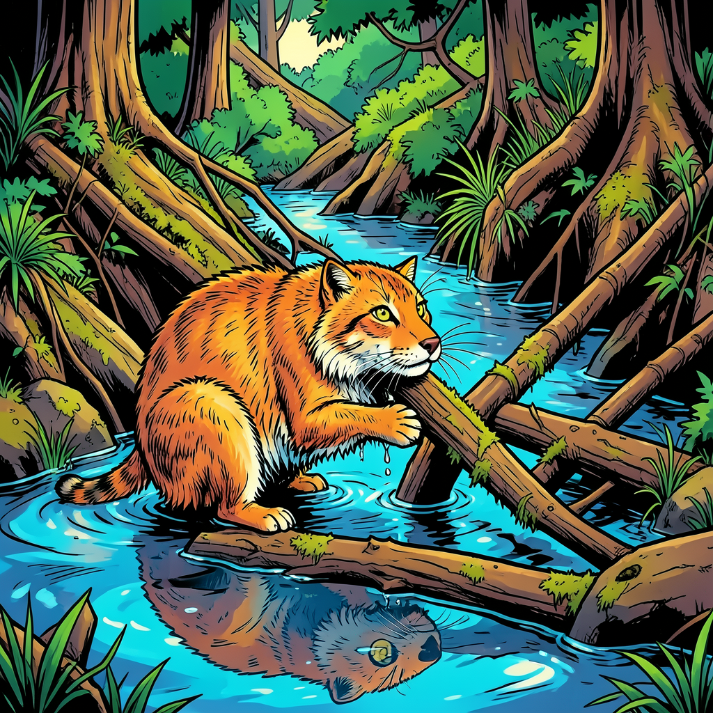
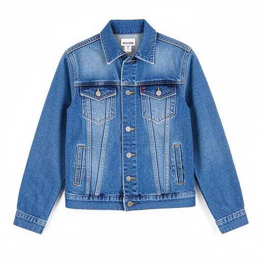
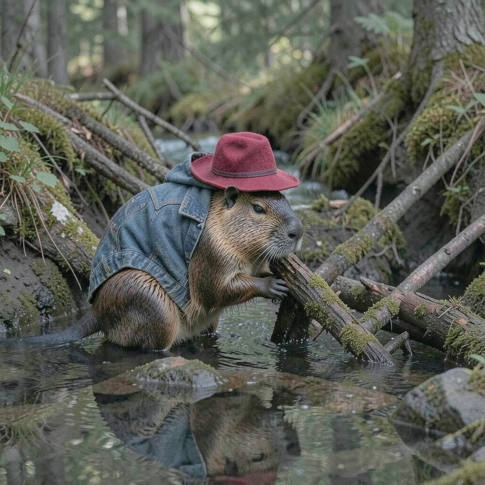
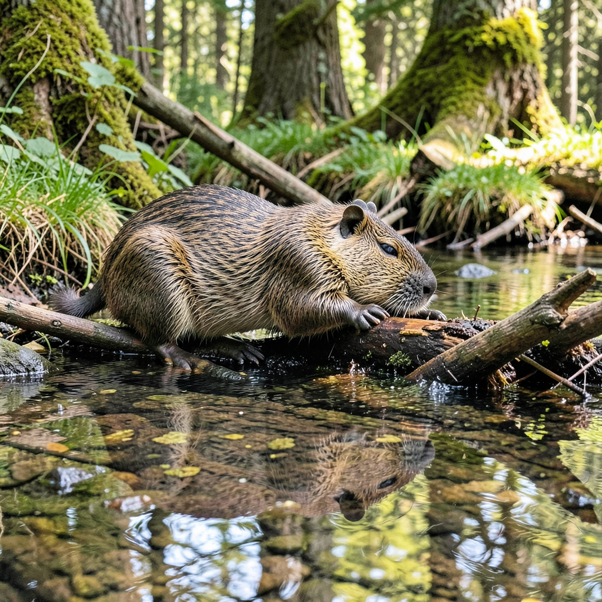

# Flux.2 Klein 4B Examples

Examples generated with **Flux.2 Klein 4B** (4B parameters) on Mac with MLX.

## Model Specifications

| Feature | Value |
|---------|-------|
| Parameters | 4B |
| Default Steps | 4 (distilled) |
| Default Guidance | 1.0 |
| Text Encoder | Qwen3-4B |
| VRAM Usage | ~8GB (bf16) / ~5GB (qint8) |
| License | Apache 2.0 |
| 1024×1024 Time | ~26s (bf16) / ~27s (qint8) |

---

## Text-to-Image Examples

### Beaver Building a Dam (1024×1024)

**Prompt:** `"a beaver building a dam"`

**Parameters:**
- Size: 1024×1024
- Steps: 4
- Guidance: 1.0
- Quantization: qint8



**Command:**
```bash
flux2 t2i "a beaver building a dam" \
  --model klein-4b \
  --width 1024 --height 1024 \
  -o beaver.png
```

---

### Beaver with Prompt Upsampling

**Original prompt:** `"a beaver building a dam"`

**Parameters:**
- Size: 1024×1024
- Steps: 4
- Guidance: 1.0
- Prompt upsampling: **enabled**

#### Progression

| Step 1 | Step 2 | Step 3 | Final (Step 4) |
|--------|--------|--------|----------------|
|  |  |  |  |

**Command:**
```bash
flux2 t2i "a beaver building a dam" \
  --model klein-4b \
  --upsample-prompt \
  --checkpoint 1 \
  -o beaver_upsampled.png
```

---

### Eagle at Landscape Resolution (1536×1024)

**Prompt:** `"a majestic eagle flying over mountains at sunset"`

**Parameters:**
- Size: 1536×1024 (landscape)
- Steps: 4
- Guidance: 1.0


**Command:**
```bash
flux2 t2i "a majestic eagle flying over mountains at sunset" \
  --model klein-4b \
  --width 1536 --height 1024 \
  -o eagle.png
```

---

### Futuristic City at Maximum Resolution (2048×2048)

**Prompt:** `"a futuristic city with flying cars and neon lights"`

**Parameters:**
- Size: 2048×2048 (maximum)
- Steps: 4
- Guidance: 1.0


**Command:**
```bash
flux2 t2i "a futuristic city with flying cars and neon lights" \
  --model klein-4b \
  --width 2048 --height 2048 \
  -o city.png
```

---

## Image-to-Image Examples

### Style Transfer: Comic Book

Transform a generated beaver image into comic book style.

**Input:** `beaver_1024.png` (from T2I above)

**Prompt:** `"transform into a comic book style illustration with bold outlines and vibrant colors"`

**Parameters:**
- Size: 1024×1024
- Steps: 4
- Strength: 0.7

| Input | Output (Comic Style) |
|-------|---------------------|
|  |  |

**Command:**
```bash
flux2 i2i "transform into a comic book style illustration with bold outlines and vibrant colors" \
  --model klein-4b \
  --images beaver_1024.png \
  --strength 0.7 \
  --steps 4 \
  -o beaver_comic_style.png
```

**Time:** 127.3s

---

### Multi-Image Conditioning: Beaver + Hat + Jacket

Combine elements from multiple reference images. This test uses neutral prompts that reference images by position (not by describing their content) to verify the model follows visual references.

**Reference Images:**

| Image 1 (Subject) | Image 2 (Hat) | Image 3 (Jacket) |
|-------------------|---------------|------------------|
|  |  |  |

**Prompt:** `"a beaver wearing the hat from image 2 and the jacket from image 3"`

> **Note:** The prompt intentionally does NOT describe the hat color (red) or jacket style (denim blue) to test if the model actually follows the visual references.

**Result:**



**Command:**
```bash
flux2 i2i "a beaver wearing the hat from image 2 and the jacket from image 3" \
  --model klein-4b \
  --images beaver_1024.png \
  --images hat.png \
  --images jacket.png \
  --steps 4 \
  -o beaver_hat_jacket.png
```

**Time:** 129.6s

---

## Quantization Comparison: bf16 vs qint8

Klein 4B supports both full precision (bf16) and quantized (qint8) modes.

### Visual Comparison

| bf16 (Full Precision) | qint8 (Quantized) |
|-----------------------|-------------------|
|  |  |

Both images generated with identical seed for fair comparison.

### Performance Metrics

| Metric | bf16 | qint8 |
|--------|------|-------|
| **Total Time** | 25.6s | 27.2s |
| **Memory Usage** | ~5.6GB | ~3.8GB |
| **Per-Step Time** | ~5.5s | ~5.8s |
| **Image Quality** | Best | Excellent |

### bf16 Performance Report

```
╔══════════════════════════════════════════════════════════════╗
║                  FLUX.2 PERFORMANCE REPORT                   ║
╠══════════════════════════════════════════════════════════════╣
📊 PHASE TIMINGS:
────────────────────────────────────────────────────────────────
  1. Load Text Encoder                1.89s    7.4%
  2. Text Encoding                  543.6ms    2.1%
  3. Unload Text Encoder             18.9ms    0.1%
  4. Load Transformer                1.32s    5.2%
  5. Load VAE                        46.9ms    0.2%
  6. Denoising Loop                 20.02s   78.2% ███████████████
  7. VAE Decode                      1.74s    6.8% █
  8. Post-processing                  1.3ms    0.0%
────────────────────────────────────────────────────────────────
  TOTAL                             25.60s  100.0%

📈 DENOISING STEP STATISTICS:
────────────────────────────────────────────────────────────────
  Steps:              4
  Total denoising:    20.02s
  Average per step:   5.01s
  Fastest step:       4.62s
  Slowest step:       5.76s
╚══════════════════════════════════════════════════════════════╝
```

### qint8 Performance Report

```
╔══════════════════════════════════════════════════════════════╗
║                  FLUX.2 PERFORMANCE REPORT                   ║
╠══════════════════════════════════════════════════════════════╣
📊 PHASE TIMINGS:
────────────────────────────────────────────────────────────────
  1. Load Text Encoder                1.92s    7.1%
  2. Text Encoding                  544.0ms    2.0%
  3. Unload Text Encoder             20.1ms    0.1%
  4. Load Transformer                1.83s    6.7%
  5. Load VAE                        49.2ms    0.2%
  6. Denoising Loop                 21.01s   77.2% ███████████████
  7. VAE Decode                      1.81s    6.7% █
  8. Post-processing                  1.4ms    0.0%
────────────────────────────────────────────────────────────────
  TOTAL                             27.22s  100.0%

📈 DENOISING STEP STATISTICS:
────────────────────────────────────────────────────────────────
  Steps:              4
  Total denoising:    21.01s
  Average per step:   5.25s
  Fastest step:       4.83s
  Slowest step:       6.02s
╚══════════════════════════════════════════════════════════════╝
```

### Recommendation

For most use cases, the default **qint8** quantization provides excellent quality with ~32% lower memory usage. Use **bf16** when maximum quality is required and memory is not constrained.

---

## CLI Commands Summary

```bash
# Basic Klein 4B generation (uses optimal defaults: steps=4, guidance=1.0)
flux2 t2i "a beaver building a dam" --model klein-4b

# Full precision (bf16)
flux2 t2i "a beaver building a dam" \
  --model klein-4b \
  --transformer-quant bf16 \
  -o beaver_bf16.png

# Quantized (qint8) - default
flux2 t2i "a beaver building a dam" \
  --model klein-4b \
  --transformer-quant qint8 \
  -o beaver_qint8.png

# Higher resolution (landscape)
flux2 t2i "a majestic eagle" \
  --model klein-4b \
  --width 1536 --height 1024 \
  -o eagle.png

# Maximum resolution (2048×2048)
flux2 t2i "futuristic city" \
  --model klein-4b \
  --width 2048 --height 2048 \
  -o city.png

# With prompt upsampling
flux2 t2i "a beaver" \
  --model klein-4b \
  --upsample-prompt \
  -o beaver_upsampled.png

# Image-to-Image style transfer
flux2 i2i "transform into comic book style" \
  --model klein-4b \
  --images input.png \
  --strength 0.7 \
  -o output.png

# Multi-image conditioning (combine elements)
flux2 i2i "a beaver wearing the hat from image 2" \
  --model klein-4b \
  --images beaver.png \
  --images hat.png \
  -o beaver_with_hat.png
```

---

## Hardware

- **Machine:** MacBook Pro 14" (Nov 2023)
- **Chip:** Apple M3 Max
- **RAM:** 96 GB Unified Memory
- **macOS:** Tahoe 26.2
- **Model:** Klein 4B with Qwen3-4B text encoder
