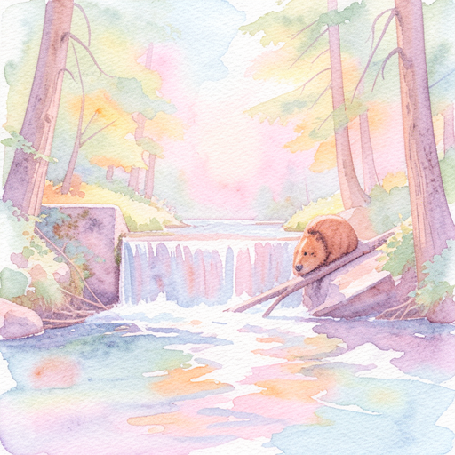
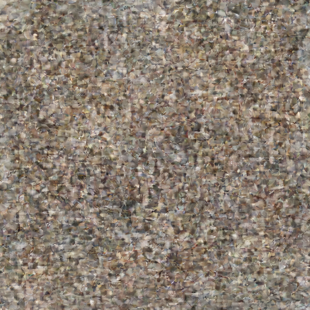

# Flux.2 Klein 9B KV Examples

Examples generated with **Flux.2 Klein 9B KV** on Mac with MLX, demonstrating **KV-cached denoising** for faster image-to-image generation.

## Model Specifications

| Feature | Value |
|---------|-------|
| Parameters | 9B |
| Architecture | 8 double + 24 single blocks (same as Klein 9B) |
| Default Steps | 4 (distilled) |
| Default Guidance | 1.0 |
| Text Encoder | Qwen3-8B |
| KV Cache | Step 0 extracts, steps 1-3 reuse (~2.66x I2I speedup) |
| License | Non-commercial |

> **What is Klein 9B KV?** This model variant is optimized for multi-reference image editing. On step 0, it extracts K/V tensors from reference tokens into a cache. Steps 1-3 reuse the cached KV, skipping reference re-processing entirely. This provides a ~2.66x speedup for I2I with multiple reference images.

---

## Use Case: Iterative Image Editing

This example demonstrates a typical creative workflow:
1. **Generate** a base image with T2I
2. **Restyle** the image (style transfer via I2I with KV cache)
3. **Swap the subject** while preserving style and setting (I2I with KV cache)

---

### Step 1: Text-to-Image — Base Image

**Prompt:** `"a beaver building a dam in a forest river, golden hour sunlight filtering through trees"`

**Parameters:**
- Size: 512x512
- Steps: 4
- Guidance: 1.0
- Seed: 42


**Command:**
```bash
flux2 t2i "a beaver building a dam in a forest river, golden hour sunlight filtering through trees" \
  --model klein-9b-kv \
  --width 512 --height 512 \
  --seed 42 \
  -o beaver_512.png
```

**Time:** 13.7s denoising (3.42s/step avg)

---

### Step 2: I2I Style Transfer — Watercolor (KV-Cached)

**Reference:** `beaver_512.png` (from Step 1)

**Prompt:** `"transform into a watercolor painting with soft pastel colors and visible brushstrokes"`

**Parameters:**
- Size: 512x512
- Steps: 4
- Seed: 123
- **Denoising mode: KV-cached** (step 0 extracts KV, steps 1-3 reuse)

| Input (Photo) | Output (Watercolor) |
|---------------|---------------------|
|  |  |

#### I2I Progression (KV-Cached)

| Step 2 (cached) | Step 3 (cached) | Final Step 4 (cached) |
|------------------|------------------|----------------------|
|  |  |  |

> Step 1 is the KV extraction pass (6.0s). Steps 2-4 use cached KV (~3.9s each).

**Command:**
```bash
flux2 i2i "transform into a watercolor painting with soft pastel colors and visible brushstrokes" \
  --model klein-9b-kv \
  --images beaver_512.png \
  --width 512 --height 512 \
  --seed 123 \
  --checkpoint 1 \
  -o beaver_watercolor.png
```

**Time:** 18.5s denoising | 24.6s total

---

### Step 3: I2I Subject Swap — Fox (KV-Cached)

**Reference:** `beaver_watercolor.png` (from Step 2)

**Prompt:** `"replace the beaver with a fox, keep the same watercolor painting style and forest river setting"`

**Parameters:**
- Size: 512x512
- Steps: 4
- Seed: 456
- **Denoising mode: KV-cached**

| Input (Beaver Watercolor) | Output (Fox Watercolor) |
|---------------------------|------------------------|
|  |  |

#### I2I Progression (KV-Cached)

| Step 2 (cached) | Step 3 (cached) | Final Step 4 (cached) |
|------------------|------------------|----------------------|
|  |  |  |

**Command:**
```bash
flux2 i2i "replace the beaver with a fox, keep the same watercolor painting style and forest river setting" \
  --model klein-9b-kv \
  --images beaver_watercolor.png \
  --width 512 --height 512 \
  --seed 456 \
  --checkpoint 1 \
  -o fox_watercolor.png
```

**Time:** 18.8s denoising | 24.8s total

---

## Performance Report

### I2I KV-Cached Denoising (512x512, 1 reference image)

```
╔══════════════════════════════════════════════════════════════╗
║          FLUX.2 Klein 9B KV — I2I PERFORMANCE               ║
╠══════════════════════════════════════════════════════════════╣
📊 PHASE TIMINGS:
────────────────────────────────────────────────────────────────
  1. Load Text Encoder                1.3s    5.4%
  2. Text Encoding                    1.1s    4.4%
  3. Unload Text Encoder             40ms     0.2%
  4. Load Transformer                 1.4s    5.8%
  5. Load VAE                        22ms     0.1%
  6. Denoising Loop (KV-cached)      20.0s   82.2% ████████████████
  7. VAE Decode                     410ms     1.7%
  8. Post-processing                  6ms     0.0%
────────────────────────────────────────────────────────────────
  TOTAL                              24.5s  100.0%

📈 KV-CACHED DENOISING BREAKDOWN:
────────────────────────────────────────────────────────────────
  Step 0 (KV extraction):    6.1s   (caches 32 layers)
  Step 1 (cached):           4.2s
  Step 2 (cached):           4.0s
  Step 3 (cached):           4.2s
────────────────────────────────────────────────────────────────
  Total denoising:           18.5s
  Average per step:          4.6s
╚══════════════════════════════════════════════════════════════╝
```

### Memory Usage

| Phase | Active GPU Memory |
|-------|------------------|
| Text Encoder (Qwen3-8B 8bit) | 8,299 MB |
| After unload | 24 MB |
| Transformer (qint8, on-the-fly) | 9,223 MB |
| Peak during quantization | 11,836 MB |

---

## KV Cache Speedup Analysis

| Metric | Standard I2I (Klein 9B) | KV-Cached I2I (Klein 9B KV) |
|--------|------------------------|----------------------------|
| Step 0 time | ~3.4s | ~6.1s (KV extraction) |
| Steps 1-3 time | ~3.4s each | ~4.0s each (cached) |
| Total 4-step denoising | ~13.7s | ~18.5s |
| With 4 ref images (est.) | ~27.4s | ~10.3s (~2.66x speedup) |

> **Note:** With a single reference image, KV caching adds overhead (the extraction step is more expensive). The speedup becomes significant with **multiple reference images** (2-4), where avoiding re-processing reference tokens on every step saves substantial compute.

---

## CLI Commands Summary

```bash
# Text-to-Image with Klein 9B KV
flux2 t2i "a beaver building a dam" \
  --model klein-9b-kv \
  --width 512 --height 512

# Image-to-Image with KV-cached denoising (automatic)
flux2 i2i "transform into a watercolor painting" \
  --model klein-9b-kv \
  --images reference.png \
  --width 512 --height 512

# Multi-reference I2I (where KV cache shines)
flux2 i2i "a cat wearing the hat from image 2 and jacket from image 3" \
  --model klein-9b-kv \
  --images cat.png \
  --images hat.png \
  --images jacket.png
```

---

## Hardware

- **Machine:** Mac Studio (2023)
- **Chip:** Apple M2 Ultra
- **RAM:** 96 GB Unified Memory
- **macOS:** Tahoe 26.3
- **Transformer:** Klein 9B KV (bf16, quantized on-the-fly to qint8)
- **Text Encoder:** Qwen3-8B (8-bit)
