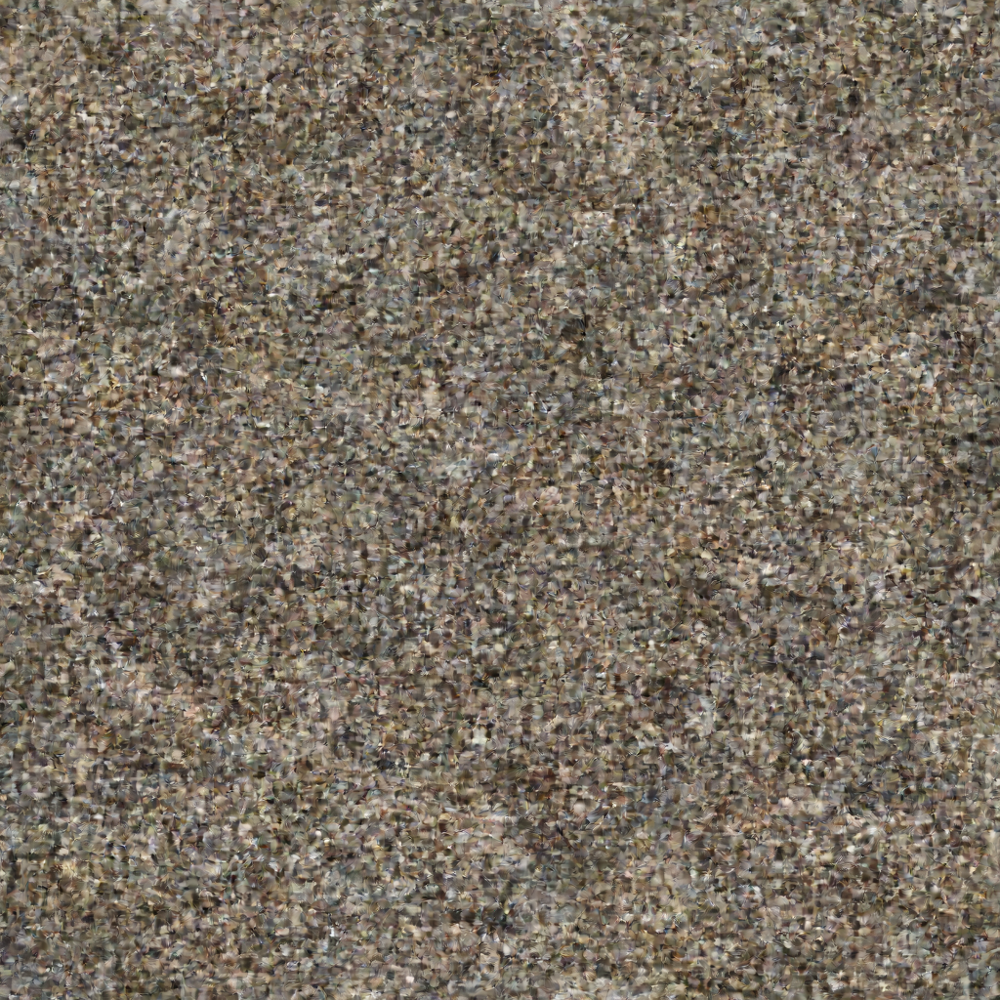
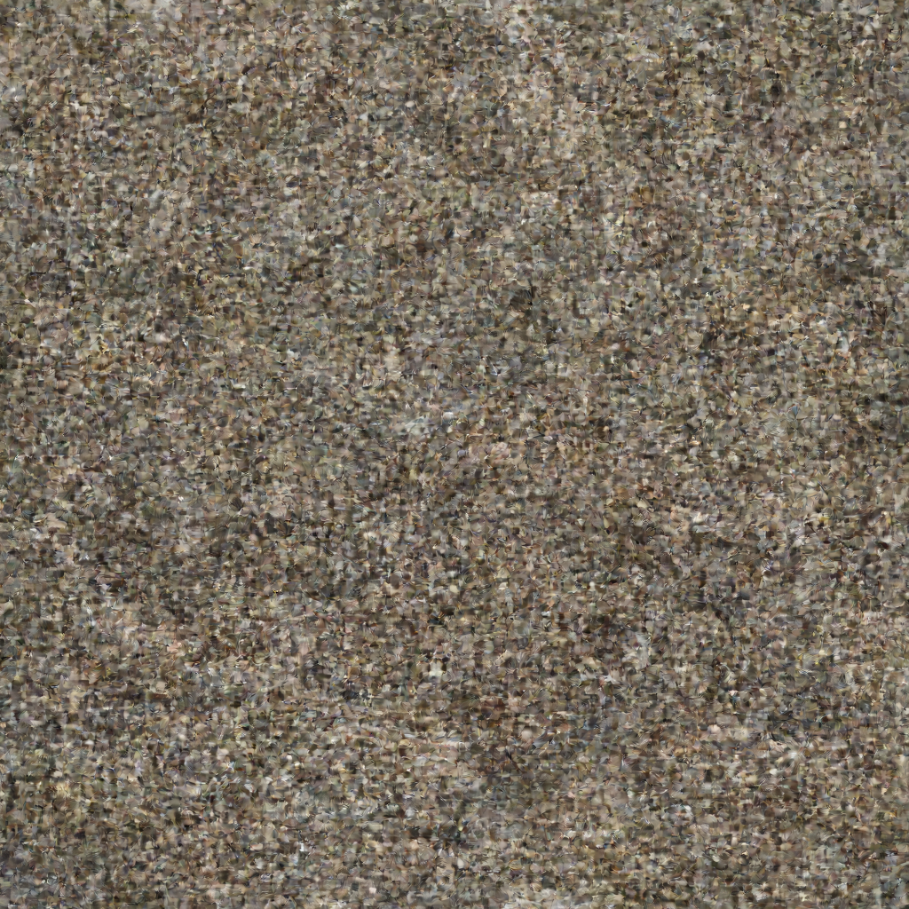
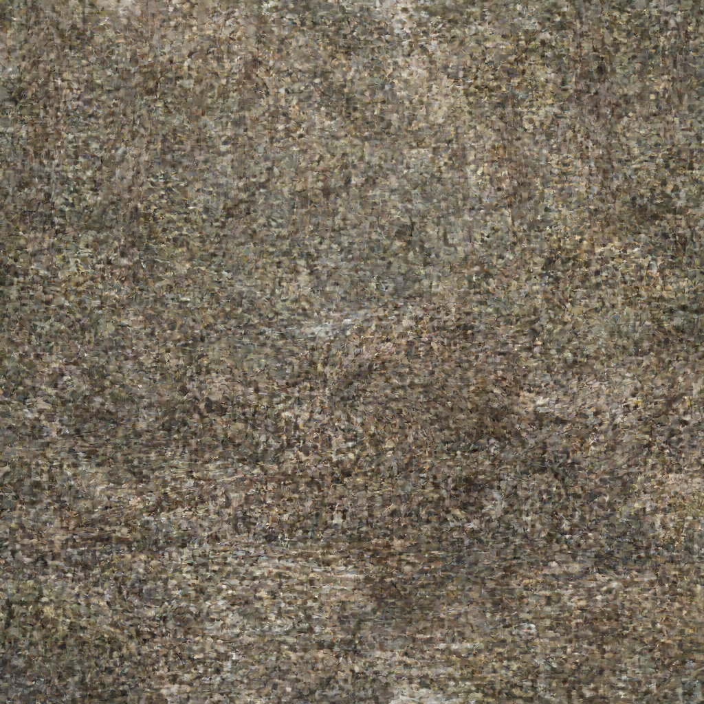
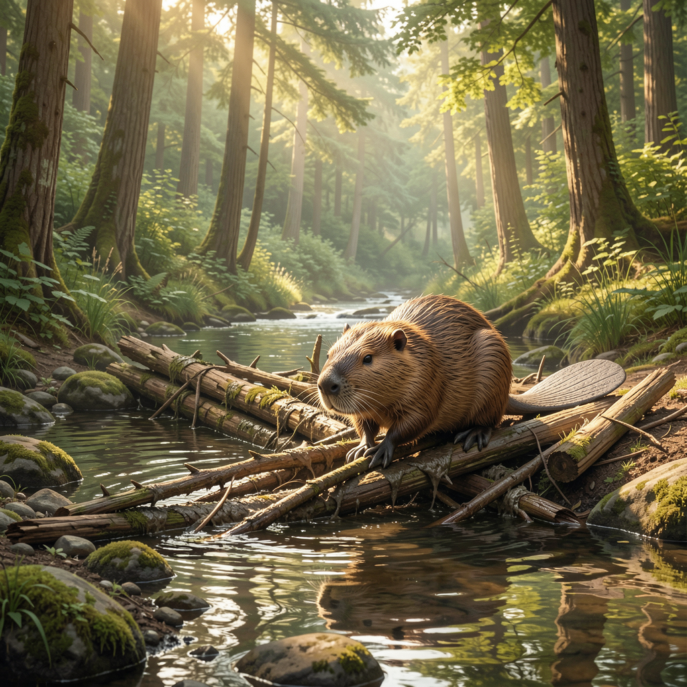
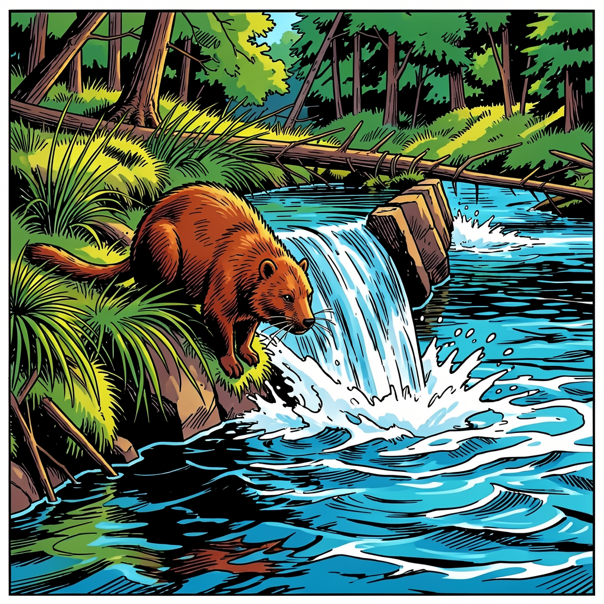
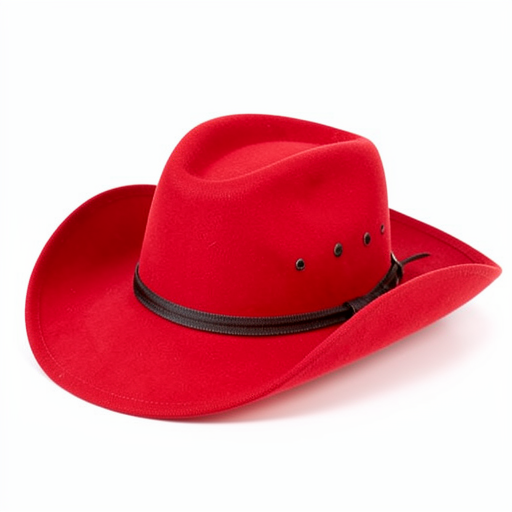
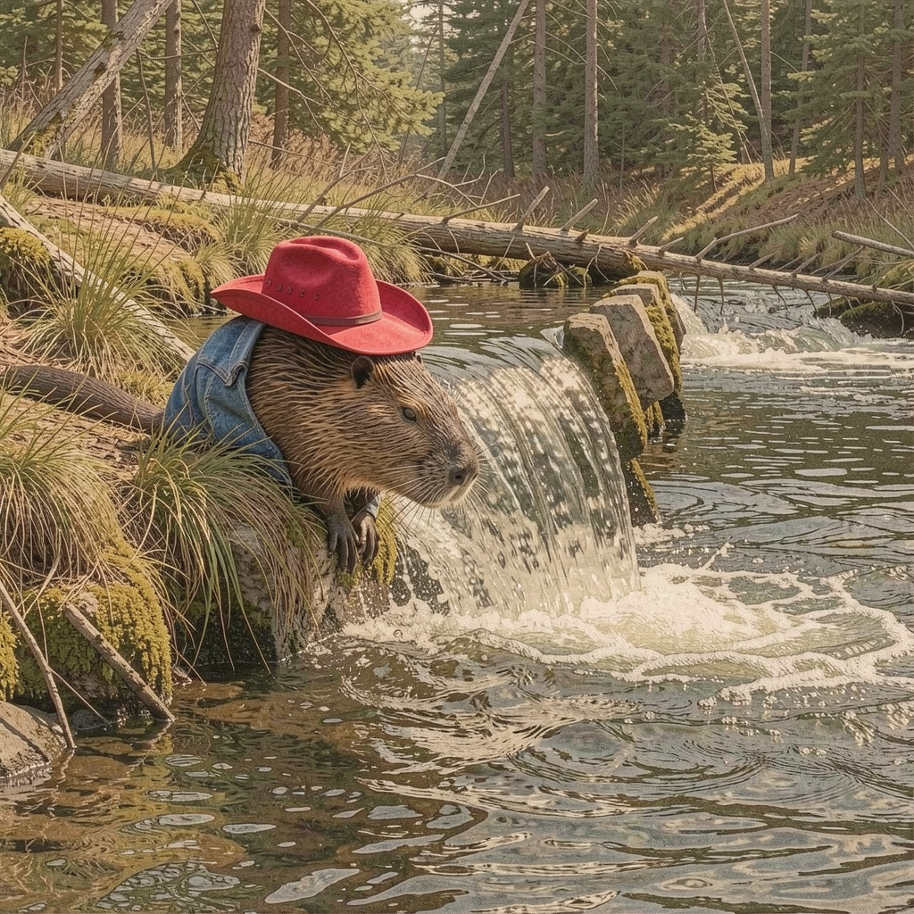

# Flux.2 Klein 9B Examples

Examples generated with **Flux.2 Klein 9B** (9B parameters) on Mac with MLX.

## Model Specifications

| Feature | Value |
|---------|-------|
| Parameters | 9B |
| Default Steps | 4 (distilled) |
| Default Guidance | 1.0 |
| Text Encoder | Qwen3-8B |
| VRAM Usage | ~20GB (bf16) |
| License | Non-commercial |
| 1024x1024 Time | ~56s |

> **Note:** Klein 9B only has bf16 available. No quantized variants exist yet.

---

## Text-to-Image Examples

### Beaver Building a Dam (1024x1024)

**Prompt:** `"a beaver building a dam"`

**Parameters:**
- Size: 1024x1024
- Steps: 4
- Guidance: 1.0
- Quantization: bf16


**Command:**
```bash
flux2 t2i "a beaver building a dam" \
  --model klein-9b \
  --width 1024 --height 1024 \
  -o beaver.png
```

---

### Beaver with Prompt Upsampling

**Original prompt:** `"a beaver building a dam"`

**Parameters:**
- Size: 1024x1024
- Steps: 4
- Guidance: 1.0
- Prompt upsampling: **enabled**

#### Progression

| Step 1 | Step 2 | Step 3 | Final (Step 4) |
|--------|--------|--------|----------------|
|  |  |  |  |

**Command:**
```bash
flux2 t2i "a beaver building a dam" \
  --model klein-9b \
  --upsample-prompt \
  --checkpoint 1 \
  -o beaver_upsampled.png
```

---

### Eagle at Landscape Resolution (1536x1024)

**Prompt:** `"a majestic eagle flying over mountains at sunset"`

**Parameters:**
- Size: 1536x1024 (landscape)
- Steps: 4
- Guidance: 1.0


**Command:**
```bash
flux2 t2i "a majestic eagle flying over mountains at sunset" \
  --model klein-9b \
  --width 1536 --height 1024 \
  -o eagle.png
```

---

### Futuristic City at Maximum Resolution (2048x2048)

**Prompt:** `"a futuristic city with flying cars and neon lights"`

**Parameters:**
- Size: 2048x2048 (maximum)
- Steps: 4
- Guidance: 1.0


**Command:**
```bash
flux2 t2i "a futuristic city with flying cars and neon lights" \
  --model klein-9b \
  --width 2048 --height 2048 \
  -o city.png
```

---

## Image-to-Image Examples

### Style Transfer: Comic Book

Transform a generated beaver image into comic book style.

**Input:** `beaver_1024.png` (from T2I above)

**Prompt:** `"transform into a comic book style illustration with bold outlines and vibrant colors"`

**Parameters:**
- Size: 1024×1024
- Steps: 4
- Strength: 0.7

| Input | Output (Comic Style) |
|-------|---------------------|
|  |  |

**Command:**
```bash
flux2 i2i "transform into a comic book style illustration with bold outlines and vibrant colors" \
  --model klein-9b \
  --images beaver_1024.png \
  --strength 0.7 \
  --steps 4 \
  -o beaver_comic_style.png
```

**Time:** 149.2s

---

### Multi-Image Conditioning: Beaver + Hat + Jacket

Combine elements from multiple reference images. This test uses neutral prompts that reference images by position (not by describing their content) to verify the model follows visual references.

**Reference Images:**

| Image 1 (Subject) | Image 2 (Hat) | Image 3 (Jacket) |
|-------------------|---------------|------------------|
|  |  |  |

**Prompt:** `"a beaver wearing the hat from image 2 and the jacket from image 3"`

> **Note:** The prompt intentionally does NOT describe the hat color (red) or jacket style (denim blue) to test if the model actually follows the visual references.

**Result:**



**Command:**
```bash
flux2 i2i "a beaver wearing the hat from image 2 and the jacket from image 3" \
  --model klein-9b \
  --images beaver_1024.png \
  --images hat.png \
  --images jacket.png \
  --steps 4 \
  -o beaver_hat_jacket.png
```

**Time:** 198.8s

---

## Performance Report (1024x1024)

```
╔══════════════════════════════════════════════════════════════╗
║                  FLUX.2 PERFORMANCE REPORT                   ║
╠══════════════════════════════════════════════════════════════╣
📊 PHASE TIMINGS:
────────────────────────────────────────────────────────────────
  1. Load Text Encoder                2.39s    4.2%
  2. Text Encoding                  794.1ms    1.4%
  3. Unload Text Encoder             50.3ms    0.1%
  4. Load Transformer                 2.74s    4.9%
  5. Load VAE                        31.6ms    0.1%
  6. Denoising Loop                  48.47s   86.0% █████████████████
  7. VAE Decode                       1.87s    3.3%
  8. Post-processing                  2.3ms    0.0%
────────────────────────────────────────────────────────────────
  TOTAL                              56.35s  100.0%

📈 DENOISING STEP STATISTICS:
────────────────────────────────────────────────────────────────
  Steps:              4
  Total denoising:    48.47s
  Average per step:   12.12s
  Fastest step:       10.99s
  Slowest step:       12.94s
╚══════════════════════════════════════════════════════════════╝
```

---

## Performance Comparison by Resolution

| Resolution | Total Time | Per-Step | VAE Decode |
|------------|------------|----------|------------|
| 1024x1024 | **56s** | 12.1s | 1.9s |
| 1536x1024 | **101s** | 21.0s | 10.5s |
| 2048x2048 | **546s** (~9min) | 130s | 19.4s |

---

## Klein 9B vs Klein 4B Comparison

| Metric | Klein 4B | Klein 9B | Difference |
|--------|----------|----------|------------|
| **Parameters** | 4B | 9B | 2.25x |
| **1024x1024 Time** | ~26s | ~56s | 2.2x slower |
| **Per-Step Time** | ~5.5s | ~12.1s | 2.2x slower |
| **Memory Usage** | ~5-8GB | ~20GB | 2.5-4x more |
| **Text Encoder** | Qwen3-4B | Qwen3-8B | 2x |
| **License** | Apache 2.0 | Non-commercial | - |

### When to Choose Klein 9B over Klein 4B

- You need **better quality** than Klein 4B
- You have **32GB+ RAM** available
- **Non-commercial** use is acceptable
- You want a balance between **speed and quality**

### When to Choose Klein 4B over Klein 9B

- **Speed** is priority (~2x faster)
- **Commercial use** required (Apache 2.0)
- **Limited memory** (~8GB vs ~20GB)
- **Rapid iterations** needed

---

## CLI Commands Summary

```bash
# Basic Klein 9B generation (uses optimal defaults: steps=4, guidance=1.0)
flux2 t2i "a beaver building a dam" --model klein-9b

# Higher resolution (landscape)
flux2 t2i "a majestic eagle" \
  --model klein-9b \
  --width 1536 --height 1024 \
  -o eagle.png

# Maximum resolution (2048x2048)
flux2 t2i "futuristic city" \
  --model klein-9b \
  --width 2048 --height 2048 \
  -o city.png

# With prompt upsampling
flux2 t2i "a beaver" \
  --model klein-9b \
  --upsample-prompt \
  -o beaver_upsampled.png

# With performance profiling
flux2 t2i "a beaver building a dam" \
  --model klein-9b \
  --profile \
  -o beaver.png

# Image-to-Image style transfer
flux2 i2i "transform into comic book style" \
  --model klein-9b \
  --images input.png \
  --strength 0.7 \
  -o output.png

# Multi-image conditioning (combine elements)
flux2 i2i "a beaver wearing the hat from image 2" \
  --model klein-9b \
  --images beaver.png \
  --images hat.png \
  -o beaver_with_hat.png
```

---

## Hardware

- **Machine:** MacBook Pro 14" (Nov 2023)
- **Chip:** Apple M3 Max
- **RAM:** 96 GB Unified Memory
- **macOS:** Tahoe 26.2
- **Model:** Klein 9B (bf16) with Qwen3-8B text encoder (8bit)
