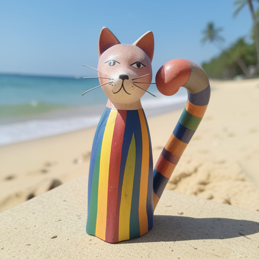
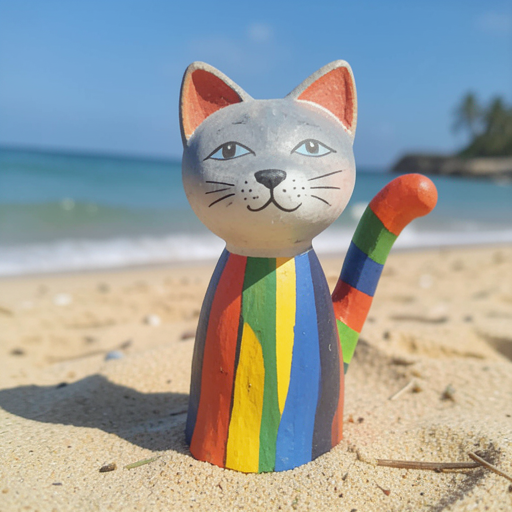
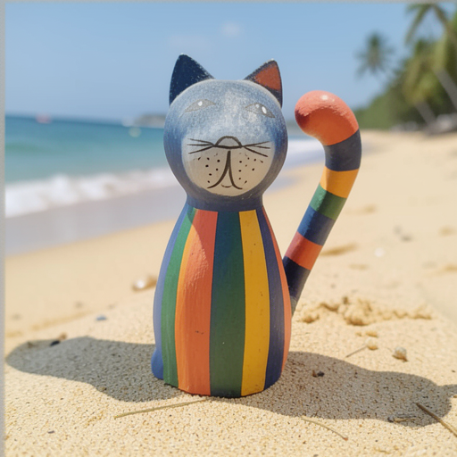
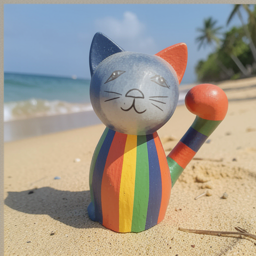
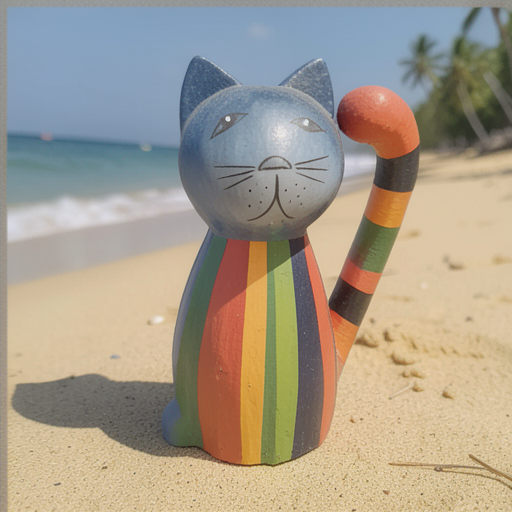
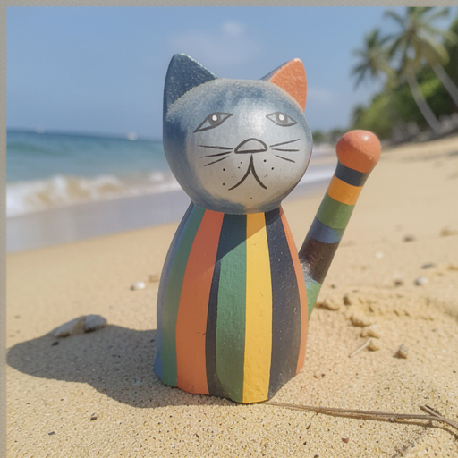

# Lion vs AdamW Optimizer Comparison

Comparison of **Lion** (EvoLved Sign Momentum) vs **AdamW** optimizers on the Cat Toy LoRA training dataset using Klein 4B.

## Test Setup

| Parameter | AdamW | Lion |
|-----------|-------|------|
| **Model** | Klein 4B (bf16 base) | Klein 4B (bf16 base) |
| **Dataset** | Cat Toy (6 images) | Cat Toy (6 images) |
| **Steps** | 500 | 500 |
| **Rank** | 32 | 32 |
| **Learning Rate** | 1e-4 | 3e-5 (smart default) |
| **Weight Decay** | 0.0001 | 0.1 (smart default) |
| **Beta2** | 0.999 | 0.99 (smart default) |
| **Timestep** | balanced | balanced |
| **DOP** | yes (cat) | yes (cat) |
| **Seed** | 42 | 42 |

## Results

### Training Time & Memory

| Metric | AdamW | Lion | Diff |
|--------|:-----:|:----:|:----:|
| **Total time** | 2h 36m 45s | 3h 03m 32s | Lion +17% |
| **Peak GPU memory** | 18,357 MB | 18,357 MB | Identical |
| **Final loss** | 0.365 | 0.344 | Lion -6% |
| **Best loss** | 0.251 (step 330) | 0.244 (step 330) | Lion -3% |

Peak memory is identical because LoRA parameters (~190MB) are a tiny fraction of the total transformer memory (~7.4GB bf16). The optimizer state difference (2x vs 1x LoRA params) is negligible at this scale.

### Loss Curves

| Step | AdamW Loss | AdamW DOP | Lion Loss | Lion DOP |
|-----:|:----------:|:---------:|:---------:|:--------:|
| 1 | 0.447 | 0.000 | 0.348 | 0.000 |
| 100 | 0.433 | 0.010 | 0.440 | 0.012 |
| 200 | 0.297 | 0.005 | 0.402 | 0.004 |
| 300 | 0.358 | 0.003 | 0.322 | 0.004 |
| 400 | 0.314 | 0.003 | 0.276 | 0.003 |
| 500 | 0.365 | 0.003 | 0.344 | 0.004 |

**Key observation**: AdamW converges faster early (0.297 at step 200 vs 0.402), but Lion catches up and produces lower loss in the second half (0.276 at step 400 vs 0.314).

### VLM Evaluation (Scene/Style scores)

Each checkpoint's validation image ("a colorful wooden cat figurine sitting on a beach" with trigger word) compared against the reference image using Qwen3.5 VLM.

| Step | AdamW Scene | AdamW Style | Lion Scene | Lion Style |
|-----:|:-----------:|:-----------:|:----------:|:----------:|
| 100 | 5 | 6 | 5 | 6 |
| 200 | 9 | 8 | 5 | 9 |
| 300 | 5 | 9 | 9 | 8 |
| 400 | 5 | 9 | 5 | 9 |
| 500 | 9 | 8 | 5 | 9 |

> Note: Scene scores vary (5 vs 9) because the validation prompt places the cat on a beach while the reference has it on a sofa. The VLM alternates between penalizing the background change and focusing on the subject. **Style scores are more consistent** and show both optimizers reaching 8-9/10 by step 200-300.

### Visual Progression

#### Step 100

| AdamW | Lion |
|:-----:|:----:|
|  |  |

Both capture the basic concept (wooden cat with stripes) but details are rough.

#### Step 300

| AdamW | Lion |
|:-----:|:----:|
|  |  |

Both show significant improvement — stripes are clearer, proportions better.

#### Step 500 (Final)

| AdamW | Lion |
|:-----:|:----:|
|  |  |

Both produce high-quality results. The figurine is clearly recognizable with correct stripes, tail, and face.

## Analysis

### 1. Does Lion converge faster or slower?
**Slower initially, better final quality.** AdamW reaches 0.297 loss at step 200, while Lion is still at 0.402. However, Lion surpasses AdamW after step 250 and achieves lower final loss (0.344 vs 0.365) and better best loss (0.244 vs 0.251).

### 2. Image quality comparison?
**Comparable.** Both produce excellent cat toy figurines by step 300+. The VLM style scores converge to 8-9/10 for both. Visual inspection confirms similar quality.

### 3. Training time difference?
**Lion is ~17% slower** (3h03 vs 2h36). This is unexpected — Lion should be faster per step. The difference may be due to background system activity during the Lion run, or the sign() operation in Lion having different Metal kernel efficiency than Adam's moment updates.

### 4. Memory savings?
**Negligible in practice.** Peak memory is identical (18.4 GB) because the optimizer state (LoRA params × state arrays) is tiny compared to the transformer activations and weights. The 50% reduction in optimizer state (1 array vs 2 per param) saves only ~190MB.

### 5. Do Lion's smart defaults work?
**Yes.** The auto-applied defaults (lr=3e-5, wd=0.1, beta2=0.99) produce competitive results without any manual tuning. Lion reaches better final loss despite 3x lower learning rate.

## Recommendation

| Scenario | Recommended |
|----------|-------------|
| **Quick experiment** | AdamW — faster convergence in first 200 steps |
| **Best final quality** | Lion — lower loss at 300+ steps |
| **Memory constrained** | Either — negligible difference for LoRA |
| **Default choice** | AdamW — well-tested, faster wall-clock time |

## How to Reproduce

```bash
# Build CLI first
xcodebuild -scheme Flux2CLI -configuration Release -destination 'platform=macOS' build

# Run both trainings
flux2 train-lora --config docs/examples/lion-vs-adamw/cat_toy_adamw.yaml
flux2 train-lora --config docs/examples/lion-vs-adamw/cat_toy_lion.yaml
```

## Configs

- [AdamW config](cat_toy_adamw.yaml)
- [Lion config](cat_toy_lion.yaml)

## Hardware

- Apple M2 Ultra, 96 GB unified memory
- macOS Tahoe 26.4
