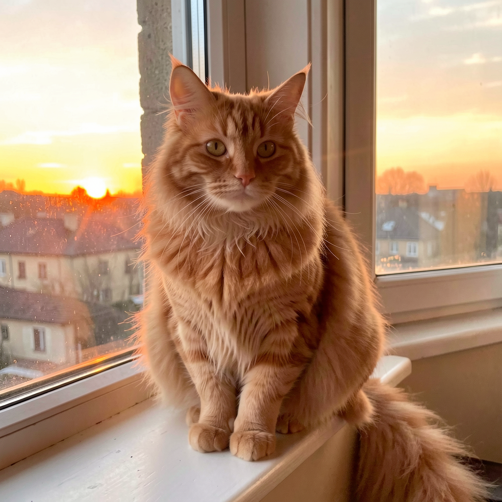
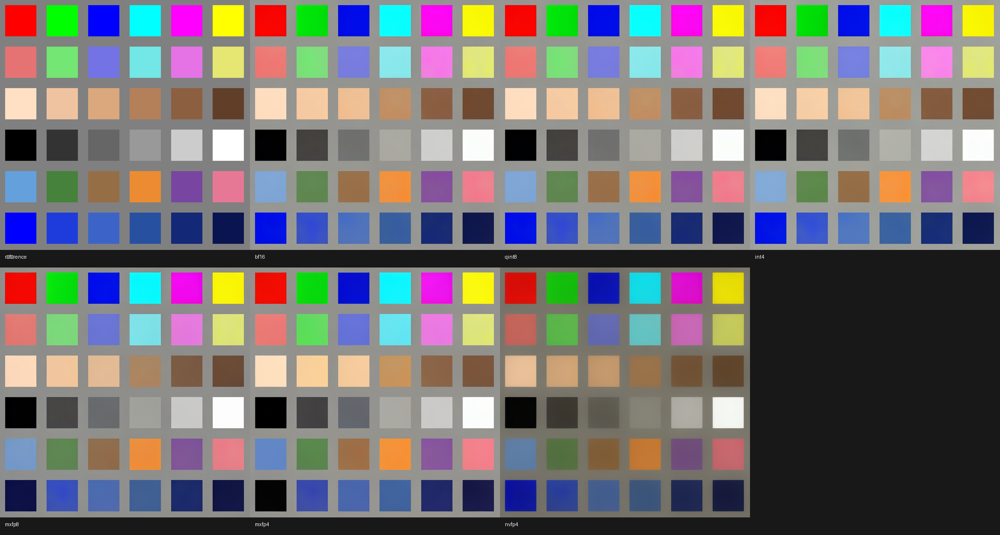
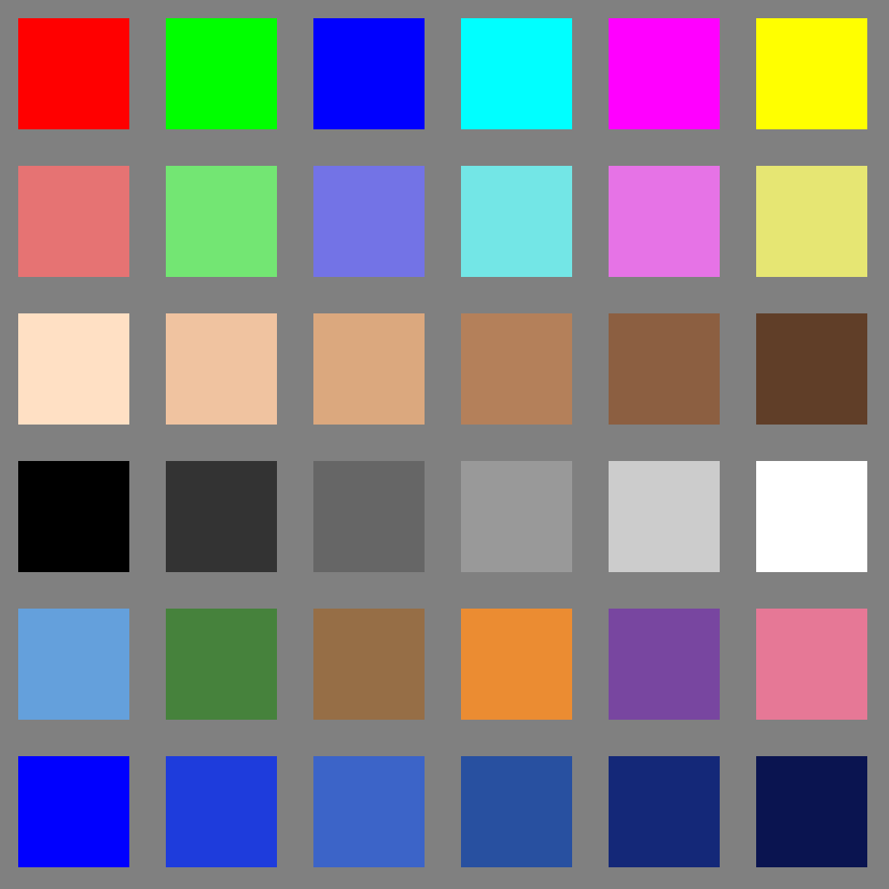
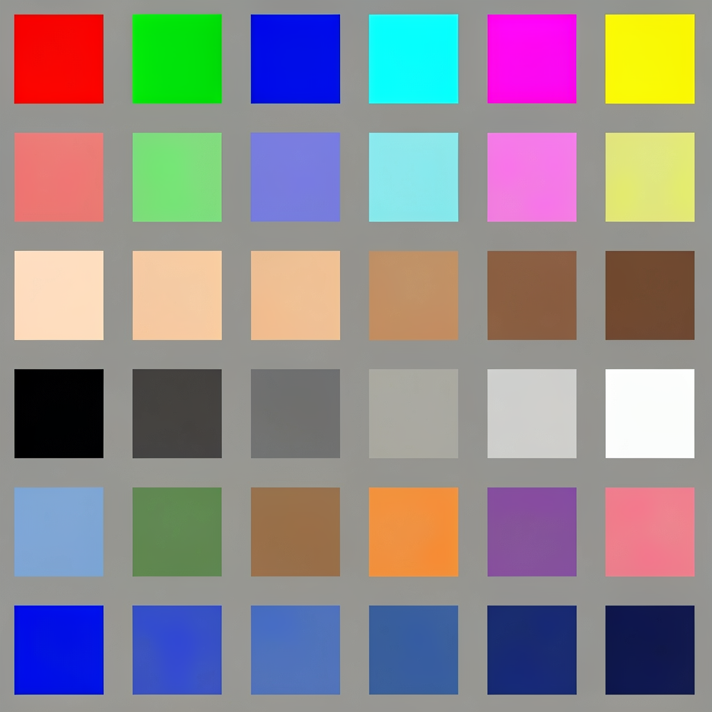
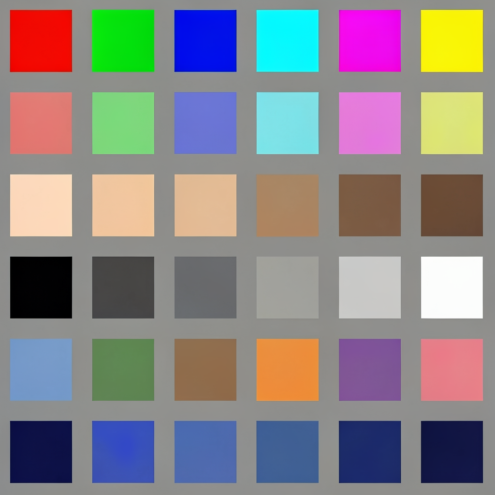
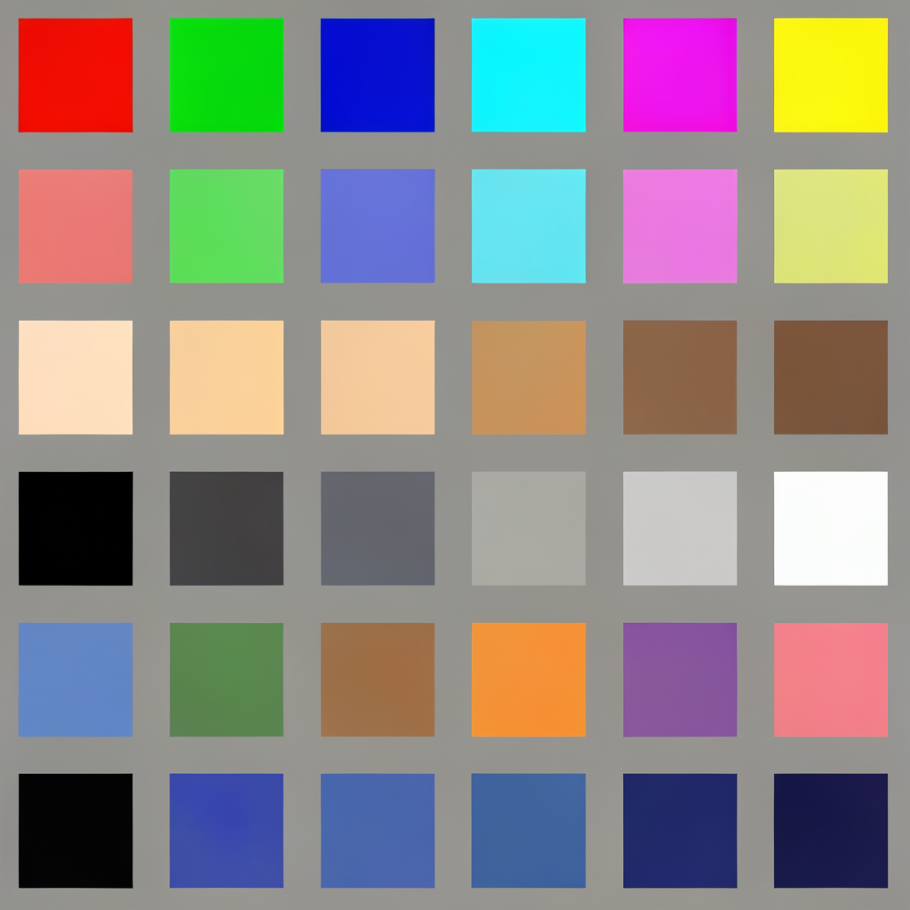
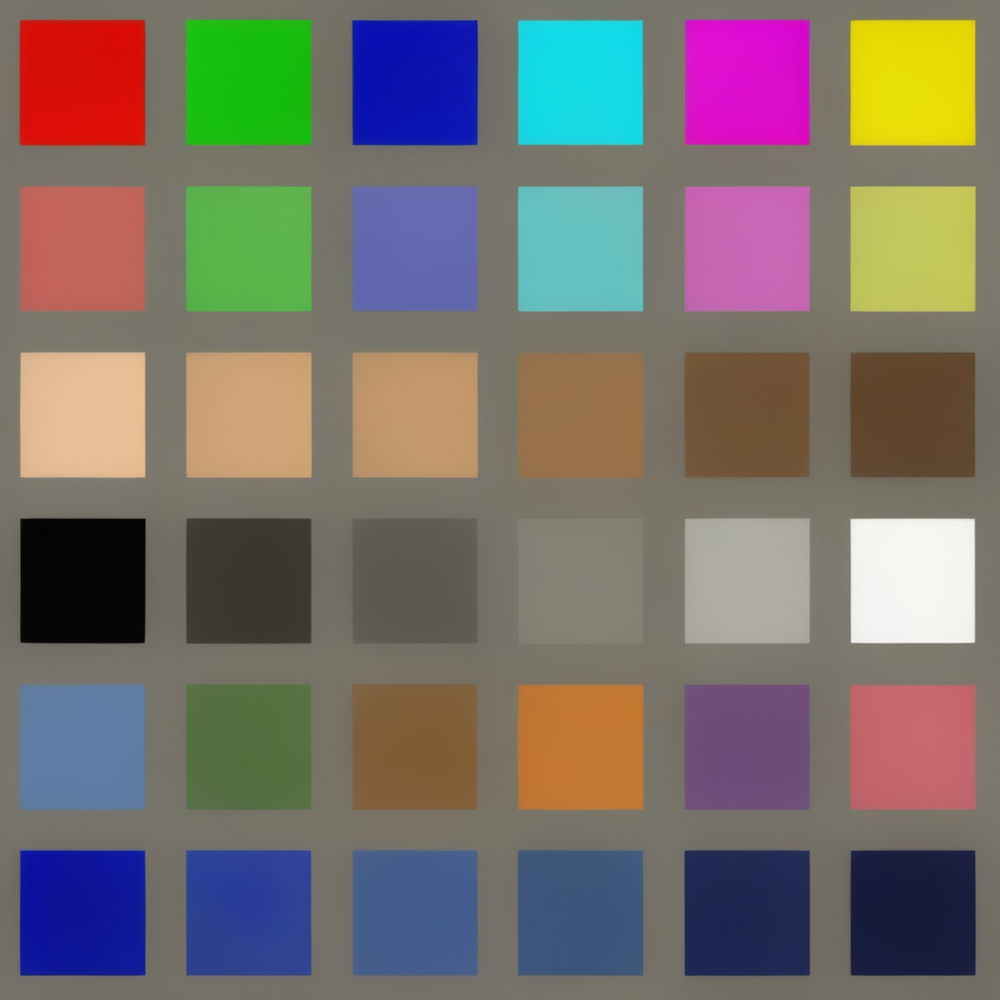

# On-the-fly Transformer Quantization Benchmark

Measured on **Apple M2 Ultra 96GB**, macOS Tahoe 26.2, MLX Swift 0.30.2.

All tests use the same prompt (`"A fluffy orange tabby cat sitting on a windowsill at sunset"`), seed 42, 1024x1024.

## Memory Results

### Transformer active memory (after quantization, before inference)

| Model | bf16 | qint8 | int4 |
|-------|------|-------|------|
| **Klein 4B** | 7 407 MB | 3 942 MB (-47%) | 2 094 MB (-72%) |
| **Klein 9B** | 17 340 MB | 9 223 MB (-47%) | 4 894 MB (-72%) |
| **Dev 32B** | 61 491 MB | 32 681 MB (-47%) | 17 315 MB (-72%) |

### Peak memory during generation (transformer + VAE + activations)

| Model | bf16 | qint8 | int4 |
|-------|------|-------|------|
| **Klein 4B** | 17 846 MB | 14 381 MB | 12 533 MB |
| **Klein 9B** | 27 779 MB | 19 662 MB | 15 333 MB |
| **Dev 32B** | 71 930 MB | 68 733 MB | 27 755 MB |

### Peak memory during quantization (loading bf16 + quantizing)

| Model | bf16 | qint8 | int4 |
|-------|------|-------|------|
| **Klein 4B** | — | 8 811 MB | 4 057 MB |
| **Klein 9B** | — | 11 836 MB | 7 979 MB |
| **Dev 32B** | — | 68 733 MB | 24 351 MB |

### Inference time (Klein: 4 steps, Dev: 28 steps)

| Model | bf16 | qint8 | int4 |
|-------|------|-------|------|
| **Klein 4B** | 25.6s | 27.9s | 30.3s |
| **Klein 9B** | 54.9s | 59.7s | 64.8s |
| **Dev 32B** | 1758.6s | 1842.5s | 1779.6s |

> Note: quantized inference is slightly slower on Klein models due to quantization overhead on small matrices. On Dev (larger matrices), int4 is comparable to bf16. The real benefit is **memory savings**, not speed.

## Minimum RAM Requirements

| Model | bf16 | qint8 | int4 |
|-------|------|-------|------|
| **Klein 4B** | 24 GB | 16 GB | **16 GB** |
| **Klein 9B** | 32 GB | 24 GB | **16 GB** |
| **Dev 32B** | 96 GB | 96 GB* | **32 GB** |

> *Dev qint8 peaks at 68 GB during quantization (loads full bf16 then quantizes). With pre-quantized Quanto weights, peak is lower.

## Visual Comparison

### Klein 4B (4 steps, seed 42)

| bf16 (7.4 GB) | qint8 (3.9 GB) | int4 (2.1 GB) |
|:-:|:-:|:-:|
|  |  |  |

### Klein 9B (4 steps, seed 42)

| bf16 (17.3 GB) | qint8 (9.2 GB) | int4 (4.9 GB) |
|:-:|:-:|:-:|
|  |  |  |

### Dev 32B (28 steps, seed 42)

| bf16 (61.5 GB) | qint8 (32.7 GB) | int4 (17.3 GB) |
|:-:|:-:|:-:|
|  |  |  |

## Key Findings

1. **Memory reduction is consistent at -47% (qint8) and -72% (int4)** across all model sizes
2. **Visual quality is remarkably preserved** even at int4 — compositions, colors, and details are nearly identical to bf16
3. **Klein 9B is now usable at qint8** without needing a pre-quantized variant (was silently falling back to bf16 before)
4. **Dev int4 fits in 32 GB** — makes Dev accessible on 36 GB Macs (previously required 96 GB)
5. **One bf16 model file serves all quantization levels** — no need to download separate variants

## Color Fidelity Test — FP Quantization Modes (mire)

Since the microscaling FP modes were added (`mxfp8`, `mxfp4`, `nvfp4` — MLX Swift 0.31.6, PR #107),
color fidelity was measured with a synthetic test chart passed through image-to-image.

**Protocol** — Klein 9B, all six modes quantized on-the-fly **from the same bf16 checkpoint**
(including qint8, so only the quantization mode varies), seed 42, faithful-reproduction prompt,
identical text encoder (Qwen3-8B 4bit) and VAE. The chart has 36 patches in a 6×6 grid on neutral
gray: saturated primaries/secondaries, half-saturated hues, skin tones, a gray ramp, memory colors,
and a deep-blue ramp (the zone where the Klein 4B qint8 drift was originally diagnosed). Each patch
is measured on its central 60% (avoids VAE-softened edges). The **bf16 column is the floor**: what
VAE round-trip + 4-step sampling already costs with no quantization at all.

**Mean ΔE per row** (RGB norm vs. the chart; lower = more faithful):

| Row | bf16 | qint8 | int4 | mxfp8 | mxfp4 | nvfp4 |
|---|---|---|---|---|---|---|
| Saturated | 15.7 | 15.7 | 17.6 | 19.6 | 28.3 | 56.9 |
| Half-saturated | 13.5 | 13.4 | 18.9 | 13.2 | 16.5 | 55.7 |
| Skin tones | 16.9 | 16.8 | 19.4 | 16.8 | 25.3 | 38.2 |
| Grays | 13.1 | 13.1 | 16.7 | 10.9 | 11.4 | 28.2 |
| **Deep blues** | 20.2 | 20.4 | 22.9 | **53.8** | **68.2** | 58.2 |
| **GLOBAL** | **16.4** | **16.4** | **19.4** | **22.3** | **28.4** | **46.7** |
| Worst patch (ΔE max) | 38 | 38 | 46 | **186** | **251** | 108 |



| reference | bf16 | qint8 | int4 | mxfp8 | mxfp4 | nvfp4 |
|:-:|:-:|:-:|:-:|:-:|:-:|:-:|
|  |  |  |  |  |  |  |

**Findings:**

1. **qint8 is virtually lossless on Klein 9B** — indistinguishable from bf16 (max pixel diff 3/255).
   The desaturation previously diagnosed on Klein 4B qint8 comes from model size, not from 8-bit
   quantization itself.
2. **Affine int4 remains the best 4-bit option** — moderate, uniform degradation (+3 ΔE over the floor).
3. **mxfp8/mxfp4 have an Achilles' heel: deep blues.** Excellent everywhere else (mxfp8 even beats
   bf16 on grays), but pure blue (0,0,255) collapses to near-black navy (per-patch ΔE 186 and 251).
   Likely culprit: MX e8m0 scales, which are restricted to powers of two.
4. **nvfp4 is not usable as-is** — a global warm/olive cast over the whole image (even the gray
   background shifts to olive-brown). NVFP4's optional `globalScale` calibration is not supported
   on the Metal backend, which may be the missing piece.

**Practical recommendation:** at 8-bit use `qint8`; at 4-bit use `int4`. The FP modes are exposed
and functional but carry the caveats above.

Reproduction scripts (chart generator, per-patch analyzer, montage) and raw per-patch data are in
[`mire/`](mire/).

## Usage

```bash
# Klein 4B — fits on 16 GB Macs with int4
flux2 t2i "your prompt" --model klein-4b --transformer-quant int4

# Klein 9B — now works with qint8 (previously fell back to bf16)
flux2 t2i "your prompt" --model klein-9b --transformer-quant qint8

# Dev — accessible on 32 GB+ Macs with int4
flux2 t2i "your prompt" --model dev --transformer-quant int4
```

## Test Environment

- Hardware: Apple M2 Ultra, 96 GB unified memory
- OS: macOS Tahoe 26.2
- MLX Swift: 0.30.2
- Quantization: MLX native `quantize(model:groupSize:bits:)` with groupSize=64
- All tests run sequentially with GPU idle between tests
