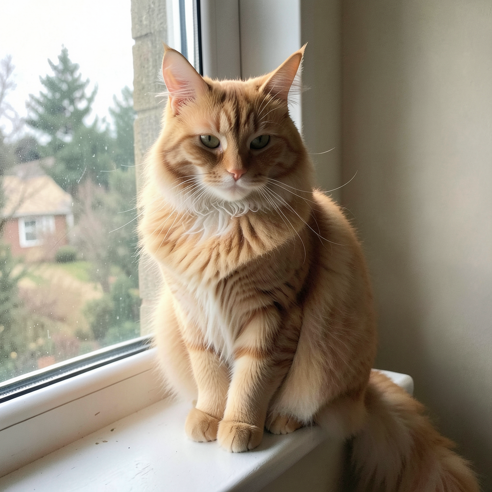
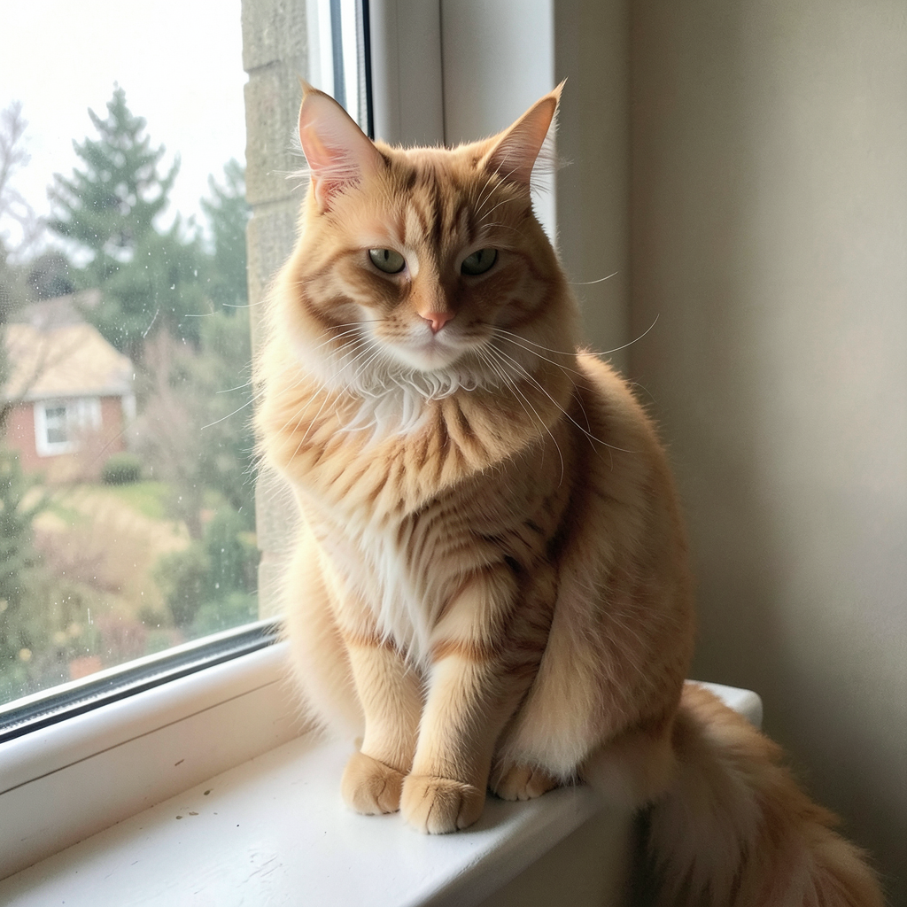

# FLUX.2 Small Decoder VAE

Drop-in replacement for the standard FLUX.2 VAE decoder, distilled by Black Forest Labs for faster decoding with minimal quality loss.

- **Source:** [black-forest-labs/FLUX.2-small-decoder](https://huggingface.co/black-forest-labs/FLUX.2-small-decoder)
- **License:** Apache 2.0
- **Compatible with:** All FLUX.2 models (Klein 4B, Klein 9B, Klein 9B-KV, Dev)

## Architecture

The small decoder reduces channel widths while keeping the encoder unchanged:

| Component | Standard | Small Decoder |
|-----------|----------|---------------|
| **Encoder** | [128, 256, 512, 512] | [128, 256, 512, 512] (unchanged) |
| **Decoder** | [128, 256, 512, 512] | [96, 192, 384, 384] |
| **Decoder params** | ~50M | ~28M (-44%) |
| **Weights file** | 160 MB | 250 MB (includes full encoder) |

## Benchmark

Measured on **Apple M2 Ultra 96GB**, macOS Tahoe 26.4, MLX Swift.

All tests: Klein 4B, qint8, 1024x1024, seed 42, 4 steps.

Prompt: `"a fluffy orange cat sitting on a windowsill"`

### Performance

| Phase | Standard VAE | Small Decoder | Delta |
|-------|-------------|---------------|-------|
| **VAE Decode** | **1.85s** | **1.61s** | **-13%** |
| Load VAE | 43 ms | 54 ms | +11 ms |
| Total generation | 29.0s | 28.7s | -1% |
| Denoising (4 steps) | 23.77s | 23.79s | = |

> The VAE decode speedup is modest at 1024x1024 because the bottleneck is the transformer (82% of total time). The benefit increases at higher resolutions where the decoder processes more pixels.

### Visual Comparison

| Standard VAE (1.85s) | Small Decoder (1.61s) |
|:---:|:---:|
|  |  |

Quality is visually identical. Same seed, same prompt, same latents — only the decoder differs.

## Usage

### Download

```bash
# Download small decoder only
flux2 download --vae-only --vae-variant small-decoder

# Download model + small decoder
flux2 download --model klein-4b --vae-variant small-decoder
```

### Inference

```bash
# Text-to-Image with small decoder
flux2 t2i "a cat on a windowsill" --model klein-4b --vae-variant small-decoder

# Image-to-Image with small decoder
flux2 i2i "oil painting style" --images ref.png --model klein-4b --vae-variant small-decoder
```

### Swift API

```swift
let pipeline = Flux2Pipeline(
    model: .klein4B,
    quantization: .balanced,
    vaeVariant: .smallDecoder
)
```

## When to Use

| Use Case | Recommended VAE |
|----------|-----------------|
| Standard generation (1024x1024) | Either (marginal difference) |
| High resolution (2048+) | **Small Decoder** (lower peak memory) |
| Commercial use | **Small Decoder** (Apache 2.0) |
| Training (encoder needed) | Standard (encoder unchanged) |
| Maximum compatibility | Standard |

## HuggingFace Files

The repo contains 3 safetensors files for different consumers:

| File | Size | Format | Use |
|------|------|--------|-----|
| `diffusion_pytorch_model.safetensors` | 250 MB | Diffusers | **This framework** |
| `full_encoder_small_decoder.safetensors` | 250 MB | Diffusers | ComfyUI |
| `small_decoder.safetensors` | 112 MB | BFL native | Decoder-only workflows |

Our pipeline loads `diffusion_pytorch_model.safetensors` (standard diffusers format with full encoder + small decoder + quant convolutions + batch norm stats).
