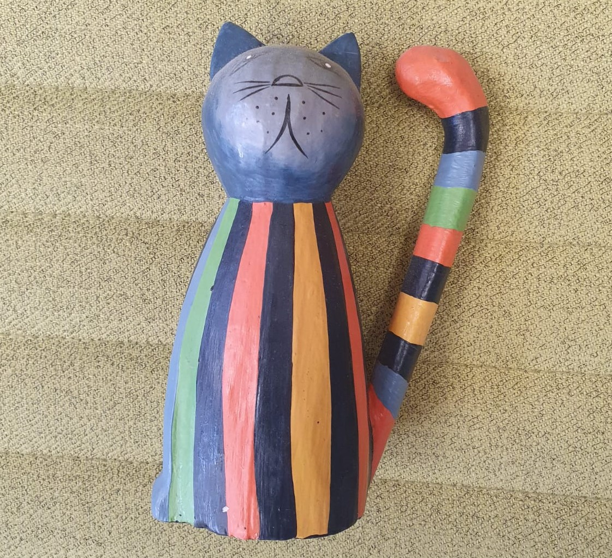
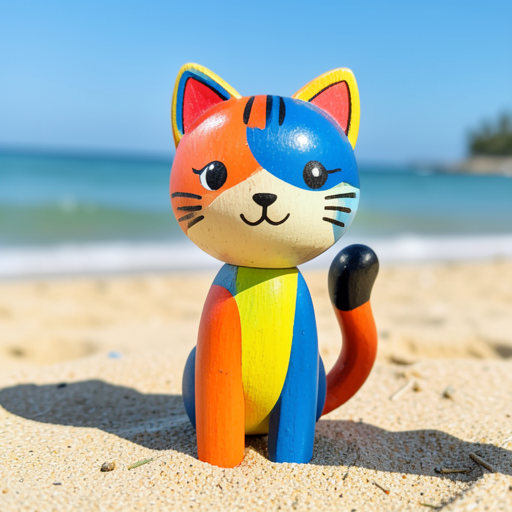
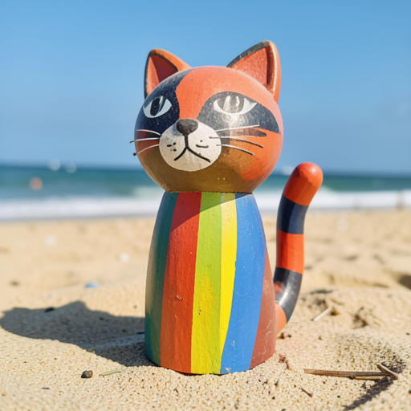
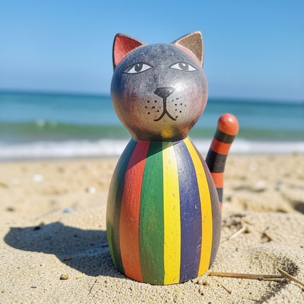
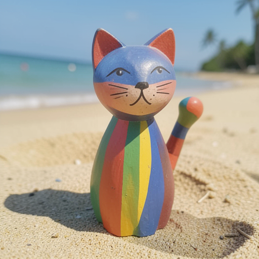
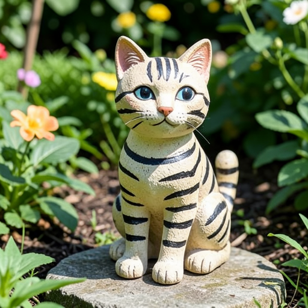
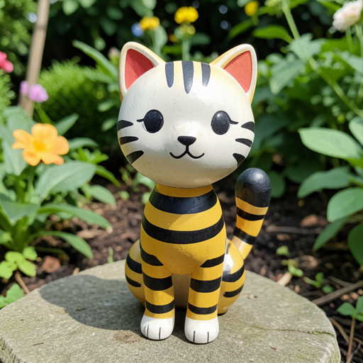
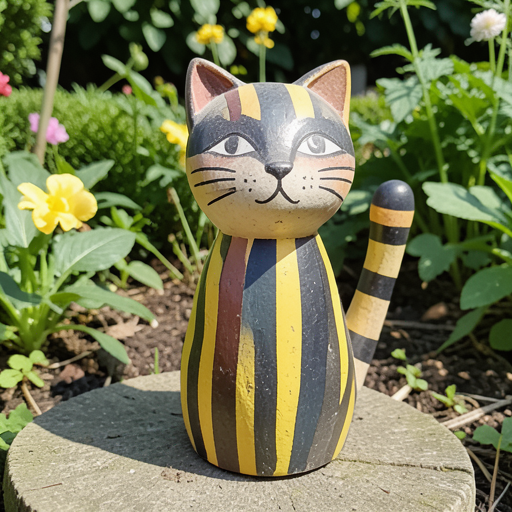
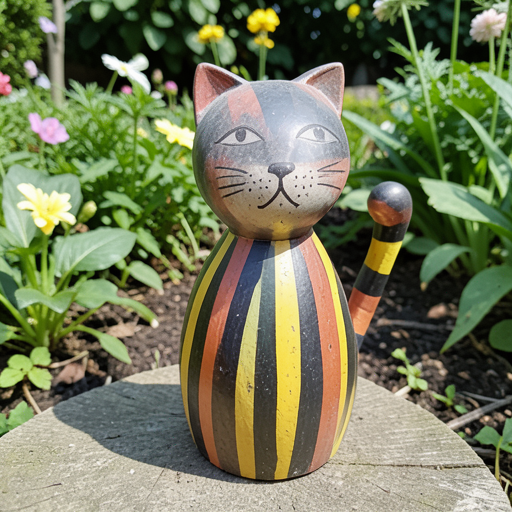
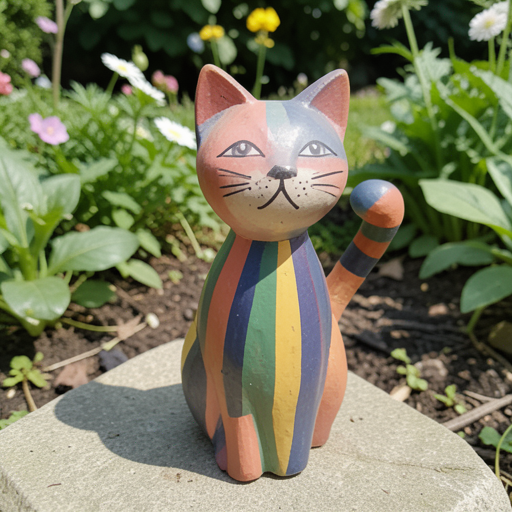

# VLM-Guided Checkpoint Selection

Automatically score validation images during LoRA training using the **Qwen3.5-4B VLM**, detect learning trends, and save the best checkpoint.

## How It Works

```
Training Loop
  |
  +-- saveCheckpoint()
  |     +-- generateValidationImages()       (existing - generates images with LoRA)
  |           +-- scoreValidationImagesWithVLM()  (NEW - scores vs reference/baseline)
  |                 |-- Compare validation vs training reference (scene + style, 0-100)
  |                 |-- Compare validation vs baseline (step 0, no LoRA)
  |                 |-- Compute composite score
  |                 |-- Track best checkpoint -> best_checkpoint/
  |                 +-- Check early stopping (stagnation/degradation)
```

At each validation checkpoint:
1. **Load VLM** (~3GB, after validation pipeline is unloaded)
2. **Score** each trigger-enabled validation image against a training reference image
3. **Log** composite score with learning status (LEARNING / PLATEAU / DEGRADING)
4. **Save** best checkpoint automatically when composite improves
5. **Unload VLM** and resume training

Scores use a **0-100 scale** (not 0-10) for fine-grained comparison between checkpoints. Only prompts with `apply_trigger: true` are scored (non-trigger prompts test DOP preservation and would penalize correct behavior if scored).

## Test Results: Cat Toy LoRA (Klein 4B, 100 steps)

### Configuration

```yaml
model:
  name: klein-4b

dataset:
  path: examples/cat-toy/train    # 6 images
  trigger_word: "statue_cat_toy"

training:
  max_steps: 100
  learning_rate: 1.0e-4

checkpoints:
  save_every: 25

validation:
  prompts:
    - prompt: "a colorful wooden cat figurine sitting on a beach"
      apply_trigger: true
      is_512: true
    - prompt: "a striped cat statue in a garden"
      apply_trigger: true
      is_512: true
    - prompt: "a cat sitting on a couch"
      apply_trigger: false    # DOP test - not scored by VLM
      is_512: true
  every_n_steps: 25

  vlm_scoring:
    enabled: true
    scene_weight: 0.5
    compare_to_baseline: true
    save_best_checkpoint: true
```

### VLM Score Progression

| Step | Composite | Scene | Style | vs Baseline | Status |
|-----:|:---------:|:-----:|:-----:|:-----------:|:------:|
| 25   | **14/100** | 8 | 20 | +14 | - |
| 50   | **51/100** | 40 | 62 | +51 | LEARNING |
| 75   | **61/100** | 62 | 60 | +61 | LEARNING |
| 100  | **42/100** | 38 | 48 | +42 | DEGRADING |

The VLM detected:
- **Steps 25-75**: consistent improvement, model is learning
- **Step 100**: score drops from 61 to 42 — early signs of overfitting/degradation
- **Best checkpoint**: automatically saved at step 75 (score 61.25/100)

### Training Reference

| Reference (training image) |
|:--:|
|  |

### Visual Progression

#### Prompt: "statue_cat_toy, a colorful wooden cat figurine sitting on a beach"

| Baseline (no LoRA) | Step 25 (14/100) | Step 50 (51/100) | Step 75 (61/100) | Step 100 (42/100) |
|:---:|:---:|:---:|:---:|:---:|
|  |  |  |  |  |

#### Prompt: "statue_cat_toy, a striped cat statue in a garden"

| Baseline (no LoRA) | Step 25 (14/100) | Step 50 (51/100) | Step 75 (61/100) | Step 100 (42/100) |
|:---:|:---:|:---:|:---:|:---:|
|  |  |  |  |  |

### VLM Analysis Excerpts

**Step 25** (14/100 — early training):
> Scene: "The generated image completely fails to match the reference. The subject is a different cat with different color scheme, pose, and facial expression."

**Step 75** (61/100 — best checkpoint):
> Scene: "The generated image correctly identifies the subject as a painted wooden cat figurine with vertical stripes and a striped tail."
> Style: "The style is reasonably well-captured, including the hand-painted, rustic aesthetic and specific color palette."

**Step 100** (42/100 — degradation):
> The VLM detected a quality drop. Without VLM scoring, the user would have used the final checkpoint (step 100) which is worse than step 75.

### Loss vs VLM Score

The loss curve alone does NOT predict visual quality well:

| Step | Loss | VLM Score |
|-----:|:----:|:---------:|
| 25 | 0.50 | 14/100 |
| 50 | 0.35 | 51/100 |
| 75 | 1.06 | **61/100** |
| 100 | 0.34 | 42/100 |

Step 75 has the **highest loss** (1.06) but the **best VLM score** (61/100). Step 100 has the **lowest loss** (0.34) but a **degraded VLM score** (42/100). This demonstrates why loss alone is insufficient for checkpoint selection in flow matching training.

### Output Structure

```
output/cat-toy-vlm-test/
  baseline/                     # Images without LoRA (step 0)
  checkpoint_000025/            # Each checkpoint has validation images + state
  checkpoint_000050/
  checkpoint_000075/
  checkpoint_000100/
  best_checkpoint/              # Auto-saved best by VLM score
    lora.safetensors            # Best LoRA weights (step 75)
    best_info.json              # {"step": 75, "composite_score": 61.25}
  learning_curve.svg
  lora_final.safetensors
```

---

## Configuration Reference

VLM scoring is configured under `validation.vlm_scoring` in the YAML config:

```yaml
validation:
  vlm_scoring:
    # Enable VLM scoring at each validation checkpoint
    enabled: true

    # Weight for scene vs style in composite score (0-1)
    # 0.5 = equal weight, 0.7 = scene-heavy (for subjects), 0.3 = style-heavy
    scene_weight: 0.5

    # Reference images for comparison (empty = auto-select from dataset)
    # reference_images:
    #   - examples/cat-toy/train/1.jpeg
    #   - examples/cat-toy/train/3.jpeg

    # Max images to auto-select from dataset when reference_images is empty
    max_reference_images: 3

    # Compare validation images against baseline (step 0, no LoRA)
    compare_to_baseline: true

    # Auto-save best checkpoint to best_checkpoint/
    save_best_checkpoint: true

    # Early stopping based on VLM scores
    early_stopping: false

    # Consecutive validations without improvement before stopping (0-100 scale)
    early_stopping_patience: 3

    # Minimum score improvement to count as progress (0-100 scale)
    early_stopping_min_delta: 3.0

    # Stop if score drops below peak by this much (0-100 scale)
    degradation_threshold: 15.0
```

### Parameter Guide

| Parameter | Default | Description |
|-----------|---------|-------------|
| `enabled` | `false` | Enable/disable VLM scoring |
| `scene_weight` | `0.5` | Scene vs style weighting. Use `0.7` for subject LoRAs, `0.3` for style LoRAs |
| `reference_images` | `[]` | Explicit reference paths. Empty = auto-select from dataset |
| `max_reference_images` | `3` | Max auto-selected references from dataset |
| `compare_to_baseline` | `true` | Also compare against step-0 baseline (measures improvement) |
| `save_best_checkpoint` | `true` | Auto-save best LoRA to `best_checkpoint/` |
| `early_stopping` | `false` | Stop training if scores stagnate or degrade |
| `early_stopping_patience` | `3` | Consecutive flat validations before stopping |
| `early_stopping_min_delta` | `3.0` | Minimum improvement to reset patience (0-100) |
| `degradation_threshold` | `15.0` | Stop if score drops this much below peak (0-100) |

### Scoring Details

- **Scale**: 0-100 (fine-grained, unlike the 0-10 scale used in `evaluate-lora`)
- **Scene score**: Content fidelity — same subjects, features, pose, spatial arrangement
- **Style score**: Visual fidelity — same art style, colors, lighting, textures
- **Composite**: `scene_weight * scene + (1 - scene_weight) * style`
- **Only trigger prompts scored**: Non-trigger prompts test DOP preservation, not learning
- **VLM model**: Qwen3.5-4B-4bit (~3GB), auto-downloaded on first use

### Memory Impact

The VLM is loaded **after** the validation pipeline is unloaded, so peak memory does not increase:

```
Training (~12-18GB) --> Validation pipeline (+10GB, then unloaded) --> VLM (+3GB, then unloaded)
```

Each VLM comparison takes ~5-10 seconds per image pair. With 2 trigger prompts and baseline comparison enabled (4 comparisons per checkpoint), expect ~20-40s of VLM scoring time per checkpoint.

### Early Stopping

When `early_stopping: true`, training stops if:

1. **Degradation**: composite drops more than `degradation_threshold` below the peak score
2. **Stagnation**: the last `early_stopping_patience` scores stay within `early_stopping_min_delta` of each other

Example with the cat-toy test (if early stopping were enabled with `degradation_threshold: 15`):
- Peak at step 75: 61/100
- Step 100: 42/100 (dropped 19 points > 15 threshold)
- Training would have stopped at step 100 with best checkpoint at step 75

---

## Key Insight: Loss is Not Enough

Flow matching training produces noisy loss curves that don't correlate well with visual quality. In our test:

- The **lowest loss** checkpoint (step 100, loss 0.34) produced **worse images** than step 75
- The **highest loss** checkpoint (step 75, loss 1.06) was **the best** visually
- Without VLM scoring, users would typically pick the final or lowest-loss checkpoint — both suboptimal

VLM scoring provides a **semantic quality signal** that tracks actual visual similarity to the training data, making checkpoint selection reliable regardless of loss behavior.
